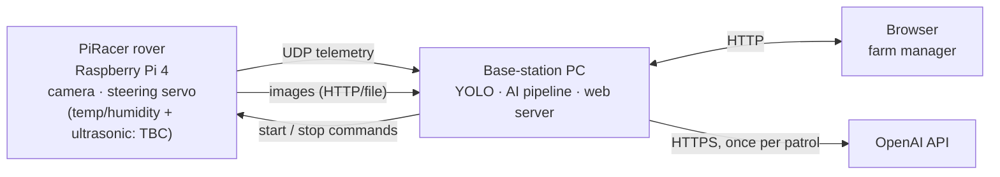
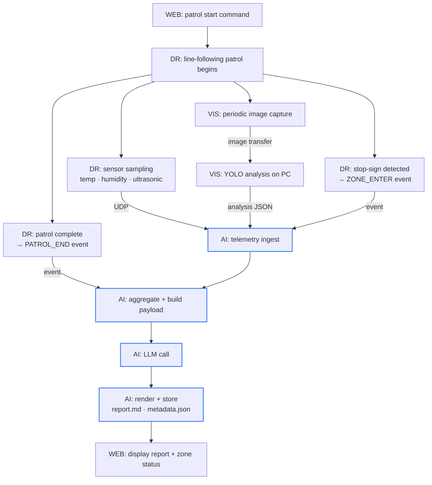

# 00 — System Overview

Context for the whole project. Read once for orientation; `01-interface-contracts.md` is what you actually code against.

## The product

A Waveshare PiRacer rover (a DonkeyCar-compatible Raspberry Pi 4 platform) patrols a greenhouse along a taped line. At intervals it photographs crops and records temperature and humidity. Images go to a base-station PC where YOLO classifies crop condition. At the end of the patrol, an LLM turns everything into a Korean-language diagnostic report that a farm manager reads on a local web dashboard.

The value proposition: a hobby farmer running a 농막 cannot be on site constantly. The rover patrols on a schedule and leaves a written report.

## Physical layout



Everything except the OpenAI call runs on a local network. The rover has no internet access.

## Four subsystems

| Code | Name | Responsibility | Runs on |
|---|---|---|---|
| **DR** | Driving | Line following, ultrasonic emergency stop, stop-sign detection, sensor collection, telemetry transmission | Rover |
| **VIS** | Vision | Periodic image capture, transmission, YOLO crop detection and condition classification | Rover (capture) + PC (analysis) |
| **AI** | Report | Telemetry ingest, zone segmentation, aggregation, LLM report generation, storage | PC |
| **WEB** | Dashboard | Local web server, report rendering, live stream, patrol scheduling, start/stop control | PC + browser |

## End-to-end data flow



Blue nodes are ours. Everything else is context.

## Where the AI subsystem sits

**Trigger:** the `PATROL_END` event from DR.
**Inputs:** telemetry stream and events from DR; analysis results and images from VIS.
**Outputs:** `report.md` and `metadata.json` in a per-patrol directory that WEB reads.
**Latency requirement:** none meaningful. A patrol takes ~20 minutes; a report taking 30 seconds is fine. Batch API is acceptable.
**Failure impact:** the rover is unaffected. WEB shows the previous report or a fallback.

## Vocabulary

Use these exact terms in code and docs. Inconsistent naming across four teams is the most common integration failure.

| Term | Meaning | Identifier form |
|---|---|---|
| **Patrol** (순찰) | One complete run from start command to completion | `patrol_id`, format `YYYYMMDD_HHMM` |
| **Zone** (구역) | A named section of the greenhouse, bounded by stop-sign markers | `zone_id`, integer, 1-based |
| **Round / 회차** | Synonym for patrol; used in Korean requirements | use `patrol` in code |
| **Observation** | One detected crop instance in one image | not deduplicated across frames — see contract C2 |
| **판단불가** | VIS could not classify an object, typically low image quality | a `state` enum value, never omitted |
| **Telemetry** | Periodic sensor sample from DR | one UDP packet |
| **Event** | A discrete occurrence with semantic meaning (zone entry, emergency stop) | delivered reliably, not plain UDP |
| **Coverage** | Fraction of expected data actually received and usable | reported per zone |

### Crop condition enum

Fixed set. Any other value is a contract violation and must raise.

```
정상  ·  미성숙  ·  병충해_의심  ·  판단불가
```

### Report status enum

```
정상  ·  주의  ·  이상
```

## Platform: Waveshare PiRacer AI Kit

Raspberry Pi 4, Ackermann steering (MG996R servo with steering knuckles and pull bars), rear DC gearmotor drive, and an integrated expansion board. Officially DonkeyCar-compatible — Waveshare ships a DonkeyCar setup guide.

### What the kit includes

| Component | Note |
|---|---|
| Raspberry Pi Camera (G) | Fixed mount, no pan/tilt |
| MG996R steering servo | Ackermann front steering |
| 2× metal gearmotor | Rear drive |
| PiRacer expansion board | PCA9685-class PWM, battery protection, 5 V regulator |
| 0.91" OLED, 128×32 | IP address, memory, power display |
| ADS1115 ADC | Battery voltage monitoring |
| Wireless gamepad | Manual driving |
| 3× 18650, up to 12.6 V | Not included in the kit |

### What the kit does NOT include — affects our contracts

| Missing | Needed by | Impact on AI subsystem |
|---|---|---|
| Temperature/humidity sensor | DR FR_101 | `env.temp_c` / `env.humid_pct` in C1.1; the 환경 조건 report section |
| Ultrasonic sensor | DR FR_102, FR_110 | `drive.ultra_cm`; `EMERGENCY_STOP` events in C1.2 |
| IR / grayscale line sensor | DR FR_104 | none directly — line following is camera-based on this platform |

The first two must be purchased and wired by the DR team, or the corresponding report content does not exist. See the flags in `01-interface-contracts.md` §C1.

### Sizing

- ~25 cm chassis on hard wheels. Demo surface is a smooth greenhouse walkway or matting, not soil.
- Patrol speed ~0.3 m/s; a full route is roughly 15–25 minutes.
- Expect 4–8 zones per patrol and 30–80 images per patrol.
- Environmental sampling roughly 1 Hz, so a zone yields tens of samples, not thousands.

These numbers set the payload budget in `02-ai-subsystem-spec.md` §8.
