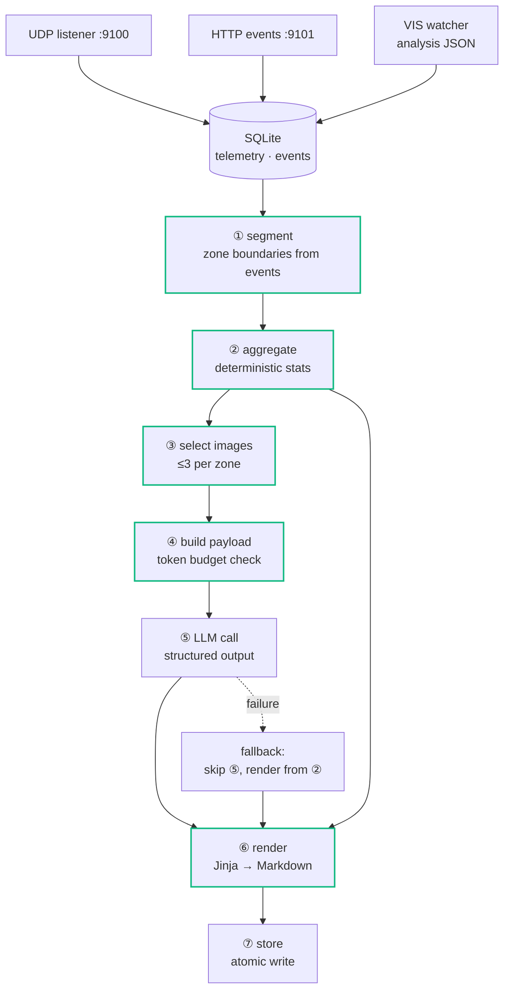

# 02 — AI Subsystem Specification

Implementation spec. Schemas at boundaries come from `01-interface-contracts.md`; this document covers internals, algorithms, the prompt, and the output schema.

## 1. Architecture



Green stages are deterministic and network-free. Only ⑤ touches the internet. The pipeline produces a complete report with ⑤ removed.

## 2. Module layout

```
ai_report/
├── __init__.py
├── config.py               # pydantic-settings; all thresholds
├── models.py               # pydantic models for every schema
├── cli.py                  # entry points
├── ingest/
│   ├── udp_listener.py     # C1.1
│   ├── event_api.py        # C1.2, FastAPI
│   ├── vis_watcher.py      # C2
│   └── store.py            # SQLite persistence
├── pipeline/
│   ├── segment.py          # ① zone segmentation
│   ├── aggregate.py        # ② deterministic statistics
│   ├── select_images.py    # ③ image selection
│   └── payload.py          # ④ payload + token estimation
├── llm/
│   ├── client.py           # ⑤ OpenAI, retry, cost metering
│   ├── prompts.py          # system prompt, versioned
│   └── schema.py           # strict JSON schema
├── render/
│   ├── markdown.py         # ⑥
│   └── templates/report.md.j2
├── storage/
│   └── layout.py           # ⑦ atomic writes
└── devtools/
    ├── fake_rover.py       # emits C1 traffic
    └── fake_vis.py         # emits C2 files
tests/
├── fixtures/
└── test_*.py
```

## 3. Configuration

`config.py`, `pydantic-settings`, `.env`. No threshold appears inline anywhere else.

```python
UDP_PORT = 9100
EVENT_PORT = 9101
DATA_ROOT = "./data"
REPORT_ROOT = "./reports"

VIS_COMPLETE_TIMEOUT_S = 600
IMAGES_PER_ZONE_MAX = 3
IMAGE_QUALITY_MIN = 0.40
IMAGE_RESIZE_PX = 768
UNDETERMINED_FLAG_THRESHOLD = 0.30
COVERAGE_WARN_THRESHOLD = 0.90
TREND_MIN_PATROLS = 10

LLM_ENABLED = True
LLM_MODEL = "gpt-5.6-luna"
LLM_MAX_RETRIES = 3
LLM_TIMEOUT_S = 120
LLM_MAX_INPUT_TOKENS = 60000
PROMPT_VERSION = "v1.0"
OPENAI_API_KEY = ...  # env only, never logged
```

## 4. Storage

SQLite at `data/sessions.db`.

```sql
CREATE TABLE telemetry (
  patrol_id TEXT NOT NULL,
  seq       INTEGER NOT NULL,
  ts_ms     INTEGER NOT NULL,
  temp_c    REAL,
  humid_pct REAL,
  speed_mps REAL,
  steer     REAL,
  ultra_cm  INTEGER,
  state     TEXT,
  PRIMARY KEY (patrol_id, seq)
);

CREATE TABLE events (
  patrol_id  TEXT NOT NULL,
  event_seq  INTEGER NOT NULL,
  ts_ms      INTEGER NOT NULL,
  type       TEXT NOT NULL,
  zone_id    INTEGER,
  detail     TEXT,
  PRIMARY KEY (patrol_id, event_seq)
);

CREATE TABLE analysis (
  patrol_id     TEXT NOT NULL,
  image_id      TEXT NOT NULL,
  captured_at_ms INTEGER NOT NULL,
  image_path    TEXT NOT NULL,
  image_quality REAL NOT NULL,
  detections    TEXT NOT NULL,
  PRIMARY KEY (patrol_id, image_id)
);
```

`PRIMARY KEY` on `(patrol_id, seq)` gives UDP deduplication free — a repeated packet is an `INSERT OR IGNORE` no-op. Same for event idempotency.

## 5. ① Zone segmentation

**The most correctness-critical algorithm in the subsystem.** Read `01-interface-contracts.md` §C1.2 before changing it.

### Primary path

```
1. Load events for the patrol, ordered by ts_ms.
2. Extract ZONE_ENTER events → boundary list.
3. Zone k spans [ZONE_ENTER[k].ts_ms, ZONE_ENTER[k+1].ts_ms).
   The final zone extends to PATROL_END.ts_ms.
4. Assign each telemetry row and each analysis row to the zone
   whose interval contains its timestamp.
5. boundary_confidence = "high"
```

Records before the first `ZONE_ENTER` belong to a transit segment, `zone_id = 0`, excluded from zone reporting but counted in coverage.

### Fallback path — no `ZONE_ENTER` events present

```
1. Compute cumulative distance from speed_mps integrated over telemetry,
   excluding intervals where state == "STOPPED" or "EMERGENCY".
2. Divide by configured route zone distances.
3. boundary_confidence = "low"
4. Add "구역 경계 추정" to data_limitations.
```

The fallback must be loud. `metadata.json` carries `zone_boundary_confidence: "low"` and the report's 데이터 한계 section states it explicitly.

> [!FLAG] **Needs human review — "configured route zone distances" was never defined**
>
> Step 2 above says "divide by configured route zone distances" but no
> document ever says where that configuration comes from — not `config.py`'s
> §3 list, not the ICD, not the traceability matrix. `pipeline/segment.py`'s
> implementation makes a concrete choice: `config.ROUTE_ZONE_COUNT` (default
> 6) equal-length zones spanning `config.ROUTE_TOTAL_DISTANCE_M` (default
> 120.0), i.e. one flat total-distance number divided evenly, not a
> per-zone distance table. Real greenhouse zones are very unlikely to be
> equal length, so **this fallback's zone boundaries will be wrong in
> proportion, even though `boundary_confidence: "low"` correctly warns that
> they're estimated at all.** Two things worth deciding with real route
> data in hand:
> 1. Replace `ROUTE_TOTAL_DISTANCE_M` with a real per-zone distance list
>    once the physical route is measured, rather than equal division.
> 2. `config.ZONE_NAMES: dict[int, str]` has the same problem one level
>    up — `metadata.json`'s `zones[].zone_name` (ICD §C3.3, e.g. "B동 2열")
>    has no defined source anywhere either. `pipeline/aggregate.py` falls
>    back to a literal `"{zone_id}구역"` when a zone isn't in this map, so
>    output is always valid, just unnamed until someone populates it.

**Never segment on wall-clock elapsed time.** Emergency stops make that mapping wrong in a way nothing downstream can detect.

## 6. ② Aggregation

Pure function: `aggregate(patrol_id, segments) -> PatrolAggregate`. No network, no filesystem beyond reads, deterministic.

Per zone:

| Output | Computation |
|---|---|
| `env.temp_c` | avg / min / max / n over non-null samples in the zone |
| `env.humid_pct` | same |
| `observations[class][state]` | sum of `count` across all images in the zone |
| `undetermined_rate` | `판단불가 total / all-states total`; `null` when denominator is 0 |
| `image_count` | analysis rows in the zone |
| `drive_events` | events of type `EMERGENCY_STOP` or `LINE_LOST` in the interval |
| `dwell_s` | zone interval duration |
| `flags` | `재촬영_필요` when `undetermined_rate > 0.30` |
| `status` | rule below |

Patrol level: `duration_min`, `udp_received`, `udp_expected` (`max(seq)+1`), `rate`, `images_analysed`, `zone_boundary_confidence`.

### Zone status rule — deterministic, not the LLM's decision

```
이상  if 병충해_의심 / (정상 + 미성숙 + 병충해_의심) > 0.15
주의  if ratio > 0.05  OR  "재촬영_필요" in flags  OR  EMERGENCY_STOP occurred
정상  otherwise
```

`overall_status` is the worst zone status.

The LLM writes prose about the status; it does not assign it. Deterministic status means the dashboard badge is reproducible and defensible.

## 7. ③ Image selection

`01-interface-contracts.md` provides `image_quality`; AI_101's "필터링된 이미지" is defined here.

Per zone, at most `IMAGES_PER_ZONE_MAX` (3), chosen in priority order:

1. **Anomaly exemplar** — among images containing a `병충해_의심` detection, the one with highest `image_quality`.
2. **Normal representative** — among images whose `정상` count is nearest the zone median, the one with highest `image_quality`.
3. **Undetermined exemplar** — only when `undetermined_rate > 0.30`, the highest-quality image containing `판단불가`, so the model can comment on why classification failed.

Hard filter: exclude any image with `image_quality < 0.40` before ranking. If a zone has no eligible images, it contributes text-only and the report notes 이미지 없음.

Selected images are resized to `IMAGE_RESIZE_PX` (768) on the long edge, JPEG quality 85, copied into the report directory.

## 8. ④ Payload construction

Schema is in `01-interface-contracts.md` §C3.3 shape, minus `llm` block. Add nothing the model cannot use.

### Token budget

Estimate before calling; raise if over `LLM_MAX_INPUT_TOKENS`.

| Component | Estimate |
|---|---|
| Text payload | ~200 tokens per zone + 300 fixed |
| System prompt | ~700 tokens |
| Each 768px image | ~765 tokens |

Typical patrol — 6 zones, 18 images: ~13,800 (images) + ~1,500 (text) + 700 ≈ **16,000 input tokens**, ~1,500 output.

At `gpt-5.6-luna` rates ($0.20 / $1.20 per 1M) that is roughly **$0.005 ≈ ₩7 per report**. Budget is not a constraint here; if quality needs more images, raise `IMAGES_PER_ZONE_MAX`.

Over-budget behaviour: drop to 2 images per zone, then 1, then text-only, recording the reduction in `data_limitations`.

## 9. ⑤ LLM call

### Model and client

- Model from `config.LLM_MODEL`, default `gpt-5.6-luna` (vision-capable, lowest cost tier).
- Structured output via strict JSON schema. Strict mode requires every property listed in `required` and `additionalProperties: false` at every level.
- Retry: 3 attempts, exponential backoff 2/4/8 s, on timeout, 429, and 5xx. Do not retry on 400.
- Record `input_tokens`, `output_tokens`, computed `cost_usd`, `model`, `prompt_version` into `metadata.json`.
- On final failure: log, set `llm.enabled = false`, proceed to fallback rendering. **Never abort the report.**

### System prompt — `PROMPT_VERSION = "v1.0"`

Store verbatim in `llm/prompts.py`. Bump the version on any edit; it is recorded per report so results stay comparable.

```
당신은 농업 생육 진단 보조 시스템이다.
스마트 순찰 로버가 1회 순찰에서 수집한 데이터를 해석하여 진단 리포트의
서술 부분을 작성한다.

[입력 규약]
- 모든 수치(관측 수, 평균, 비율)는 이미 확정되어 제공된다.
- 제공된 수치를 그대로 인용하라. 다시 계산하거나 추정하지 마라.
- 이미지는 수치의 근거 확인과 시각적 소견 기술에만 사용한다.
- 이미지에서 수치를 직접 세지 마라.

[평가 기준]
1. 작물 생육 상태
   정상 / 미성숙 / 병충해_의심 분포와 이미지의 시각적 소견을 함께 기술한다.
2. 환경 조건
   구역별 온습도를 해당 구역에서 함께 관찰된 조건으로 기술한다.
3. 통로 장애 요인
   비상정지 및 라인 이탈 이벤트의 발생 구역과 빈도를 기술한다.

[금지 규칙]
- 단일 순찰 데이터로 인과관계를 주장하지 마라.
  "때문에", "로 인해", "원인은", "영향으로" 사용 금지.
  대신 "함께 관찰됨", "동일 구역에서 확인됨"으로 서술하라.
- 제공되지 않은 수치를 만들어내지 마라.
- undetermined_rate 가 0.30 을 초과하는 구역은 생육 상태에 대한 결론을
  내리지 말고, 재촬영이 필요하다고 기술하라.
- data_completeness.rate 가 0.90 미만이면 데이터 한계를 반드시 명시하라.
- boundary_confidence 가 "low" 인 경우 구역 구분이 추정값임을 명시하라.
- 관측 수(observation count)는 개체 수가 아니다.
  "개체 수", "그루", "포기" 등의 표현을 쓰지 말고 "관측 수"로 서술하라.

[출력]
지정된 JSON 스키마를 따른다. 모든 서술 필드는 한국어로 작성한다.
서술은 간결하게. 각 필드는 지정된 문장 수를 지킨다.
```

The 금지 규칙 block is the part that determines report quality. Two failure modes it prevents: inventing causal claims from six zone-level data points, and asserting plant counts that the pipeline never measured.

### Output schema

```json
{
  "summary_ko": "string, 2-3 sentences",
  "overall_note_ko": "string, 1-2 sentences",
  "zones": [{
    "zone_id": "integer",
    "growth_note_ko": "string, 2-3 sentences",
    "env_note_ko": "string, 1-2 sentences",
    "visual_findings_ko": ["string"],
    "recommended_actions_ko": ["string"]
  }],
  "path_obstructions_ko": ["string"],
  "data_limitations_ko": ["string"],
  "next_patrol_suggestion_ko": "string, 1-2 sentences"
}
```

The model returns **no numbers and no status values.** Those come from ②. If a returned `zone_id` is not in the aggregate, drop it and log.

## 10. ⑥ Markdown rendering

Jinja2, `render/templates/report.md.j2`. All figures are template-substituted from ②; prose fields come from ⑤. Section structure is fixed by `01-interface-contracts.md` §C3.2 and must hold for fallback reports too.

```jinja
# 순찰 리포트 — {{ agg.patrol_date }}

## 순찰 요약
{{ llm.summary_ko if llm else "LLM 분석이 포함되지 않은 자동 생성 리포트입니다." }}

- 순찰 시간: {{ agg.duration_min }}분
- 구역 수: {{ agg.zones | length }}
- 전체 상태: **{{ agg.overall_status }}**
- 데이터 수신률: {{ "%.1f" | format(agg.completeness.rate * 100) }}%

## 구역별 생육 현황

### {{ z.zone_id }}구역 — {{ z.zone_name }}

상태: **{{ z.status }}** ({{ z.flags | join(", ") }})

| 상태 | 관측 수 |
|---|---|

| {{ state }} | {{ n }} |

{{ llm.zone(z.zone_id).growth_note_ko }}


## 환경 조건

- {{ z.zone_id }}구역: 평균 {{ z.env.temp_c.avg }}°C / {{ z.env.humid_pct.avg }}%
  (표본 {{ z.env.temp_c.n }}개) — {{ llm.zone(z.zone_id).env_note_ko }}


## 통로 장애 요인
...

## 권장 조치
...

## 데이터 한계
- UDP 패킷 수신 {{ agg.completeness.udp_received }} / {{ agg.completeness.udp_expected }}

- 구역 경계가 이벤트가 아닌 추정값으로 산출되었습니다.

```

Note every number in this template comes from `agg`, never from `llm`. That is the rule from `CLAUDE.md` made concrete.

## 11. ⑦ Storage

Build the whole report directory under `reports/.tmp_{patrol_id}/`, then `os.replace` to `reports/{patrol_id}/`. WEB polls the directory and must never see a partial write.

Regeneration: `payload.json` is the complete LLM input. `cli.py regenerate {patrol_id}` re-runs ⑤ ⑥ ⑦ from the stored payload with no rover involvement. Essential for prompt tuning — expect dozens of iterations.

## 12. Error handling matrix

| Failure | Detection | Response |
|---|---|---|
| UDP packet malformed | Pydantic validation | Log, drop the packet, increment a counter |
| Unknown `state` enum from VIS | Pydantic validation | **Raise.** A contract violation must not be papered over |
| `_COMPLETE` never written | Timeout 600 s | Proceed with available analyses, note the gap |
| No `ZONE_ENTER` events | Empty boundary list | Fallback segmentation, `confidence: "low"` |
| Zone has no images | Empty selection | Text-only zone, note 이미지 없음 |
| LLM 429 / 5xx / timeout | HTTP status | Retry 3× with backoff |
| LLM final failure | Retries exhausted | Fallback report, `llm.enabled = false` |
| LLM returns unknown `zone_id` | Cross-check against aggregate | Drop that entry, log |
| Payload over token budget | Pre-call estimate | Reduce images per zone, note the reduction |
| Disk full on write | OSError | Fail loudly; leave the previous report intact |

## 13. Testing

- **No network in any test.** The OpenAI client is injected and mocked.
- `tests/fixtures/` holds a full synthetic patrol: telemetry rows, events, analysis JSON, sample images.
- **Segmentation gets adversarial tests specifically:** an emergency stop mid-zone, a missing `ZONE_ENTER`, out-of-order UDP arrival, duplicate packets, a zone with zero images, a zone with 100% `판단불가`.
- Aggregation is tested for determinism: same input twice, byte-identical output.
- `devtools/fake_rover.py` replays a fixture over real UDP so the ingest path is exercised end to end without hardware.
