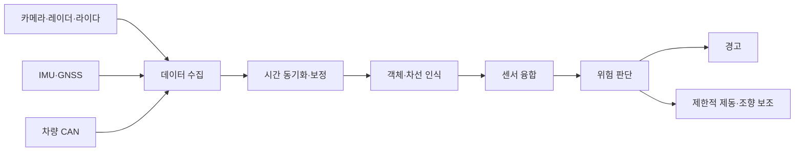
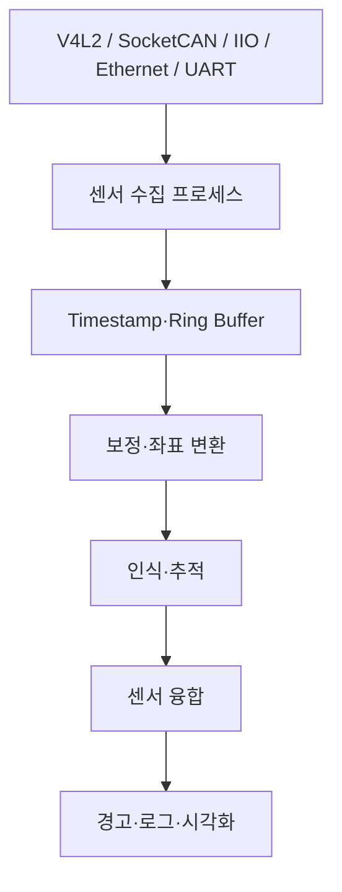

# ADAS 기능 및 센서 요약 보고서

## 1. 학습 목표

ADAS(Advanced Driver Assistance Systems)의 주요 기능과 센서 특성을 이해하고, 임베디드 리눅스에서 센서 데이터를 수집·동기화·융합하여 위험을 판단하는 전체 흐름을 정리한다.

> 본 문서는 학습 및 벤치 시험용이다. Raspberry Pi 4와 일반 Linux는 알고리즘 실습에 사용할 수 있지만, 실제 차량의 조향·제동을 제어하는 양산 안전 시스템으로 사용해서는 안 된다.

---

## 2. ADAS 핵심 개념

ADAS는 차량 주변과 운전자 상태를 감지해 사고를 예방하거나 충돌 피해를 줄이는 **운전자 보조 시스템**이다. 기능에 따라 경고만 제공하거나 제한적으로 제동·조향을 지원한다.



핵심은 센서 하나의 결과를 그대로 믿는 것이 아니라 다음 과정을 거쳐 신뢰도를 확보하는 것이다.

```text
감지 → 유효성 검사 → 시간·좌표 정렬 → 인식 → 추적 → 융합 → 위험 판단
```

---

## 3. 주요 ADAS 기능

| 기능 | 목적 | 주요 입력 | 출력 |
|---|---|---|---|
| FCW 전방 충돌 경고 | 전방 추돌 가능성 경고 | 거리, 상대속도, 자차 속도 | 시각·청각·진동 경고 |
| AEB 자동 긴급 제동 | 충돌 회피 또는 충돌 속도 감소 | 전방 객체, TTC, 제동 상태 | 제동 준비·자동 제동 |
| LDW 차선 이탈 경고 | 비의도 차선 이탈 경고 | 차선, 차량 중심, 방향지시등 | 이탈 경고 |
| LKA 차선 유지 보조 | 차선 안쪽으로 제한적 복귀 | 횡오차, 진행각, 곡률, 속도 | 조향 보조 |
| ACC 적응형 순항 제어 | 설정 속도와 차간거리 유지 | 선행차 거리·상대속도 | 가속·감속 요청 |
| BSW 사각지대 경고 | 차선 변경 충돌 방지 | 후측방 객체와 상대속도 | 경고 |
| RCTA 후방 교차 경고 | 후진 경로의 교차 객체 감지 | 후측방 객체, 후진 경로 | 경고·후방 제동 |
| TSR 교통표지 인식 | 제한속도·규제 정보 표시 | 카메라 영상 | 표지 분류 결과 |
| DMS 운전자 감시 | 졸음·시선 이탈 감지 | 얼굴, 눈, 머리 방향 | 주의 경고 |
| 주차 보조 | 저속 근거리 충돌 방지 | 카메라, 초음파, 레이더 | 거리 경고·주차 보조 |

NHTSA는 경고 기능과 직접 개입 기능을 구분한다. 예를 들어 FCW와 LDW는 운전자에게 위험을 알리지만, AEB와 LKA는 조건이 충족될 때 차량 동작에 개입한다. 보조 기능이 작동하더라도 해당 자동화 수준에서 운전자에게 요구되는 감시 책임을 이해해야 한다.

### 3.1 충돌 예상 시간

전방 객체가 가까워지는 상황의 단순 충돌 예상 시간(Time To Collision)은 다음과 같다.

```text
TTC = 상대 거리 / 접근 속도
```

- 접근 속도 `≤ 0`: 가까워지는 상황이 아니므로 TTC를 무한대로 처리
- TTC가 작을수록 충돌 위험 증가
- 실제 시스템은 제동거리, 노면, 곡률, 객체 경로, 운전자 반응과 센서 불확실성을 추가로 고려

---

## 4. 센서별 역할과 한계

| 센서 | 주요 출력 | 강점 | 주요 한계 | 대표 기능 |
|---|---|---|---|---|
| 카메라 | 영상, 색상, 형태 | 객체 종류·차선·표지 인식 | 야간, 역광, 악천후, 오염 | LDW, LKA, TSR, DMS |
| 레이더 | 거리, 각도, 상대속도 | 속도 측정, 장거리, 일부 악천후 | 세부 분류, 다중 반사, 고스트 | ACC, AEB, BSW |
| 라이다 | 3D 포인트 클라우드 | 정밀 거리와 공간 구조 | 비용, 날씨, 오염, 데이터량 | 3D 인식, 공간 판단 |
| 초음파 | 근거리 거리 | 저비용, 단순한 근접 감지 | 짧은 범위, 표면·온도 영향 | 주차 보조 |
| IMU | 가속도, 각속도 | 빠른 자세·운동 측정 | 바이어스와 적분 오차 누적 | 운동 보상, 자세 추정 |
| GNSS | 전역 위치, 속도, 시간 | 전역 기준과 시간 제공 | 터널, 도심 다중경로 | 위치 추정, 지도 연계 |
| 차량 CAN | 속도, 조향각, 제동 상태 | 자차 상태를 직접 제공 | 신호 정의·보안·버스 부하 | 판단 및 제어 상태 확인 |

### 센서 선택 원칙

- 정확도뿐 아니라 감지 거리, 데이터율, 지연, 날씨, 장착 위치, 비용, 전력과 고장 형태를 함께 평가한다.
- 카메라의 객체 분류와 레이더의 거리·상대속도를 결합하면 서로의 약점을 보완할 수 있다.
- 센서가 서로 같은 객체를 가리키려면 시간 동기화와 외부 캘리브레이션이 선행되어야 한다.

---

## 5. 임베디드 리눅스 센서 통합

| 센서/통신 | Linux 인터페이스 | 대표 확인 방법 |
|---|---|---|
| CSI·USB 카메라 | V4L2, `/dev/videoX` | `v4l2-ctl --list-devices` |
| 차량 CAN·일부 레이더 | SocketCAN, `can0` | `ip link`, `candump can0` |
| IMU | Linux IIO, `/dev/iio:deviceX` | `/sys/bus/iio/devices/` |
| 라이다 | Ethernet UDP/TCP | `ip`, `tcpdump` |
| GNSS | UART·USB serial | `/dev/ttyUSBX`, `/dev/serial0` |



간단한 점검 명령은 다음과 같다.

```bash
# 카메라
v4l2-ctl --list-devices
v4l2-ctl -d /dev/video0 --list-formats-ext

# CAN
sudo ip link set can0 up type can bitrate 500000
candump can0

# IIO
ls /sys/bus/iio/devices/
ls /dev/iio:device*

# Ethernet 센서
ip addr
tcpdump -i eth0
```

SocketCAN은 CAN 컨트롤러를 Linux 네트워크 인터페이스처럼 다루며, V4L2는 영상 장치와 스트리밍 API를 제공하고, IIO는 IMU 같은 산업용 센서의 채널 및 버퍼 접근을 제공한다.

---

## 6. 데이터 처리와 센서 융합

### 6.1 공통 처리 단계

1. 센서 데이터 수신 및 캡처 시각 기록
2. 패킷·프레임 유효성 검사
3. 노이즈 필터링과 센서 보정
4. 공통 차량 좌표계로 변환
5. 객체·차선 후보 검출
6. 프레임 간 객체 추적
7. 센서 간 동일 객체 연관
8. 상태와 신뢰도 갱신
9. 충돌·차선 위험 판단

### 6.2 시간 동기화

차량이 움직이는 동안 100 ms의 센서 시차도 위치 오차를 만들 수 있다. 데이터에는 최소한 다음 정보가 필요하다.

```text
sensor_id, sequence, capture_timestamp,
receive_timestamp, frame_id, validity
```

동기화 방법에는 하드웨어 타임스탬프, PTP, GNSS PPS, 공통 트리거와 소프트웨어 시간 오프셋 보정이 있다. 센서가 측정한 시각과 호스트가 수신한 시각을 구분해야 한다.

### 6.3 좌표 변환과 캘리브레이션

```text
P_vehicle = R × P_sensor + T
```

- `R`: 센서에서 차량 좌표계로의 회전
- `T`: 센서 장착 위치의 이동
- 카메라 내부 보정, 센서 외부 보정, 시간 보정, IMU 바이어스 보정이 필요

캘리브레이션 오류가 있으면 같은 객체가 센서마다 다른 위치에 나타나 융합 결과가 악화된다.

### 6.4 융합 수준

| 방식 | 설명 | 장점 | 단점 |
|---|---|---|---|
| 원시/특징 융합 | 영상·포인트·레이더 특징을 조기에 결합 | 정보 활용도가 높음 | 연산량과 결합 복잡도 큼 |
| 객체 수준 융합 | 센서별 객체 목록을 결합 | 모듈화와 디버깅이 쉬움 | 전처리에서 손실된 정보 복원 불가 |
| 판단 수준 융합 | 기능별 경고 결과를 결합 | 구현이 단순 | 센서 간 세밀한 보완이 제한됨 |

대표 알고리즘은 Kalman/EKF 상태 추정, Hungarian 객체 연관, DBSCAN 포인트 군집화, Occupancy Grid 공간 표현 등이다.

### 6.5 압축된 위험 판단 예

```python
def ttc(distance_m: float, closing_speed_mps: float) -> float:
    return float("inf") if closing_speed_mps <= 0 else distance_m / closing_speed_mps


def warning(lane_offset_m: float, distance_m: float,
            closing_speed_mps: float) -> str:
    lane_risk = abs(lane_offset_m) >= 0.35
    collision_risk = ttc(distance_m, closing_speed_mps) <= 2.5

    if lane_risk and collision_risk:
        return "WARNING"
    if lane_risk or collision_risk:
        return "CAUTION"
    return "NORMAL"
```

이 코드는 원리 확인용이다. 실제 ADAS 판단에는 센서 신뢰도, 시간 차이, 객체 궤적, 차량 속도, 도로 곡률, 제동거리와 고장 상태가 포함되어야 한다.

---

## 7. ROS 2 통합 예시

```text
/camera/image_raw ─┐
/radar/objects ────┤
/lidar/points ─────┼→ /sensor_fusion → /adas/warning
/imu/data ─────────┤
/gnss/fix ─────────┤
/vehicle/status ───┘
```

- 센서 스트림은 Topic을 사용한다.
- 최신성이 중요한 센서는 Sensor Data 계열 QoS와 작은 Queue를 검토한다.
- 손실 허용 여부와 지연 요구에 따라 Best Effort/ Reliable 정책을 선택한다.
- `rosbag2`로 동일 데이터를 반복 재생하면 알고리즘 버전별 결과를 재현 가능하게 비교할 수 있다.

---

## 8. 성능·안전 평가

| 영역 | 주요 지표 |
|---|---|
| 인식 | Precision, Recall, mAP, 거리·횡오차 |
| 추적 | Track 지속성, ID Switch |
| 기능 | True/False Positive, 미검출률 |
| 실시간성 | End-to-End Latency, 최대 지연, Jitter |
| 데이터 | Frame Drop, Packet Loss, Timestamp 오차 |
| 자원 | CPU, 메모리, 네트워크, 저장 공간 |
| 하드웨어 | 온도, Throttling, 장시간 안정성 |

시험 조건에는 주야간, 역광, 비·안개, 차선 마모, 센서 가림, 패킷 손실, CPU 과부하, 센서 분리와 재연결을 포함한다.

```text
센서 이상 감지
→ 해당 데이터 무효화
→ 대체 센서 또는 제한 모드
→ 잘못된 제어 출력 억제
→ 운전자에게 기능 상태 알림
→ 진단 로그 저장
```

### 필수 안전 원칙

- 실제 차량 CAN에 임의 제어 프레임을 전송하지 않는다.
- 조향·제동 시험은 폐쇄된 전문 환경에서 수행한다.
- 평균 지연뿐 아니라 최대 지연과 Jitter를 측정한다.
- 오경고와 미검출을 모두 평가한다.
- 센서, 캘리브레이션, 모델과 설정 파일의 버전을 기록한다.
- 카메라 영상과 위치 정보의 개인정보를 보호한다.
- 기능 한계를 운전자에게 명확하게 표시해 과신을 방지한다.

---

## 9. Raspberry Pi 4 학습 범위

```text
USB·CSI 카메라 → V4L2/OpenCV ┐
가상 CAN → SocketCAN ─────────┼→ Raspberry Pi 4
I2C·SPI IMU → IIO ────────────┤   수집·융합·로그
기록 데이터 → ROS 2 ──────────┘
```

하드웨어 없이 가상 CAN을 시험할 수 있다.

```bash
sudo modprobe vcan
sudo ip link add dev vcan0 type vcan
sudo ip link set vcan0 up
candump vcan0
```

다른 터미널에서 다음과 같이 시험 프레임을 보낸다.

```bash
cansend vcan0 123#0102030405060708
```

가능한 실습은 TTC 계산, 녹화 영상 처리, 가상 CAN, ROS 2 Topic 설계와 기록 데이터 재생이다. 실제 레이더·라이다 성능, 차량 CAN 신호와 조향·제동 기능은 센서, 차량 및 전문 시험 환경이 필요하다.

---

## 10. 결론

ADAS의 핵심은 여러 센서의 장점을 결합해 운전자의 인지·판단을 보조하는 것이다. 카메라는 분류와 차선 인식, 레이더는 거리와 상대속도, 라이다는 3차원 구조, IMU·GNSS는 차량 운동과 위치 추정에 강점이 있다.

임베디드 리눅스에서는 V4L2, SocketCAN, IIO, Ethernet과 UART로 센서를 통합할 수 있다. 수집된 데이터는 시간 동기화, 보정, 좌표 변환, 객체 인식·추적과 융합을 거쳐 위험 판단에 사용된다.

성능은 인식 정확도만으로 평가할 수 없다. 최대 지연, 데이터 손실, 센서 고장, 악천후, 시스템 자원과 운전자 과신까지 포함해 검증해야 한다. Raspberry Pi 4는 이 흐름을 학습하는 데 적합하지만 실제 차량 안전 제어에는 검증된 자동차용 하드웨어와 안전 개발 절차가 필요하다.

---

## 11. 참고 자료

- [NHTSA Driver Assistance Technologies](https://www.nhtsa.gov/vehicle-safety/driver-assistance-technologies)
- [Linux Kernel V4L2 API](https://docs.kernel.org/userspace-api/media/v4l/v4l2.html)
- [Linux Kernel SocketCAN](https://docs.kernel.org/networking/can.html)
- [Linux Kernel Industrial I/O](https://docs.kernel.org/iio/index.html)
- [ROS 2 Quality of Service](https://docs.ros.org/en/rolling/Concepts/Intermediate/About-Quality-of-Service-Settings.html)
