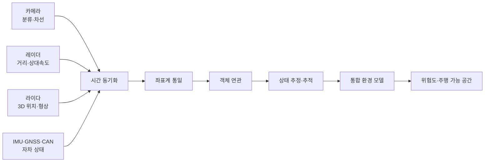
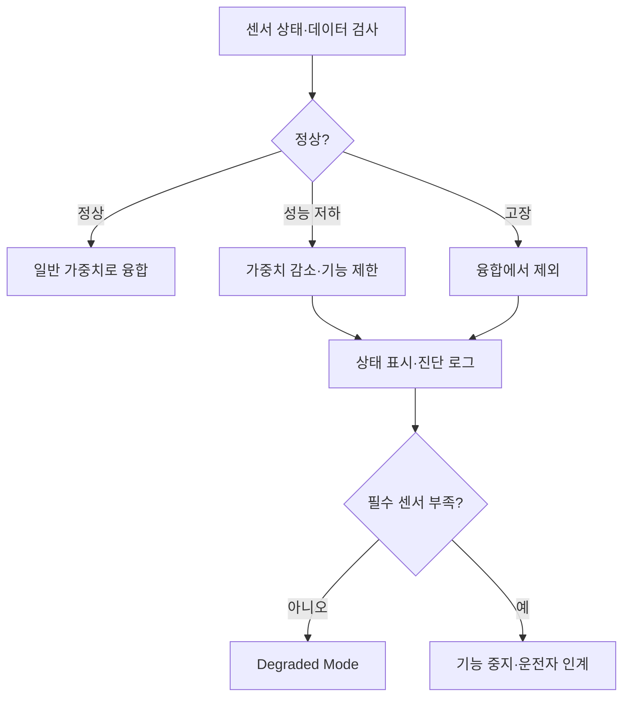

# 센서 융합 기술 및 환경 인식 요약 보고서

## 1. 수행 목표

카메라, 레이더, 라이다, IMU, GNSS와 차량 CAN 데이터를 결합하여 차량 주변의 객체와 도로 환경, 차량 위치·자세를 추정하는 원리를 이해한다. 특히 센서 융합의 선행 조건인 **시간 동기화와 좌표 정합**, 핵심 알고리즘인 **객체 연관과 상태 추정**, 그리고 고장 상황에서의 신뢰도 관리 방법을 정리한다.

> Raspberry Pi 4는 기록 데이터 재생과 학습용 융합 실습에 적합하지만, 실제 차량 조향·제동을 담당하는 안전 제어기로 사용할 수 없다.

---

## 2. 센서 융합의 개념과 필요성

센서 융합은 여러 센서의 측정값과 불확실성을 결합해 단일 센서보다 정확하고 안정적인 상태를 추정하는 기술이다. 데이터를 단순히 한곳에 모으는 것이 아니라 각 데이터의 시각, 좌표, 정확도, 지연과 고장 상태를 함께 판단한다.



### 센서 간 상호 보완

| 센서 | 강점 | 대표 실패 조건 |
|---|---|---|
| 카메라 | 객체 종류, 차선, 표지와 신호 | 야간, 역광, 악천후, 렌즈 오염 |
| 레이더 | 거리와 상대속도, 중장거리 | 세부 분류, 다중 반사, 고스트 |
| 라이다 | 정밀 3D 위치와 형상 | 비·눈·안개, 오염, 비용과 데이터량 |
| IMU | 고주기 운동과 자세 변화 | Bias와 적분 Drift |
| GNSS | 전역 위치와 시간 기준 | 터널, 도심 다중경로와 음영 |
| 차량 CAN | 속도·조향·제동 상태 | 신호 정의 오류, Timeout과 통신 장애 |

예를 들어 카메라가 객체 종류를 제공하고 레이더가 거리·상대속도를 제공하면, 전방 차량의 의미와 충돌 가능성을 더 신뢰성 있게 계산할 수 있다.

---

## 3. 환경 인식 파이프라인

```text
센서 수집
→ 데이터 유효성 검사
→ 센서별 전처리·인식
→ 시간 동기화
→ 좌표계 변환
→ 객체 연관
→ 상태 추정·Track 관리
→ 차선·점유 공간과 결합
→ 환경 모델
→ 위험도·주행 가능 영역 판단
```

통합 환경 모델의 객체에는 다음 항목이 필요하다.

```text
track_id, classification,
position, velocity, acceleration,
size, heading, confidence,
covariance, sensor_sources,
timestamp, validity
```

`confidence`는 모델의 분류 확신을, `covariance`는 위치·속도 추정의 불확실성을 나타낸다. 둘은 의미가 다르므로 구분한다.

---

## 4. 융합 수준

| 수준 | 결합 대상 | 장점 | 단점 |
|---|---|---|---|
| 원시 데이터 | Pixel, Radar point, Lidar point | 원본 정보 활용도가 높음 | 데이터량·연산량이 크고 정밀 정합 필요 |
| 특징 수준 | Feature map·embedding | 정보량과 계산량의 절충 | 센서 모델이 강하게 결합됨 |
| 객체 수준 | 센서별 객체 목록 | 모듈화·분석·고장 격리가 쉬움 | 개별 인식에서 손실된 정보 복원 불가 |
| 판단 수준 | 경고·기능 결과 | 구현이 단순 | 객체 상태의 세밀한 보완이 어려움 |

학습과 초기 프로토타입에는 객체 수준 융합이 이해하기 쉽다. AI 기반 BEV·Occupancy 모델은 원시 또는 특징 수준에서 센서 정보를 결합하는 경우가 많다.

---

## 5. 시간 동기화

융합은 같은 시각에 존재했던 상태를 비교해야 한다. 센서 시간 차이는 차량과 객체의 이동으로 공간 오차가 된다.

```text
위치 오차 ≈ 속도 × 시간 차이
```

차량이 `20 m/s`로 움직이고 시간 차이가 `0.1 s`라면 단순 계산으로 약 `2 m`의 위치 차이가 발생할 수 있다.

### 5.1 관리해야 할 시각

```text
capture_timestamp   센서가 측정한 시각
transmit_timestamp  센서가 전송한 시각
receive_timestamp   호스트가 수신한 시각
process_timestamp   알고리즘이 처리한 시각
```

수신 시각만 사용하면 네트워크, 드라이버와 Queue 지연이 측정 시각에 섞인다.

### 5.2 동기화 방식

| 방식 | 적용 |
|---|---|
| Hardware Timestamp | 측정 또는 NIC 송수신 시점에 가까운 시각 기록 |
| PTP/PHC | Ethernet 센서와 호스트 시계 동기화 |
| GNSS PPS | 정밀한 초 기준 제공 |
| 공통 Trigger | 여러 카메라·센서의 동시 측정 |
| Clock Offset 추정 | 서로 다른 센서 시계의 편차 보정 |
| Approximate Sync | 허용 시간 범위 안의 메시지 결합 |

Linux의 `SO_TIMESTAMPING`은 송수신 소프트웨어·하드웨어 Timestamp를 지원하며, 실제 하드웨어 Timestamp 사용 여부는 NIC와 드라이버 지원을 확인해야 한다.

동기화 허용 범위를 크게 하면 결합되는 메시지는 많아지지만 서로 다른 시점의 상태가 섞인다. 허용 오차는 차량 속도, 센서 주기와 기능의 허용 위치 오차로 결정한다.

---

## 6. 좌표계 정합과 캘리브레이션

각 센서는 서로 다른 위치와 방향에 장착된다.

```text
Camera Frame
Radar Frame
Lidar Frame
IMU Frame
Vehicle Base Frame
Map Frame
```

센서 좌표의 점을 차량 좌표로 변환한다.

```text
P_vehicle = R × P_sensor + T
```

- `R`: 센서 축에서 차량 축으로의 회전
- `T`: 차량 원점 기준 센서 장착 위치
- 센서 간 위치·회전 관계는 Extrinsic Calibration

| 보정 | 주요 항목 |
|---|---|
| 카메라 내부 보정 | 초점거리, 중심점, 렌즈 왜곡 |
| 센서 외부 보정 | 센서 간 위치와 회전 |
| IMU 보정 | Bias, Scale, 축 정렬 |
| 레이더 보정 | 거리·각도 Offset |
| 시간 보정 | Clock Offset |
| 차량 보정 | 휠베이스, 센서 장착 위치 |

진동, 충격, 센서 교체 후에는 캘리브레이션 변화 여부를 확인한다. 보정값에는 버전, 적용 차량과 생성 날짜를 기록해야 한다.

---

## 7. 객체 연관

객체 연관(Data Association)은 서로 다른 센서 또는 시점의 검출 결과가 같은 실제 객체인지 판단하는 과정이다.

### 7.1 연관 정보와 알고리즘

| 방법 | 설명 | 주의점 |
|---|---|---|
| Euclidean Distance | 객체 중심 간 직선거리 비교 | 측정 오차와 속도를 반영하지 못함 |
| IoU | 2D/3D Box의 중첩 비율 | 관점과 Box 정확도의 영향 |
| Mahalanobis Distance | 공분산을 반영한 통계적 거리 | 올바른 공분산 추정 필요 |
| Hungarian Algorithm | 전체 연관 비용의 최소 조합 탐색 | 사전 Gating 없이 사용하면 비용 증가 |

일반적인 연관 흐름:

```text
시간 차이 검사
→ 공통 좌표계 변환
→ 물리적으로 불가능한 후보 Gating
→ 거리·IoU·Class·속도 비용 계산
→ 최적 매칭
→ 미매칭 Track/Detection 처리
```

미매칭 Detection은 일정 조건에서 새 Track을 만들고, 미매칭 Track은 즉시 삭제하지 않고 짧은 가림을 허용한 뒤 제거한다.

---

## 8. 상태 추정과 환경 표현

### 8.1 대표 추정 알고리즘

| 알고리즘 | 적합한 용도 | 특징 |
|---|---|---|
| Kalman Filter | 선형 위치·속도 추적 | 예측과 측정 보정을 반복 |
| EKF | 비선형 차량·센서 모델 | Jacobian으로 선형화 |
| UKF | 강한 비선형 상태 추정 | Sigma point, EKF보다 계산량 증가 |
| Particle Filter | 비가우시안·다중 가설 | 표현력은 높지만 계산량 큼 |

필터의 기본 순서:

```text
이전 상태
→ 운동 모델 예측
→ 새 측정과 공분산 입력
→ Innovation 검사
→ 상태·공분산 보정
```

### 8.2 Occupancy Grid

주변 공간을 격자로 나누어 각 Cell을 다음 상태로 표현한다.

```text
Free / Occupied / Unknown
```

객체 목록은 동적 객체의 의미와 궤적 표현에 유리하고, Occupancy 표현은 형상이 불규칙하거나 분류되지 않은 장애물과 주행 가능 공간을 표현하는 데 유리하다.

---

## 9. 신뢰도와 센서 고장 처리

불확실성은 센서 노이즈, 가림, 날씨, 보정 오차, 시간 오차, 통신 지연과 인식 모델 오분류에서 발생한다. 측정 분산이 작은 데이터에 더 높은 가중치를 줄 수 있지만, 센서 출력의 `confidence`만으로 정확도를 단정해서는 안 된다.

고장 징후:

- 데이터 Timeout과 Sequence 누락
- Timestamp 정지·역전
- 값 고정 또는 물리 범위 초과
- CRC 오류와 Frame/Packet Drop
- 신뢰도 급감과 센서 온도 이상
- 센서 간 잔차 증가로 나타나는 캘리브레이션 이탈



고장 센서의 마지막 값을 정상 데이터처럼 계속 사용하는 것보다 유효하지 않음을 명확히 전파하는 것이 중요하다.

---

## 10. 임베디드 Linux와 ROS 2 구조

```text
V4L2 Camera ───────┐
SocketCAN Radar ───┤
Ethernet Lidar ────┼→ 수집·Timestamp·Ring Buffer
IIO IMU ───────────┤             ↓
Serial GNSS ───────┘      전처리·센서별 인식
                                  ↓
                          동기화·좌표 변환
                                  ↓
                          연관·추정·환경 모델
```

ROS 2 Topic 예:

```text
/camera/image_raw
/radar/objects
/lidar/points
/imu/data
/gnss/fix
/vehicle/status
        ↓
/sensor_fusion
        ↓
/environment_model
```

### QoS와 동기화 원칙

- 카메라·라이다처럼 다음 데이터가 계속 들어오는 스트림은 작은 `Keep Last` Queue를 검토한다.
- 최신성이 중요하고 일부 손실을 허용할 수 있으면 Sensor Data 계열의 Best Effort 정책을 검토한다.
- 손실을 허용할 수 없는 차량 상태는 통신·지연 요구를 함께 고려해 Reliable을 선택한다.
- Publisher와 Subscriber의 QoS가 호환되는지 확인한다.
- `message_filters`의 Exact/Approximate Time을 사용할 때 허용 시간 범위를 기능 요구로 산정한다.
- `rosbag2`로 동일 장면을 반복 재생하여 알고리즘 버전 간 결과를 비교한다.

---

## 11. 객체 수준 융합 실습

다음 예제는 이미 같은 차량 좌표계로 변환된 카메라·레이더 객체를 시간과 거리로 연관한 뒤, 신뢰도 가중 위치를 계산한다.

```python
from dataclasses import dataclass
from math import hypot


@dataclass(frozen=True)
class Detection:
    timestamp: float
    x_m: float
    y_m: float
    confidence: float


def fuse(camera: Detection, radar: Detection) -> tuple[float, float] | None:
    if abs(camera.timestamp - radar.timestamp) > 0.1:
        return None
    if hypot(camera.x_m - radar.x_m, camera.y_m - radar.y_m) > 2.0:
        return None

    wc = max(camera.confidence, 0.01)
    wr = max(radar.confidence, 0.01)
    total = wc + wr
    return (
        (wc * camera.x_m + wr * radar.x_m) / total,
        (wc * camera.y_m + wr * radar.y_m) / total,
    )
```

이 예제의 한계:

- `confidence`를 실제 측정 분산처럼 사용했으며 공분산이 없음
- 좌표 변환과 차량 운동 보상이 선행되었다고 가정
- 다수 객체의 전역 연관과 Track 생명주기가 없음
- 가림, Class 불일치와 센서 고장 처리가 없음
- 실제 시스템에서는 Kalman Filter와 Mahalanobis Gating 등이 필요

---

## 12. 대표 융합 조합

### 카메라 + 레이더

```text
카메라 Class·2D 객체
+ 레이더 거리·상대속도
→ 공통 좌표와 시간으로 정렬
→ 객체 연관
→ 종류·거리·속도가 있는 Track
```

ACC와 AEB에서 상호 보완 효과가 크다.

### 카메라 + 라이다

```text
라이다 Point를 영상 평면에 투영
→ 영상 Class/Segmentation과 결합
→ 3D 위치와 의미가 있는 객체 생성
```

카메라 내부·외부 보정 정확도가 핵심이다.

### GNSS + IMU + 휠 속도

```text
GNSS 절대 위치
+ IMU 고주기 운동
+ 휠 속도
→ EKF/UKF
→ 차량 위치·속도·자세
```

GNSS가 잠시 끊기면 IMU·휠 속도로 예측하고, 복구 후 누적 오차를 보정한다.

---

## 13. 성능 및 안정성 평가

| 영역 | 주요 지표 |
|---|---|
| 인식 | Precision, Recall, mAP, 거리·속도 오차 |
| 추적 | ID Switch, Track Loss, Track 유지 시간 |
| 정합 | 센서 시간 오차, 투영·좌표 오차 |
| 융합 | 단일 센서 대비 검출률·오차 개선 |
| 실시간 | End-to-End Latency, 최대 지연, Jitter, Deadline Miss |
| 데이터 | Frame Drop, Packet Loss, Queue Depth |
| 자원 | CPU·메모리 사용량, 온도와 Throttling |
| 고장 대응 | 센서 제외 시간, Degraded Mode 유지 능력 |

필수 시험:

- 주야간, 역광, 비·눈·안개와 센서 가림
- 카메라 Frame Drop, 레이더 객체 누락, 라이다 Packet Loss
- GNSS 단절, IMU Bias 증가와 센서 재연결
- Timestamp 지연·역전과 캘리브레이션 오차
- CPU 과부하, 장시간 연속 실행과 저장 공간 부족

평균 처리시간만 보지 말고 최악 지연과 오래된 데이터가 환경 모델에 남는 시간을 측정한다.

---

## 14. 데이터 기록·정제·라벨링

```text
원시 기록
→ 손상 Frame·Packet 제거
→ Timestamp·센서 상태 검사
→ Calibration 적용
→ 좌표계 통일
→ Scenario 구간 추출
→ 객체·차선·주행 영역 라벨
→ 학습/검증/시험 데이터 분리
```

라벨에는 객체 Class, 2D/3D Box, Track ID, 가림 정도, 날씨·조도, 센서 상태와 Scenario를 포함할 수 있다. 시간·좌표 보정이 틀리면 정답 라벨 자체가 잘못되므로 라벨링 전 정합 품질을 검증한다.

---

## 15. 발전 방향

- Imaging Radar와 고해상도 카메라·라이다
- Camera/Radar/Lidar Feature Fusion
- Bird's-Eye View와 Occupancy Network
- 객체 행동 예측과 Multi-task Perception
- 중앙 ADAS 컴퓨터와 Automotive Ethernet
- 센서별 불확실성을 추정하는 자가 진단형 융합
- 차량·인프라 정보를 결합하는 협력 인식

AI 융합 모델도 학습 범위 밖의 날씨·도로, 불확실성, 설명 가능성, 실시간성 및 고장 시 동작을 별도로 검증해야 한다.

---

## 16. 결론

센서 융합의 핵심은 여러 센서의 값을 평균내는 것이 아니라 같은 시각과 좌표계로 정렬하고, 불확실성을 반영해 동일 객체를 연관하며, 시간에 따라 일관된 Track과 환경 모델을 만드는 것이다.

카메라의 의미 정보, 레이더의 거리·상대속도, 라이다의 3D 구조, IMU·GNSS·CAN의 자차 상태는 서로 보완적이다. 하지만 Timestamp, 캘리브레이션이나 고장 상태가 잘못되면 센서가 많아도 결과가 악화될 수 있다.

임베디드 Linux와 ROS 2에서는 드라이버, Topic, QoS, 동기화와 기록·재생 구조를 구성할 수 있다. 최종 평가는 인식 정확도뿐 아니라 최대 지연, 정합 오차, Track 안정성, 센서 고장과 Degraded Mode를 포함해야 한다.

---

## 17. 참고 자료

- [Linux Kernel Timestamping](https://docs.kernel.org/networking/timestamping.html)
- [Linux PTP Hardware Clock](https://docs.kernel.org/driver-api/ptp.html)
- [ROS 2 Topics](https://docs.ros.org/en/rolling/Concepts/Basic/About-Topics.html)
- [ROS 2 Quality of Service](https://docs.ros.org/en/rolling/Concepts/Intermediate/About-Quality-of-Service-Settings.html)
- [ROS 2 message_filters](https://docs.ros.org/en/rolling/p/message_filters/doc/index.html)
- [Autoware Documentation](https://autowarefoundation.github.io/autoware-documentation/main/)
