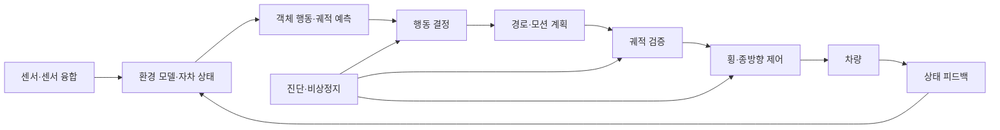
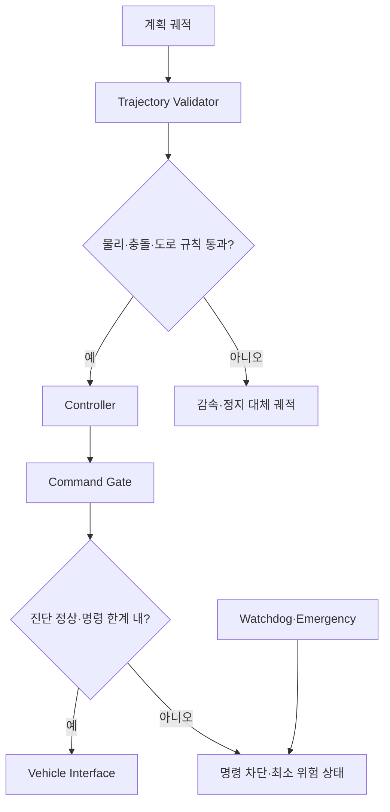

# 자율주행 결정 및 제어 알고리즘 요약 보고서

## 1. 수행 목표

센서 융합으로 생성된 환경 모델을 이용해 주변 객체의 움직임을 예측하고, 안전한 행동과 주행 궤적을 선택한 뒤 조향·가속·제동 명령으로 변환하는 기본 원리를 이해한다.

> 이 문서는 시뮬레이션과 학습용이다. Raspberry Pi 4와 예제 코드를 실제 차량의 안전 제어기로 사용하거나 실제 차량 CAN에 임의 제어 명령을 전송해서는 안 된다.

---

## 2. 전체 폐루프 구조



### 단계별 역할

| 단계 | 질문 | 입력 | 출력 |
|---|---|---|---|
| 예측 | 주변 객체는 어디로 움직이는가? | Track, 지도, 신호 | 복수의 예상 궤적과 확률 |
| 행동 결정 | 차량은 무엇을 해야 하는가? | 환경·교통규칙·목표 | 유지, 추종, 정지, 회피, 차선 변경 |
| 경로 계획 | 공간상 어디로 이동하는가? | 지도, 장애물, 행동 | `x, y, yaw` 경로 |
| 모션 계획 | 언제 어떤 속도로 이동하는가? | 경로, 동역학, 제한 | 위치·속도·가속도가 포함된 궤적 |
| 제어 | 궤적을 어떻게 따라가는가? | 목표 궤적, 현재 상태 | 조향·가속·제동 명령 |

```text
목표 궤적 - 현재 차량 상태
→ 추종 오차
→ 제어기
→ 차량 입력
→ 새 차량 상태
```

---

## 3. 입력 환경 모델

결정·계획 계층은 원시 센서보다 정제된 환경 모델을 입력으로 사용한다.

```text
차선·도로 경계
객체 종류·위치·속도·예상 궤적
신호등·정지선·제한속도
자차 위치·속도·가속도·Yaw
센서 신뢰도·공분산·고장 상태
```

오래된 객체나 위치 추정이 불안정한 상태로 계획을 계속하면 안전한 궤적처럼 보여도 실제 위치에서는 충돌할 수 있다. 모든 입력에 Timestamp, 좌표계, 유효 상태와 불확실성이 필요하다.

---

## 4. 객체 의도와 궤적 예측

예측 대상은 차선 유지·변경, 회전, 감속·정지, 보행자 횡단, 합류와 끼어들기 등이다.

| 방식 | 강점 | 한계 |
|---|---|---|
| 규칙 기반 | 해석과 검증이 쉬움 | 복잡한 상호작용 표현 제한 |
| HMM·Bayesian | 행동 확률 표현 | 상태·전이 모델 설계 필요 |
| LSTM·GRU | 시간 순서의 궤적 처리 | 장기·다중 객체 관계 제한 |
| Transformer | 장기 관계와 다중 객체 처리 | 연산량과 학습 데이터 요구 |
| GNN | 객체 간 상호작용 표현 | 그래프 구성과 실시간성 고려 |
| 생성 모델 | 여러 미래 궤적 생성 | 확률 보정과 안전 검증 필요 |

교차로나 차선 변경 상황에서는 미래를 하나로 고정하지 않고 여러 경로와 확률로 유지한다.

```text
차선 유지 0.60
차선 변경 0.30
감속      0.10
```

계획기는 가장 확률이 높은 경로만 고려하지 않고 낮은 확률이라도 충돌 피해가 큰 가설을 안전 제약에 포함해야 한다.

---

## 5. 행동 결정

### 5.1 대표 방식

| 방법 | 구조 | 적합한 상황 |
|---|---|---|
| FSM | 상태와 전이 조건 | 명확한 주행 모드와 단순 시나리오 |
| Behavior Tree | 조건·행동의 계층적 우선순위 | 기능 조합과 비상 행동 |
| 비용 기반 | 후보 행동의 비용 비교 | 안전·진행·승차감의 균형 |
| MDP | 상태·행동·전이·보상 | 불확실한 순차 결정 |
| 강화학습 | 상호작용으로 정책 학습 | 복잡한 전략 연구·시뮬레이션 |

FSM 예:

```text
LANE_KEEP ↔ FOLLOW
     ↓         ↓
LANE_CHANGE  STOP
     └──→ EMERGENCY
```

비용 기반 결정:

```text
Total Cost =
Safety + Rule + Progress + Comfort + Energy
```

안전 제약을 위반한 후보는 높은 비용을 주는 것만으로 끝내지 않고 **선택 후보에서 먼저 제외**하는 것이 바람직하다.

강화학습·학습 기반 행동은 복잡한 전략을 만들 수 있지만, 학습하지 않은 상황과 보상 함수의 허점을 고려해 독립적인 규칙·충돌 검사 계층이 필요하다.

---

## 6. 경로와 모션 계획

### 6.1 전역 경로

| 알고리즘 | 특징 |
|---|---|
| Dijkstra | 비음수 비용 그래프에서 최단 경로, 탐색 범위가 넓을 수 있음 |
| A* | `f(n)=g(n)+h(n)`으로 목표 방향을 이용해 탐색 |
| Hybrid A* | `x, y, yaw`와 차량 회전반경을 반영 |

전역 계획은 목적지까지의 도로·차선 연결을 결정하며, 즉각적인 장애물 회피는 지역 계획이 담당한다.

### 6.2 지역 경로·모션 계획

| 알고리즘 | 핵심 | 장점 | 한계 |
|---|---|---|---|
| RRT/RRT* | 상태 공간에서 Tree 확장 | 복잡한 자유 공간 | 경로 불규칙·실행 편차 |
| Lattice | 여러 후보 궤적 생성·평가 | 차량 제약과 비용 반영 | 후보 설계와 계산량 |
| Frenet | 도로 진행 `s`, 횡방향 `d` | 차선 유지·변경 표현 용이 | 기준선 품질과 복잡한 도로 |
| 최적화 기반 | 비용 최소화와 제약조건 | 매끄러운 궤적 | 초기값·Solver·계산시간 |

후보 궤적 비용 예:

```text
장애물 위험 + 차선 오차 + 곡률
+ 조향 변화 + 속도 오차 + 가속도 + Jerk
```

모션 계획 결과에는 시간 정보가 포함되어야 한다.

```text
trajectory point =
(time, x, y, yaw, velocity, acceleration, curvature)
```

---

## 7. 충돌 방지와 궤적 검증

### 7.1 TTC와 정지거리

```text
TTC = 상대 거리 / 접근 속도
정지거리 = 반응거리 + 제동거리
제동거리 근사 d ≈ v² / (2a)
```

TTC는 빠른 위험 지표이지만 횡방향 운동, 차량 크기, 곡선 경로와 제동 지연을 충분히 반영하지 못한다.

### 7.2 시간 기반 Footprint 검사

```text
후보 자차 궤적
+ 객체별 복수 예상 궤적
→ 시간별 Footprint 계산
→ 겹침·최소 거리 검사
→ 위험 후보 제거
→ 감속·정지·회피 선택
```

궤적 Validator는 계획기와 독립적으로 다음을 확인한다.

- 충돌과 도로 경계 이탈
- 최대 곡률·조향각·조향 변화율
- 속도·가속도·감속도·Jerk 한계
- 궤적 Timestamp와 연속성
- 계획 실패·NaN·빈 궤적

---

## 8. 차량 모델

저속 경로 추종에는 Kinematic Bicycle Model을 사용할 수 있다.

```text
ẋ   = v cos(ψ)
ẏ   = v sin(ψ)
ψ̇   = v/L × tan(δ)
```

- `v`: 차량 속도
- `ψ`: 차량 Yaw
- `L`: 휠베이스
- `δ`: 조향각

고속·저마찰 영역에서는 타이어 Slip, 횡속도와 Yaw 동역학을 포함한 모델이 필요하다. 모델 정확도와 계산량 사이의 절충이 중요하다.

---

## 9. 횡방향 제어

| 제어기 | 원리 | 장점 | 주의점 |
|---|---|---|---|
| Pure Pursuit | 전방 Look-ahead 점 추종 | 단순, 저속 구현 용이 | Look-ahead 설정과 고속 곡선 |
| Stanley | Heading·횡오차 결합 | 경로 오차 직접 보정 | 저속 분모 처리와 Gain 튜닝 |
| LQR | 상태·제어 비용 최소화 | 모델 기반 안정적 제어 | 선형화·Q/R 튜닝 |
| MPC | 미래 구간 최적화 | 제약조건과 미래 경로 반영 | 계산량, Solver와 최악 시간 |

Pure Pursuit의 단순 형태:

```text
δ = atan(2L sin(α) / Ld)
```

- `Ld`: Look-ahead 거리
- `α`: 차량 진행 방향과 목표점 방향 차이

속도가 높을 때 Look-ahead를 증가시키면 제어가 부드러워질 수 있으나, 너무 크면 곡선 추종 오차가 커지고 너무 작으면 조향이 진동할 수 있다.

MPC는 매 제어 주기에 미래 상태와 입력을 최적화하고 첫 입력만 적용한 뒤 다음 주기에 다시 계산한다. 조향각·변화율 같은 제약을 포함할 수 있지만 Deadline 안에 항상 해를 내는지 검증해야 한다.

---

## 10. 종방향 제어

PID 속도 제어:

```text
e(t) = 목표 속도 - 현재 속도
u(t) = Kp·e + Ki·∫e dt + Kd·de/dt
```

| 항 | 역할 | 과도할 때 |
|---|---|---|
| P | 현재 오차 보정 | 진동·Overshoot |
| I | 정상상태 오차 제거 | Windup |
| D | 빠른 변화 억제 | 노이즈 증폭 |

실제 종방향 제어는 다음 구조가 유용하다.

```text
목표 가속도 Feedforward
+ 속도·가속도 오차 Feedback
→ 가속/제동 명령
→ Saturation·Rate Limit·Anti-windup
```

가속기와 브레이크의 응답 지연과 비대칭, 도로 경사와 차량 질량 변화를 고려한다.

---

## 11. 학습용 결정·제어 예제

아래 코드는 TTC로 목표 속도를 결정하고, PID로 가속도를 계산하는 최소 예이다. 실제 차량 명령은 출력하지 않는다.

```python
from math import inf


def ttc(distance_m: float, closing_speed_mps: float) -> float:
    return inf if closing_speed_mps <= 0 else distance_m / closing_speed_mps


def target_speed(distance_m: float, closing_speed_mps: float) -> tuple[str, float]:
    risk = ttc(distance_m, closing_speed_mps)
    if risk < 2.5:
        return "STOP", 0.0
    if risk < 5.0:
        return "SLOW_DOWN", 3.0
    return "CRUISE", 8.0


class PID:
    def __init__(self, kp: float, ki: float, kd: float) -> None:
        self.kp, self.ki, self.kd = kp, ki, kd
        self.integral = 0.0
        self.previous = 0.0

    def update(self, error: float, dt: float) -> float:
        self.integral = max(-10.0, min(10.0, self.integral + error * dt))
        derivative = (error - self.previous) / dt
        self.previous = error
        output = self.kp * error + self.ki * self.integral + self.kd * derivative
        return max(-5.0, min(2.0, output))
```

한계:

- TTC가 횡방향 움직임과 차량 크기를 반영하지 않음
- 제동거리, 노면 마찰, 제동 지연과 객체 궤적이 없음
- 실제 가속·제동 장치 모델과 명령 승인 계층이 없음
- 독립 비상정지와 Watchdog가 없음

---

## 12. 임베디드 Linux와 ROS 2 구조

```text
/perception/objects
/localization/kinematic_state
        ↓
/prediction/objects
        ↓
/planning/trajectory
        ↓
Trajectory Validator
        ↓
/control/command
        ↓
Command Gate → Vehicle Interface
        ↑
/vehicle/status  /system/diagnostics
```

구현 원칙:

- 메시지에 Timestamp, Frame ID, Sequence와 유효 상태 포함
- 궤적·차량 상태는 오래된 Queue가 쌓이지 않도록 작은 Queue 검토
- QoS Reliability, Deadline과 Lifespan을 기능 요구로 설정
- 제어 Loop와 비실시간 로그를 분리
- Heartbeat, Watchdog와 통신 Timeout 감시
- Control Command Gate에서 조향·가감속 한계와 승인 상태 검사
- 수동 운전자 입력과 비상정지를 최우선으로 처리

Autoware의 모듈형 구성은 행동 경로·속도 계획, 모션 계획, 궤적 검증, 횡·종방향 제어와 명령 게이트를 분리해 단계별 시험과 원인 분석을 가능하게 한다.

---

## 13. 시뮬레이션 검증

CARLA 같은 시뮬레이터에서 도로, 교차로, 차량·보행자, 날씨, 센서와 제어 입력을 반복 시험할 수 있다.

```text
Scenario 정의
→ 센서·Ground Truth 생성
→ 예측·결정·계획·제어 실행
→ 충돌·오차·지연 기록
→ 실패 원인 분석
→ 알고리즘 회귀시험
```

필수 시나리오:

- 정지 장애물과 저속 선행 차량
- 갑작스러운 끼어들기와 보행자 횡단
- 차선 변경 차량과 신호등 정지
- 차선 소실, 위치 오차와 객체 예측 오류
- 센서 Timeout, 통신 지연과 CPU 과부하
- 젖은 노면, 낮은 마찰과 제동 성능 변화

시뮬레이션은 위험 상황을 반복할 수 있지만 실제 센서 노이즈, 타이어·제동 동역학과 하드웨어 지연을 완전히 재현하지 못하므로 실제 시험을 대체하지 않는다.

---

## 14. 성능 평가

| 영역 | 지표 |
|---|---|
| 예측 | ADE/FDE, 의도 분류 정확도, 확률 보정 |
| 계획 | 성공률, 계산시간, 최소 장애물 거리, 곡률, Jerk |
| 횡제어 | 횡오차, Heading 오차, 조향 진동 |
| 종제어 | 속도·정지 위치 오차, Overshoot, Settling Time |
| 실시간 | End-to-End Latency, 최대 지연, Jitter, Deadline Miss |
| 시스템 | CPU·메모리, 온도, Throttling, 장시간 안정성 |
| 안전 | 충돌률, 최소 TTC, 기능 제한·비상정지 성공률 |

계획이 매 주기 다른 좌우 후보를 선택하는 진동 현상도 평가한다. Hysteresis, 이전 궤적과의 차이 비용, 상태 전이 조건으로 안정화할 수 있다.

---

## 15. 안전 계층과 실패 대응



필수 보호 장치:

- 독립 충돌 검사기와 계획 결과 Validator
- 조향각·변화율, 가속도·감속도·Jerk 제한
- 입력·궤적의 Timestamp와 Timeout 검사
- Watchdog, Heartbeat와 Deadline 감시
- 센서·위치·계획 실패 시 보수적 감속 또는 최소 위험 상태
- Manual Override와 독립 비상정지

AI가 생성한 Waypoint나 궤적도 동일한 물리·교통규칙·충돌 검사를 통과해야 한다.

---

## 16. 발전 방향

- 여러 가능한 미래와 확률을 출력하는 Multi-modal Prediction
- BEV·Occupancy를 계획과 직접 연결하는 중간 표현
- 신경망이 후보·비용을 만들고 기존 최적화·안전 계층이 검증하는 혼합 구조
- 학습 기반 Planner와 궤적 Safety Filter
- V2X 정보를 이용한 가려진 위험과 교통 흐름 예측
- 중앙 차량 컴퓨터와 가속기 기반 통합 처리

학습 기반 기술은 데이터 범위, 불확실성, 설명 가능성, 사이버보안과 학습 분포 밖 상황을 별도로 검증해야 한다.

---

## 17. 결론

자율주행 결정과 제어는 환경 모델을 바탕으로 주변 객체의 미래를 예측하고, 행동과 궤적을 선택한 뒤 차량 입력으로 변환하는 폐루프 과정이다.

전역 계획은 목적지까지의 도로 경로를 찾고, 지역 모션 계획은 장애물과 차량 제약을 고려한 시간 궤적을 만든다. Pure Pursuit·Stanley·LQR·MPC는 횡방향 추종에, PID와 Feedforward는 종방향 속도·가속도 제어에 사용할 수 있다.

알고리즘 성능만으로 안전이 보장되지는 않는다. 궤적 Validator, 명령 Gate, Timeout, Watchdog, 물리 한계, 독립 비상정지와 수동 개입 구조가 함께 필요하다. 검증은 정확도와 평균시간뿐 아니라 최악 지연, 실패 시나리오와 최소 위험 상태까지 포함해야 한다.

---

## 18. 참고 자료

- [Autoware Planning Components](https://autowarefoundation.github.io/autoware_universe/main/planning/)
- [Autoware Behavior Path Planner](https://autowarefoundation.github.io/autoware_universe/main/planning/behavior_path_planner/autoware_behavior_path_planner/)
- [Autoware MPC Lateral Controller](https://autowarefoundation.github.io/autoware_universe/main/control/autoware_mpc_lateral_controller/)
- [Autoware Trajectory Follower](https://autowarefoundation.github.io/autoware_universe/main/control/autoware_trajectory_follower_node/)
- [ROS 2 Quality of Service](https://docs.ros.org/en/rolling/Concepts/Intermediate/About-Quality-of-Service-Settings.html)
- [CARLA Simulator Documentation](https://carla.readthedocs.io/en/latest/)
