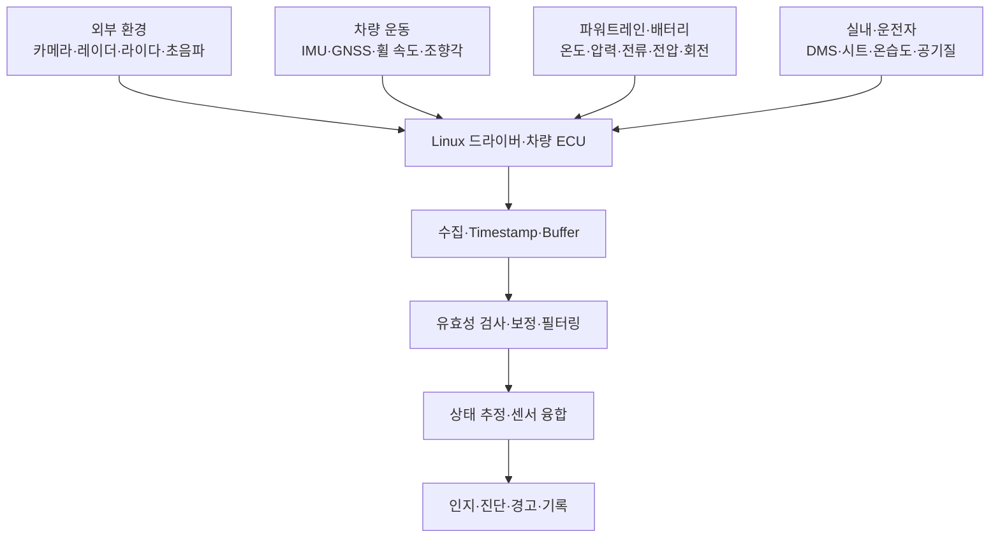
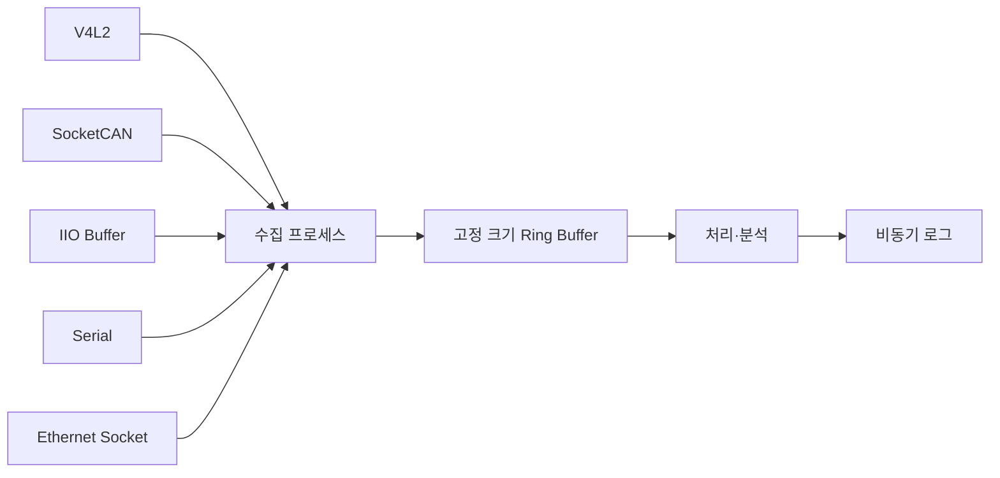

# 차량용 센서 데이터 요약 보고서

## 1. 수행 목표

차량의 외부 환경, 운동 상태, 파워트레인·배터리 및 실내 상태를 측정하는 센서의 종류와 데이터 특성을 이해하고, 임베디드 리눅스에서 데이터를 수집·검증·처리하는 전체 흐름을 정리한다.

> Raspberry Pi 4는 센서 수집과 알고리즘 학습용 장치로 사용한다. 검증되지 않은 장치로 실제 차량의 조향·제동을 제어하거나 실제 차량 CAN에 임의의 제어 프레임을 보내지 않는다.

---

## 2. 차량 센서 시스템 구조



센서 데이터는 값 하나만으로 완전하지 않다. 단위, 측정 시각, 유효 상태와 오류 정보를 함께 관리해야 올바르게 해석할 수 있다.

```text
sensor_id, value, unit, capture_timestamp,
receive_timestamp, sequence, validity,
error_code, confidence, frame_id
```

---

## 3. 센서 종류와 데이터 특성

### 3.1 외부 환경 센서

| 센서 | 주요 데이터 | 강점 | 한계 | 활용 |
|---|---|---|---|---|
| 카메라 | 픽셀, 영상 크기, 노출, Timestamp | 객체·차선·표지 분류 | 조명, 날씨, 렌즈 오염, 큰 연산량 | 인식, 차선, 주차, DMS |
| 레이더 | 거리, 방위각, 상대속도, 반사 강도 | 속도·중장거리 측정 | 세부 형상 분류, 다중 반사 | ACC, AEB, 사각지대 |
| 라이다 | XYZ, 거리, 반사 강도, Point 시각 | 정밀한 3D 공간 | 비용, 데이터량, 날씨·오염 | 장애물, 지면, 정밀 위치 |
| 초음파 | 근거리 거리, 반사 상태, 온도 | 저비용 근접 감지 | 짧은 범위, 표면 각도·온도 영향 | 주차, 저속 장애물 |

### 3.2 차량 운동과 위치 센서

| 센서 | 주요 데이터 | 활용 및 주의점 |
|---|---|---|
| IMU | 3축 가속도, Roll/Pitch/Yaw 각속도 | 자세·급가감속·선회 측정. 빠르지만 Bias와 적분 오차가 누적됨 |
| GNSS | 위도·경도·고도, 속도, UTC, Fix 상태 | 전역 위치 제공. 터널과 도심 다중경로에서 성능 저하 |
| 휠 속도 | 바퀴별 속도·방향 | ABS, TCS, ESC, 자차 속도 추정 |
| 조향각 | 핸들 각도·각속도 | 차선 유지, 자세 제어, 주차 |
| Yaw Rate | 차량 회전 속도 | 선회 상태와 미끄럼 판단 |

IMU는 고주기 운동 변화를 잘 포착하고 GNSS는 장기적인 전역 기준을 제공하므로 함께 융합하면 상호 보완할 수 있다.

### 3.3 파워트레인과 전동화 센서

| 분류 | 측정 위치·값 | 주요 목적 |
|---|---|---|
| 온도 | 냉각수, 오일, 흡·배기, 모터, 인버터, 배터리 | 열관리, 출력 제한, 부품 보호 |
| 압력 | 흡기, 연료, 오일, 브레이크, 타이어, 냉매 | 분사·제동·공조·고장 진단 |
| 위치·회전 | 크랭크/캠, 페달, 스로틀, Rotor, 변속기 | 회전 동기화와 토크·구동 제어 |
| 전류·전압 | 셀/Pack, DC Link, 충·방전 전류 | SOC·SOH, 출력 제한, 과전압·누설 보호 |

전류 적산을 이용한 단순 SOC 변화는 다음과 같이 표현할 수 있다.

```text
SOC(k) = SOC(k-1) - 전류 × 시간 / 배터리 용량
```

실제 BMS에서는 전류 센서 오차, 충·방전 효율, 온도, 셀 특성과 전압 기반 보정을 함께 사용한다.

### 3.4 실내와 운전자 센서

- 운전자 카메라: 눈 개폐, 시선, 머리 자세, 졸음·주의 분산
- 시트·벨트 센서: 탑승 여부, 시트 압력, 안전벨트 상태
- 환경 센서: 온습도, CO₂, 공기질, 일사량
- 활용: 운전자 경고, 에어백 판단, HVAC, 김서림 방지와 쾌적성 제어

---

## 4. 센서 데이터율과 처리 특성

| 데이터 | 일반적 특성 | 핵심 처리 과제 |
|---|---|---|
| 카메라 | 대용량 연속 Frame | 복사 최소화, Frame Drop 관리 |
| 레이더 | Detection 또는 객체 목록 | CAN/Ethernet 디코딩, 객체 추적 |
| 라이다 | 대규모 Point Cloud | 대역폭, 패킷 손실, Downsampling |
| IMU | 고주기·소량 | 정확한 Timestamp, Bias 보정 |
| GNSS | 상대적으로 저주기 | Fix 품질, 끊김과 다중경로 |
| 차량 CAN | 작은 Payload의 다수 신호 | DBC, Bit/Byte order, Timeout |
| 온도·압력 | 저주기·느린 변화 | Drift, 단선·단락 진단 |
| 전류·전압 | 제어 목적에 따라 고주기 | 영점·Gain 보정, 안전 한계 |

---

## 5. 임베디드 리눅스 통합

| 센서/통신 | Linux 인터페이스 | 대표 장치·도구 |
|---|---|---|
| USB·CSI 카메라 | V4L2 | `/dev/videoX`, `v4l2-ctl` |
| CAN·CAN FD | SocketCAN | `can0`, `ip`, `candump`, `cansend` |
| IMU·아날로그 센서 | IIO | `/dev/iio:deviceX`, sysfs |
| GNSS·직렬 센서 | UART/USB Serial | `/dev/ttyUSBX`, `/dev/serial0` |
| 레이더·라이다 | Ethernet UDP/TCP | socket, `tcpdump`, `ip -s link` |



### 5.1 카메라: V4L2

```bash
v4l2-ctl --list-devices
v4l2-ctl -d /dev/video0 --list-formats-ext
```

V4L2는 장치 제어, 형식 협상과 스트리밍 버퍼 API를 제공한다. 실시간 영상은 MMAP 또는 DMABUF를 검토해 불필요한 메모리 복사를 줄인다.

### 5.2 CAN: SocketCAN

```bash
sudo ip link set can0 up type can bitrate 500000
candump can0
```

CAN Payload를 물리값으로 변환하는 과정은 다음과 같다.

```text
CAN ID 확인
→ Bit 추출
→ Byte Order와 부호 적용
→ 물리값 = Raw × Scale + Offset
→ 범위·상태·Timeout 검사
```

실제 차량 신호에는 DBC 또는 제조사 정의가 필요하다. 일반 CAN Frame보다 큰 진단 메시지는 목적에 따라 ISO-TP 같은 전송 계층을 사용할 수 있다.

### 5.3 IMU: IIO

```bash
ls /sys/bus/iio/devices/
ls /dev/iio:device*
```

IIO Triggered Buffer를 사용하면 여러 센서 채널을 묶어 읽을 수 있어 시스템 호출과 CPU 부하를 줄일 수 있다.

### 5.4 GNSS와 Ethernet 센서

```bash
# GNSS
stty -F /dev/ttyUSB0 115200
cat /dev/ttyUSB0

# Ethernet
ip -s link
tcpdump -i eth0
```

GNSS는 NMEA/바이너리 패킷의 Checksum과 Fix 상태를 검사한다. Ethernet 센서는 IP, 포트, MTU, 수신 버퍼, 패킷 Sequence, Timestamp와 Packet Loss를 관리한다.

---

## 6. 데이터 처리 알고리즘

### 6.1 공통 파이프라인

```text
수집
→ Frame·CRC·Checksum 검사
→ Timestamp·Sequence 검사
→ 범위·상태·Timeout 검사
→ 단위 변환·보정
→ 필터링
→ 좌표 변환
→ 상태 추정·융합
→ 경고·진단·기록
```

### 6.2 유효성 검사

- 최소·최대 범위와 비정상 변화율
- NaN, 예약값과 상태 비트
- Timestamp 역전과 허용 지연 초과
- Sequence 누락, CAN Timeout, Frame Drop과 Packet Loss
- CRC/Checksum 오류
- 센서 값이 변하지 않는 Stuck 상태

무효 데이터는 정상값으로 위장해 제어에 전달하지 않고, 오류 상태와 마지막 정상 시각을 함께 보고한다.

### 6.3 보정과 필터링

```text
Physical Value = Raw × Scale + Offset
```

| 처리 | 적합한 용도 | 주의점 |
|---|---|---|
| 이동평균 | 단순 노이즈 감소 | 창 크기만큼 응답 지연 |
| 저역통과 필터 | 고주파 노이즈 완화 | 강한 필터는 급격한 변화 지연 |
| 중앙값 필터 | 순간 Spike 제거 | 창 크기와 계산량 고려 |
| Kalman Filter | 위치·속도·SOC 상태 추정 | 모델과 Noise 파라미터 필요 |

1차 저역통과 필터:

```text
y(k) = α × x(k) + (1 - α) × y(k-1)
```

`α`가 크면 변화에 빠르게 반응하고, 작으면 부드럽지만 지연이 커진다.

### 6.4 시간과 좌표 정렬

센서가 같은 객체를 보더라도 측정 시각과 장착 위치가 다르다.

```text
P_vehicle = R × P_sensor + T
```

- `R`: 센서 축에서 차량 축으로의 회전
- `T`: 센서 장착 위치의 이동
- 시간 동기화: Hardware Timestamp, PTP, GNSS PPS, Trigger, Clock Offset 보정
- 캡처 시각과 호스트 수신 시각을 반드시 구분

---

## 7. 학습용 데이터 처리 예제

다음 코드는 휠 속도 Frame의 상태·범위·시간·Sequence를 검사한 뒤 저역통과 필터를 적용한다.

```python
from dataclasses import dataclass


@dataclass(frozen=True)
class SensorFrame:
    timestamp: float
    sequence: int
    speed_kph: float
    valid: bool = True


class SpeedProcessor:
    def __init__(self, alpha: float = 0.3) -> None:
        self.alpha = alpha
        self.filtered: float | None = None
        self.last_time: float | None = None
        self.last_seq: int | None = None

    def process(self, frame: SensorFrame) -> float | None:
        if not frame.valid or not 0.0 <= frame.speed_kph <= 300.0:
            return None
        if self.last_time is not None and frame.timestamp <= self.last_time:
            return None
        if self.last_seq is not None and frame.sequence != self.last_seq + 1:
            print("sequence gap")

        self.filtered = (
            frame.speed_kph if self.filtered is None else
            self.alpha * frame.speed_kph
            + (1.0 - self.alpha) * self.filtered
        )
        self.last_time = frame.timestamp
        self.last_seq = frame.sequence
        return self.filtered
```

실제 시스템에서는 단위, Timeout, CRC, 센서 고장 진단, 오류 누적 횟수와 복구 조건을 추가한다.

---

## 8. 실시간 성능과 Linux 최적화

```text
전체 지연 =
측정 + 전송 + Queue + 전처리 + 추론 + 융합 + 출력
```

| 평가 영역 | 지표 |
|---|---|
| 데이터 품질 | 정확도, 정밀도, Bias, Noise, Drift, Missing Rate |
| 실시간성 | End-to-End Latency, 최대 지연, Jitter, Deadline Miss |
| 전송 | Frame Drop, Packet Loss, CAN Error |
| 자원 | CPU, 메모리, 네트워크, 저장 공간, 온도 |
| 안정성 | 장시간 실행, 센서 재연결, 고장 복구 |

최적화 방법:

- 센서 수집·처리·로그 Thread 분리
- 고정 크기 Ring Buffer와 오래된 Frame 폐기 정책
- MMAP, DMABUF, DMA 등 복사 감소
- GPU·NPU·ISP 활용
- 로그를 실시간 처리 경로에서 분리
- CPU Affinity와 PREEMPT_RT는 최악 실행시간과 Blocking을 측정한 뒤 적용
- CPU 온도와 Throttling 감시

우선순위를 높이는 것만으로 실시간성과 안전성이 보장되지는 않는다. 평균값보다 최악 지연과 Deadline Miss를 확인해야 한다.

---

## 9. 고장 시험과 Fail-safe

| 시험 조건 | 기대 동작 |
|---|---|
| CAN Timeout·Frame 누락 | 신호 무효 처리, 진단 기록 |
| GNSS 단절 | IMU 기반 단기 추정 후 신뢰도 감소 |
| 카메라 Frame Drop | 짧은 Track 유지 또는 기능 제한 |
| 값 범위 초과·Stuck | 해당 데이터 제외 |
| Timestamp 지연 | 융합 제외 또는 시간 보정 |
| CPU 과부하 | 오래된 Frame 폐기, 비필수 기능 제한 |
| 센서 분리·재연결 | 안전 상태 전환 후 검증된 자동 복구 |
| 저장 공간 부족 | 실시간 기능 보호, 기록 제한·경고 |

```text
고장 감지
→ 데이터 무효화
→ 대체 센서·제한 모드
→ 운전자 또는 상위 ECU에 상태 보고
→ 진단 로그
→ 복구 조건 확인
```

---

## 10. Raspberry Pi 4 실습 범위

가능한 실습:

- 가상 CAN으로 SocketCAN 수신·디코딩 시험
- 녹화 영상 또는 USB 카메라의 V4L2 수집
- IMU 기록 데이터의 필터와 Bias 보정
- Timestamp·Sequence·Timeout 검사
- 센서 로그 재생과 지연·누락 통계

가상 CAN:

```bash
sudo modprobe vcan
sudo ip link add dev vcan0 type vcan
sudo ip link set vcan0 up
candump vcan0
```

다른 터미널:

```bash
cansend vcan0 123#0102030405060708
```

실제 레이더·라이다·차량 CAN 통합과 조향·제동 검증은 센서 사양, 차량 네트워크 정의와 전문 폐쇄 시험 환경이 필요하다.

---

## 11. 발전 방향

- 고해상도 카메라, Imaging Radar와 고채널 라이다
- 센서 Feature Fusion과 Bird's-Eye View/Occupancy 표현
- 센서 불확실성 추정과 고장 센서 자동 제외
- 분산 ECU에서 중앙 차량 컴퓨터로의 통합
- Automotive Ethernet, TSN과 PTP 기반 고속·시간 결정적 통신
- 실제 센서 대신 노면 마찰, SOC·SOH, 타이어 상태 등을 추정하는 가상 센서

센서의 고해상도화는 인식 성능을 높이지만 대역폭, 전력, 열, 사이버보안과 고장 격리 요구도 함께 증가시킨다.

---

## 12. 결론

차량용 센서는 주변 객체만이 아니라 차량 운동, 동력계, 배터리, 실내 환경과 운전자 상태까지 측정한다. 센서별 데이터율과 실패 형태가 다르기 때문에 공통 데이터 구조, Timestamp, 유효 상태와 오류 코드를 함께 관리해야 한다.

임베디드 리눅스에서는 V4L2, SocketCAN, IIO, Serial과 Ethernet Socket을 통해 센서를 통합할 수 있다. 데이터는 Frame 검사, 보정, 필터링, 시간·좌표 정렬과 상태 추정을 거친 뒤 인지·진단·경고에 사용된다.

정확한 센서라도 늦거나 잘못 정렬된 데이터는 위험하다. 따라서 정확도뿐 아니라 최대 지연, Jitter, 누락, Timeout, 센서 고장과 복구 동작을 포함해 평가해야 한다.

---

## 13. 참고 자료

- [Linux Kernel V4L2 API](https://docs.kernel.org/userspace-api/media/v4l/v4l2.html)
- [Linux Kernel SocketCAN](https://docs.kernel.org/networking/can.html)
- [Linux Kernel Industrial I/O](https://docs.kernel.org/iio/index.html)
- [Linux Kernel ISO-TP](https://docs.kernel.org/networking/iso15765-2.html)
- [Automotive Grade Linux](https://www.automotivelinux.org/)
