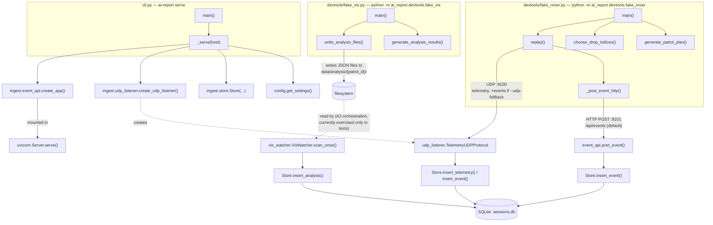

# A1 call map

Which function calls which, and who runs each module. This documents the
code as built in Phase A1 (`ingest/` + `devtools/`); it will grow as A2+
(`pipeline/`, `llm/`, `render/`, `storage/`) lands. See `../02-ai-subsystem-spec.md`
§2 for the intended full module layout and `../CALL_MAP.md`'s sibling docs
for the contracts these modules implement.

## Two runtime processes, one shared package

A1 has two independent ways to run the ingest path, both importing the same
`ai_report` code:

1. **The real server** — `ai_report.cli` (`ai-report serve` / `python -m
   ai_report.cli serve`). Long-running: listens for real DR traffic.
2. **The test/devtool path** — `devtools/fake_rover.py` and
   `devtools/fake_vis.py` run as short-lived scripts that either talk to a
   running server over the network, or (in tests) drive the same listener
   objects in-process on an ephemeral port.

## Per-module function reference

Each row: what the function does in one line, what it calls, and what
calls it. "Framework callback" means asyncio/FastAPI invokes it — nothing
in this codebase calls it directly.

### `config.py`

| Function | Calls | Called by |
|---|---|---|
| `Settings.sqlite_path` (property) | — | `cli.py::_serve` |
| `get_settings()` | `Settings()` | `cli.py::_serve`, `devtools/fake_rover.py::main`, `devtools/fake_vis.py::main` |

### `models.py`

Not "called" so much as constructed/parsed. See the module docstring in
`models.py` for the full producer/consumer list per model. Summary:

| Model / function | Constructed by | Parsed by |
|---|---|---|
| `TelemetryPacket`, `EnvReading`, `DriveReading` | `devtools/fake_rover.py::generate_patrol_plan` | `ingest/udp_listener.py::TelemetryUDPProtocol._handle` |
| `EventMessage` | `devtools/fake_rover.py::generate_patrol_plan`; `ingest/store.py::Store.events_for_patrol` (from DB rows) | `ingest/udp_listener.py::_handle` (UDP fallback); `ingest/event_api.py::post_event` (FastAPI, HTTP body) |
| `AnalysisResult`, `Detection` | `devtools/fake_vis.py::generate_analysis_results` | `ingest/vis_watcher.py::VisWatcher.scan_once` |
| `_validate_patrol_id` | — | Pydantic calls it automatically for every `patrol_id` field |
| `Detection._confidence_required_unless_undetermined` | — | Pydantic calls it automatically after `Detection` validation |

### `ingest/store.py`

| Function | Calls | Called by |
|---|---|---|
| `Store.__init__` | `sqlite3.connect`, executes `_SCHEMA` | `cli.py::_serve`; every test via `tests/conftest.py::store` |
| `Store.close` | — | `cli.py::_serve` (`finally`); test teardown |
| `Store.insert_telemetry` | — | `udp_listener.py::TelemetryUDPProtocol._handle` |
| `Store.insert_event` | — | `udp_listener.py::_handle` (UDP fallback); `event_api.py::post_event` (HTTP) |
| `Store.insert_analysis` | — | `vis_watcher.py::VisWatcher.scan_once` |
| `Store.received_telemetry_seqs` | — | `Store.loss_rate`; tests |
| `Store.max_telemetry_seq` | — | `Store.loss_rate` |
| `Store.loss_rate` | `max_telemetry_seq`, `received_telemetry_seqs` | `tests/test_a1_acceptance.py` (the phase-done check); future `pipeline/aggregate.py` (A2) |
| `Store.events_for_patrol` | — | tests; future `pipeline/segment.py` (A2) |
| `Store.analysis_count` | — | tests |

### `ingest/udp_listener.py`

| Function | Calls | Called by |
|---|---|---|
| `TelemetryUDPProtocol.__init__` | — | the factory lambda inside `create_udp_listener` |
| `.connection_made` | — | asyncio (framework callback) |
| `.datagram_received` | `._handle` | asyncio (framework callback) |
| `.error_received` | — | asyncio (framework callback) |
| `._handle` | `._parse_json`, `TelemetryPacket.model_validate`, `EventMessage.model_validate`, `Store.insert_telemetry`, `Store.insert_event` | `.datagram_received` |
| `._parse_json` | — | `._handle` |
| `create_udp_listener` | `loop.create_datagram_endpoint` | `cli.py::_serve`; `tests/test_udp_listener.py`; `tests/test_a1_acceptance.py` |

### `ingest/event_api.py`

| Function | Calls | Called by |
|---|---|---|
| `create_app` | `FastAPI()` | `cli.py::_serve`; `tests/test_event_api.py` |
| `post_event` (inner handler) | `Store.insert_event` | FastAPI routing (framework callback), triggered by `devtools/fake_rover.py::_post_event_http` in real use or `TestClient` in tests |

### `ingest/vis_watcher.py`

| Function | Calls | Called by |
|---|---|---|
| `VisWatcher.__init__` | — | tests; intended future A2 orchestration |
| `.scan_once` | `AnalysisResult.model_validate`, `Store.insert_analysis` | `.watch`; tests directly |
| `.watch` | `.scan_once` | tests directly; intended future A2 orchestration (on `PATROL_END`) |

### `cli.py`

| Function | Calls | Called by |
|---|---|---|
| `_serve` | `get_settings`, `Store`, `create_udp_listener`, `create_app`, `uvicorn.Server.serve` | `main` |
| `main` | `_serve` (via `asyncio.run`) | the `ai-report` console script; `if __name__ == "__main__"` |

### `devtools/fake_rover.py`

| Function | Calls | Called by |
|---|---|---|
| `generate_patrol_plan` | constructs `EventMessage`/`TelemetryPacket`/`EnvReading`/`DriveReading` | `main`; `tests/test_fake_rover.py`; `tests/test_a1_acceptance.py` |
| `choose_drop_indices` | — | `main`; `tests/test_fake_rover.py`; `tests/test_a1_acceptance.py` |
| `_post_event_http` | `urllib.request.urlopen` | `replay` (when `udp_fallback=False`) |
| `replay` | `_post_event_http`, `socket.sendto` | `main`; `tests/test_a1_acceptance.py` |
| `build_arg_parser` | — | `main` |
| `main` | `build_arg_parser`, `get_settings`, `generate_patrol_plan`, `choose_drop_indices`, `replay` | `python -m ai_report.devtools.fake_rover` |

### `devtools/fake_vis.py`

| Function | Calls | Called by |
|---|---|---|
| `generate_analysis_results` | constructs `Detection`/`AnalysisResult` | `main`; `tests/test_fake_vis.py` |
| `write_analysis_files` | — | `main`; `tests/test_fake_vis.py` |
| `build_arg_parser` | — | `main` |
| `main` | `build_arg_parser`, `get_settings`, `generate_analysis_results`, `write_analysis_files` | `python -m ai_report.devtools.fake_vis` |

## What's not wired up yet

`VisWatcher.watch` and `Store.loss_rate` / `Store.events_for_patrol` have no
production caller yet — they exist because A1's acceptance criteria and
future A2 modules (`pipeline/segment.py`, `pipeline/aggregate.py`) need
them, but the orchestration that calls them automatically on `PATROL_END`
doesn't exist until A2. Today they're reachable only from tests and from
ad hoc scripts (as in the manual smoke test used to verify this phase).
