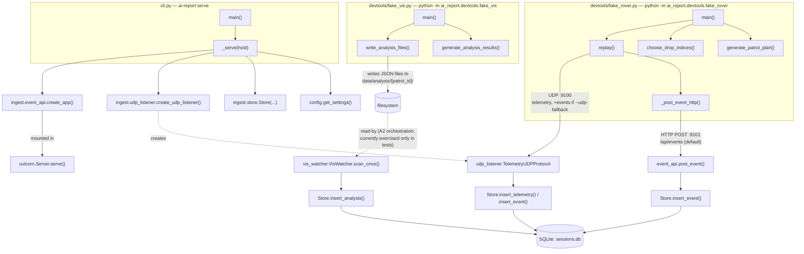

# Call map

Which function calls which, and who runs each module. Covers A1
(`ingest/` + `devtools/`), A2 (`pipeline/segment.py`, `pipeline/aggregate.py`),
A3 (`render/` + `storage/`), and A4 (`pipeline/select_images.py`,
`pipeline/payload.py`); it will grow further as `llm/` (A5) lands. See
`../02-ai-subsystem-spec.md` §2 for the intended full module layout and
`../01-interface-contracts.md` for the contracts these modules implement.

**There is still no production orchestration.** Nothing in this codebase
yet calls `segment_patrol` → `aggregate` → `apply_image_selection` →
`build_payload` → `render_report` → `write_report` automatically when a
patrol finishes (`PATROL_END` + VIS `_COMPLETE`) — that glue is a later
addition (likely `cli.py`, once the trigger condition needs watching for).
Today that whole chain is only exercised by tests and by manual scripts,
such as the one used to smoke-test A2–A4 end to end against a real running
server. See "What's not wired up yet" at the bottom.

## Two runtime processes, one shared package

A1 has two independent ways to run the ingest path, both importing the same
`ai_report` code:

1. **The real server** — `ai_report.cli` (`ai-report serve` / `python -m
   ai_report.cli serve`). Long-running: listens for real DR traffic.
2. **The test/devtool path** — `devtools/fake_rover.py` and
   `devtools/fake_vis.py` run as short-lived scripts that either talk to a
   running server over the network, or (in tests) drive the same listener
   objects in-process on an ephemeral port.

## The A2–A4 pipeline (no automatic trigger yet)

Given a `patrol_id`, this is the chain that turns ingested rows into a
report on disk. Every arrow below is a real function call once something
invokes `segment_patrol`; nothing currently does that automatically.

```mermaid
flowchart LR
    LOAD["caller loads rows via\nStore.telemetry_for_patrol() /\nevents_for_patrol() /\nanalysis_for_patrol()"]
    LOAD --> SEG["pipeline.segment.segment_patrol()"]
    SEG -->|"PatrolSegmentation"| AGG["pipeline.aggregate.aggregate()"]
    AGG -->|"PatrolAggregate\n(image_ids all [])"| SEL["pipeline.select_images.apply_image_selection()"]
    SEG -.->|"segmentation also passed in"| SEL
    SEL -->|"PatrolAggregate\n(image_ids populated)"| PAY["pipeline.payload.build_payload()"]
    SEG -.->|"segmentation also passed in\n(for obstructions)"| PAY
    SEL -->|"PatrolAggregate"| REN["render.markdown.render_report()"]
    SEG -.->|"segmentation also passed in\n(for obstruction_counts)"| REN
    REN -->|"Markdown string"| ST["storage.layout.write_report()"]
    SEL -->|"PatrolAggregate\n(for metadata.json)"| ST
    SEL -.->|"extra_writers=[...]"| COPY["select_images.copy_and_resize_images()"]
    PAY -.->|"extra_writers=[...]"| WPAY["payload.write_payload()"]
    COPY -.-> ST
    WPAY -.-> ST
    ST --> FS[("reports/{patrol_id}/\nreport.md + metadata.json\n+ payload.json + images/")]

    classDef det stroke:#10B981,stroke-width:2px
    class SEG,AGG,SEL,PAY,REN,ST det
```

Green stages match spec §1's architecture diagram — deterministic,
network-free. Two non-obvious wiring details:

- `render_report` needing *both* `PatrolAggregate` and `PatrolSegmentation`:
  `ZoneMetadata` (what `aggregate()` returns per zone) deliberately
  excludes raw `EMERGENCY_STOP`/`LINE_LOST` event detail because that's not
  part of `c3-metadata.schema.json` — so the 통로 장애 요인 section (and
  `Payload.obstructions`) read that detail back out of the segmentation
  object directly, via `PatrolSegmentation.obstruction_counts()`.
- `copy_and_resize_images`/`write_payload` must be passed to
  `write_report` via `extra_writers`, **not** called against the final
  report path directly — a real bug (images silently discarded by the
  atomic swap) was found this way during A4's end-to-end smoke test; see
  the `[!FLAG]` in `storage/layout.py`.

## Per-module function reference

Each row: what the function does in one line, what it calls, and what
calls it. "Framework callback" means asyncio/FastAPI invokes it — nothing
in this codebase calls it directly.

### `config.py`

| Function | Calls | Called by |
|---|---|---|
| `Settings.sqlite_path` (property) | — | `cli.py::_serve` |
| `get_settings()` | `Settings()` | `cli.py::_serve`, `devtools/fake_rover.py::main`, `devtools/fake_vis.py::main` |

### `models.py`

Not "called" so much as constructed/parsed. See the module docstring in
`models.py` for the full producer/consumer list per model. Summary:

| Model / function | Constructed by | Parsed by |
|---|---|---|
| `TelemetryPacket`, `EnvReading`, `DriveReading` | `devtools/fake_rover.py::generate_patrol_plan` | `ingest/udp_listener.py::TelemetryUDPProtocol._handle` |
| `EventMessage` | `devtools/fake_rover.py::generate_patrol_plan`; `ingest/store.py::Store.events_for_patrol` (from DB rows) | `ingest/udp_listener.py::_handle` (UDP fallback); `ingest/event_api.py::post_event` (FastAPI, HTTP body) |
| `AnalysisResult`, `Detection` | `devtools/fake_vis.py::generate_analysis_results` | `ingest/vis_watcher.py::VisWatcher.scan_once` |
| `_validate_patrol_id` | — | Pydantic calls it automatically for every `patrol_id` field |
| `Detection._confidence_required_unless_undetermined` | — | Pydantic calls it automatically after `Detection` validation |

### `ingest/store.py`

| Function | Calls | Called by |
|---|---|---|
| `Store.__init__` | `sqlite3.connect`, executes `_SCHEMA` | `cli.py::_serve`; every test via `tests/conftest.py::store` |
| `Store.close` | — | `cli.py::_serve` (`finally`); test teardown |
| `Store.insert_telemetry` | — | `udp_listener.py::TelemetryUDPProtocol._handle` |
| `Store.insert_event` | — | `udp_listener.py::_handle` (UDP fallback); `event_api.py::post_event` (HTTP) |
| `Store.insert_analysis` | — | `vis_watcher.py::VisWatcher.scan_once` |
| `Store.received_telemetry_seqs` | — | `Store.loss_rate`; tests |
| `Store.max_telemetry_seq` | — | `Store.loss_rate` |
| `Store.loss_rate` | `max_telemetry_seq`, `received_telemetry_seqs` | `tests/test_a1_acceptance.py` (the phase-done check) |
| `Store.events_for_patrol` | — | tests; whatever loads a patrol for `pipeline/segment.py::segment_patrol` |
| `Store.analysis_count` | — | tests |
| `Store.telemetry_for_patrol` | — | tests; whatever loads a patrol for `pipeline/segment.py::segment_patrol` |
| `Store.analysis_for_patrol` | — | tests; whatever loads a patrol for `pipeline/segment.py::segment_patrol` |

### `ingest/udp_listener.py`

| Function | Calls | Called by |
|---|---|---|
| `TelemetryUDPProtocol.__init__` | — | the factory lambda inside `create_udp_listener` |
| `.connection_made` | — | asyncio (framework callback) |
| `.datagram_received` | `._handle` | asyncio (framework callback) |
| `.error_received` | — | asyncio (framework callback) |
| `._handle` | `._parse_json`, `TelemetryPacket.model_validate`, `EventMessage.model_validate`, `Store.insert_telemetry`, `Store.insert_event` | `.datagram_received` |
| `._parse_json` | — | `._handle` |
| `create_udp_listener` | `loop.create_datagram_endpoint` | `cli.py::_serve`; `tests/test_udp_listener.py`; `tests/test_a1_acceptance.py` |

### `ingest/event_api.py`

| Function | Calls | Called by |
|---|---|---|
| `create_app` | `FastAPI()` | `cli.py::_serve`; `tests/test_event_api.py` |
| `post_event` (inner handler) | `Store.insert_event` | FastAPI routing (framework callback), triggered by `devtools/fake_rover.py::_post_event_http` in real use or `TestClient` in tests |

### `ingest/vis_watcher.py`

| Function | Calls | Called by |
|---|---|---|
| `VisWatcher.__init__` | — | tests; intended future A2 orchestration |
| `.scan_once` | `AnalysisResult.model_validate`, `Store.insert_analysis` | `.watch`; tests directly |
| `.watch` | `.scan_once` | tests directly; intended future A2 orchestration (on `PATROL_END`) |

### `cli.py`

| Function | Calls | Called by |
|---|---|---|
| `_serve` | `get_settings`, `Store`, `create_udp_listener`, `create_app`, `uvicorn.Server.serve` | `main` |
| `main` | `_serve` (via `asyncio.run`) | the `ai-report` console script; `if __name__ == "__main__"` |

### `devtools/fake_rover.py`

| Function | Calls | Called by |
|---|---|---|
| `generate_patrol_plan` | constructs `EventMessage`/`TelemetryPacket`/`EnvReading`/`DriveReading` | `main`; `tests/test_fake_rover.py`; `tests/test_a1_acceptance.py` |
| `choose_drop_indices` | — | `main`; `tests/test_fake_rover.py`; `tests/test_a1_acceptance.py` |
| `_post_event_http` | `urllib.request.urlopen` | `replay` (when `udp_fallback=False`) |
| `replay` | `_post_event_http`, `socket.sendto` | `main`; `tests/test_a1_acceptance.py` |
| `build_arg_parser` | — | `main` |
| `main` | `build_arg_parser`, `get_settings`, `generate_patrol_plan`, `choose_drop_indices`, `replay` | `python -m ai_report.devtools.fake_rover` |

### `devtools/fake_vis.py`

| Function | Calls | Called by |
|---|---|---|
| `generate_analysis_results` | constructs `Detection`/`AnalysisResult` | `main`; `tests/test_fake_vis.py` |
| `write_analysis_files` | — | `main`; `tests/test_fake_vis.py` |
| `build_arg_parser` | — | `main` |
| `main` | `build_arg_parser`, `get_settings`, `generate_analysis_results`, `write_analysis_files` | `python -m ai_report.devtools.fake_vis` |

### `pipeline/segment.py`

| Function | Calls | Called by |
|---|---|---|
| `segment_patrol` | `_first_ts`, `_last_ts`, `_boundaries_from_events` or `_boundaries_from_distance`, `_build_windows` | `tests/test_segment.py`; whatever loads a patrol (A2 orchestration, not yet written) |
| `_first_ts` / `_last_ts` | — | `segment_patrol` |
| `_boundaries_from_events` | — | `segment_patrol`, when any `ZONE_ENTER` events exist |
| `_boundaries_from_distance` | — | `segment_patrol`, fallback path; also called directly by `tests/test_segment.py` to unit-test the distance-integration mechanic in isolation |
| `_build_windows` | `_fill_window` | `segment_patrol` |
| `_fill_window` | — | `_build_windows` |
| `PatrolSegmentation.zones` | — | `pipeline/aggregate.py::aggregate`; `PatrolSegmentation.obstruction_counts`; `pipeline/select_images.py::apply_image_selection`/`copy_and_resize_images` |
| `PatrolSegmentation.obstruction_counts` | `.zones` | `render/markdown.py::render_report`; `pipeline/payload.py::build_payload` |

### `pipeline/aggregate.py`

| Function | Calls | Called by |
|---|---|---|
| `aggregate` | `_aggregate_zone`, `_worst_status`, `_patrol_date`; constructs `PatrolAggregate`/`DataCompleteness`/`LlmMetadata` | `tests/test_aggregate.py`; whatever runs the pipeline for a patrol (A2 orchestration, not yet written) |
| `_patrol_date` | — | `aggregate` |
| `_worst_status` | — | `aggregate` |
| `_stat` | — | `_aggregate_zone` |
| `_aggregate_zone` | `_stat`; constructs `ZoneMetadata`/`ZoneEnv` | `aggregate`, once per non-transit `ZoneWindow` |

### `render/markdown.py`

| Function | Calls | Called by |
|---|---|---|
| `_env_line` | — | `_build_zone_views` |
| `_observation_lines` | — | `_build_zone_views` |
| `_obstruction_line` | — | `_build_zone_views` |
| `_recommendation_line` | — | `_build_zone_views` |
| `_image_note` | — | `_build_zone_views` |
| `_build_zone_views` | `_env_line`, `_observation_lines`, `_obstruction_line`, `_recommendation_line`, `_image_note` | `render_report` |
| `_jinja_env` | `jinja2.Environment(...)` | `render_report` |
| `render_report` | `PatrolSegmentation.obstruction_counts`, `_build_zone_views`, `_jinja_env`, renders `templates/report.md.j2` | `tests/test_markdown.py`; production caller once orchestration exists |

### `pipeline/select_images.py`

| Function | Calls | Called by |
|---|---|---|
| `_count_state` / `_has_state` | — | `select_images_for_zone` |
| `select_images_for_zone` | `_count_state`, `_has_state`, `statistics.median` | `apply_image_selection`; directly by `tests/test_select_images.py` |
| `apply_image_selection` | `select_images_for_zone`, `PatrolSegmentation.zones` | whatever runs the pipeline for a patrol; `tests/test_select_images.py` |
| `copy_and_resize_images` | `PatrolSegmentation.zones`, `PIL.Image.open`/`.thumbnail`/`.save` | passed to `storage/layout.py::write_report` via `extra_writers`; directly by `tests/test_select_images.py` |

### `pipeline/payload.py`

| Function | Calls | Called by |
|---|---|---|
| `estimate_tokens` | — | `build_payload`, once per candidate image budget |
| `_truncate_images` | — | `build_payload` |
| `build_payload` | `PatrolSegmentation.obstruction_counts`, `estimate_tokens`, `_truncate_images`; constructs `Payload` | whatever runs the pipeline for a patrol; `tests/test_payload.py` |
| `write_payload` | — | passed to `storage/layout.py::write_report` via `extra_writers`; directly by `tests/test_payload.py` |

### `storage/layout.py`

| Function | Calls | Called by |
|---|---|---|
| `_write_files` | writes `report.md`, `metadata.json` into a tmp dir | `write_report` (and monkeypatched directly by `tests/test_layout.py` to simulate a write failure mid-way) |
| `write_report` | `_write_files`, each function in `extra_writers` (e.g. `select_images.copy_and_resize_images`, `payload.write_payload`), `os.replace` (the atomic directory swap) | `tests/test_layout.py`; production orchestration once it exists |

## What's not wired up yet

Nothing yet calls the A2–A4 chain (`segment_patrol` → `aggregate` →
`apply_image_selection` → `build_payload` → `render_report` →
`write_report`) automatically on `PATROL_END` + VIS `_COMPLETE` — see this
doc's intro. `VisWatcher.watch` is the other still-unwired piece: it
exists for A1's polling-until-complete behaviour, but nothing calls it
outside tests either. All of this is reachable today only from tests and
from ad hoc scripts, such as the manual smoke test (real `ai-report serve`
process, real `fake_rover`/`fake_vis` traffic, then a short script running
the full A1–A4 chain by hand, including `write_report`'s `extra_writers`)
used to verify A2–A4 end to end.
