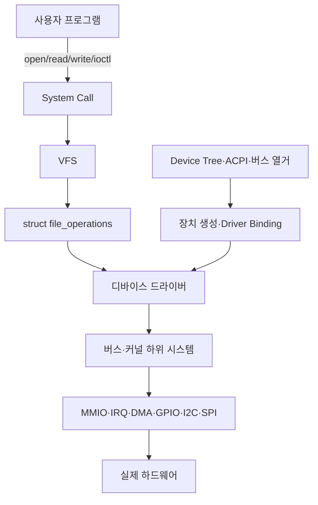
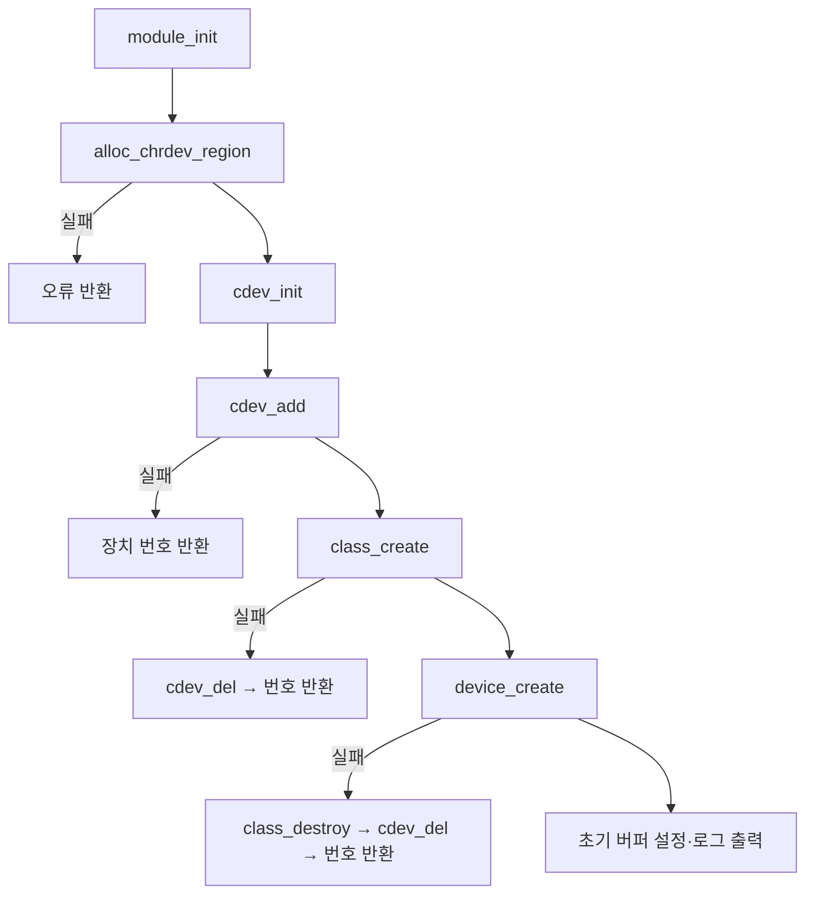

# 리눅스 디바이스 드라이버 개발 방법론

## 1. 수행 개요

| 항목 | 내용 |
|---|---|
| 수행 목표 | 디바이스 드라이버의 구조·생명주기·안정성 원칙 이해 및 문자 드라이버 구현 |
| 실습 드라이버 | `/dev/string_buffer` 문자 디바이스 |
| 저장 용량 | 내부 버퍼 256바이트, 문자열 최대 255바이트와 종료 문자 1바이트 |
| 구현 연산 | `open`, `release`, `read`, `write` |
| 장치 번호 | `alloc_chrdev_region()`을 이용한 동적 major/minor 할당 |
| 동시성 | mutex로 공유 문자열과 길이 보호 |
| 개발 환경 | Linux VM·데스크톱, Raspberry Pi 4, 준비된 커널 빌드 트리 |
| 현재 검증 상태 | 소스·Kbuild·시험 절차 작성 및 정적 검사 완료, `.ko` 빌드·적재는 Linux에서 수행 필요 |

> 요청된 파일명 `디바이스*드라이버개발*방법론.md`의 `*`는 Windows 파일명으로 사용할 수 없으므로 이 문서는 `디바이스_드라이버개발_방법론.md`로 저장한다.

> 안전 주의: 디바이스 드라이버는 커널 권한으로 실행된다. 잘못된 포인터, 범위 초과, 잘못된 락과 자원 해제 누락은 한 프로세스가 아니라 시스템 전체의 Oops·교착·커널 패닉을 일으킬 수 있다. 처음에는 스냅샷이 있는 VM이나 복구 가능한 Raspberry Pi에서 시험한다.

---

## 2. 디바이스 드라이버의 역할

디바이스 드라이버는 사용자 프로그램과 하드웨어 사이에서 장치별 동작을 Linux의 표준 인터페이스로 변환한다.



드라이버의 주요 책임은 다음과 같다.

- 장치와 드라이버 등록 및 연결
- 레지스터, 메모리, IRQ, DMA와 전원 자원 획득
- 사용자 요청을 하드웨어 동작으로 변환
- 동시에 들어오는 요청의 순서와 공유 상태 보호
- 장치 오류, Timeout과 잘못된 입력 처리
- suspend/resume와 제거 시 실행 작업·자원 정리
- 사용자 공간에 안정적인 ABI 제공

### 2.1 커널 모듈과 드라이버의 차이

| 구분 | 커널 모듈 | 디바이스 드라이버 |
|---|---|---|
| 의미 | 실행 중 커널에 코드를 적재·제거하는 배포 방식 | 장치를 제어하고 커널 인터페이스에 연결하는 역할 |
| 장치 필요 | 필요하지 않음 | 물리 또는 논리 장치를 대상으로 함 |
| 빌드 방식 | 일반적으로 `.ko` | built-in 또는 `.ko` 모두 가능 |
| 핵심 진입점 | `module_init`, `module_exit` | `probe/remove` 또는 장치 등록과 file operation |

따라서 모든 모듈이 드라이버는 아니며 모든 드라이버가 모듈인 것도 아니다. 이 실습은 논리 문자 장치 드라이버를 외부 커널 모듈로 빌드한다.

---

## 3. 문자 디바이스의 구조

문자 디바이스는 바이트 스트림 형태로 접근하며 `/dev` 장치 노드의 major/minor 번호가 커널의 `cdev`와 연결된다.

```mermaid
flowchart LR
    A[/dev/string_buffer] --> B[major:minor]
    B --> C[struct cdev]
    C --> D[struct file_operations]
    D --> E[open]
    D --> F[read]
    D --> G[write]
    D --> H[release]
    F --> I[256-byte 커널 버퍼]
    G --> I
```

### 3.1 주요 구성 요소

| 요소 | 역할 |
|---|---|
| `dev_t` | major와 minor를 하나로 표현 |
| `alloc_chrdev_region()` | 충돌하지 않는 장치 번호를 동적으로 할당 |
| `struct cdev` | 문자 장치를 VFS에 연결하는 커널 객체 |
| `cdev_add()` | `cdev`를 활성화하여 file operation 호출 가능 상태로 만듦 |
| `struct file_operations` | `open/read/write/release` 함수 포인터 집합 |
| `class_create()` | `/sys/class/string_buffer_class` 클래스 생성 |
| `device_create()` | sysfs 장치와 uevent 생성; 일반 Linux에서는 udev/devtmpfs가 `/dev` 노드 생성 |
| `copy_from_user()` | 사용자 주소의 데이터를 안전한 API로 커널에 복사 |
| `simple_read_from_buffer()` | 파일 offset을 반영해 커널 버퍼를 사용자에게 복사 |
| `mutex` | 여러 프로세스가 공유 버퍼를 동시에 변경하지 못하게 보호 |

`cdev_add()`가 성공하면 장치는 즉시 접근 가능해질 수 있으므로, 이 호출 전에 `cdev`와 `file_operations`가 완전히 초기화되어 있어야 한다.

---

## 4. 실습 요구사항과 설계 결정

| 요구사항 | 구현 방법 |
|---|---|
| 초기화·정리 | `module_init()`과 `module_exit()` |
| major/minor | major는 동적 할당, minor는 0부터 1개 사용 |
| `/dev` 노드 | class와 device 등록으로 `/dev/string_buffer` 생성 요청 |
| `open/release` | 접근과 반환을 `pr_debug()`로 기록, `nonseekable_open()` 적용 |
| `write` | 최대 255바이트를 임시 버퍼로 받은 뒤 mutex 아래 공유 버퍼 교체 |
| `read` | 최근 저장 문자열을 offset 기반으로 한 번 반환한 뒤 EOF 반환 |
| 동시 접근 | `DEFINE_MUTEX()`와 `mutex_lock_interruptible()` |
| 범위 초과 | 256바이트 이상 입력은 `-EMSGSIZE`로 거부 |
| 사용자 포인터 오류 | `-EFAULT` 반환 |
| 초기화 실패 | 생성한 자원을 역순으로 해제한 뒤 오류 반환 |
| 모듈 사용 중 제거 | `.owner = THIS_MODULE`로 열린 파일의 모듈 참조 유지 |

버퍼 전체 크기는 256바이트다. C 문자열 종료 문자 `\0`를 보장하기 위해 실제 문자열 payload는 최대 255바이트로 제한한다. 초과 입력을 조용히 자르면 데이터 손실을 사용자가 알 수 없으므로 명시적으로 오류를 반환한다.

---

## 5. 제공 파일

```text
device_driver_methodology_example/
├─ string_char_driver.c
├─ Makefile
├─ test_driver.sh
└─ README.md
```

- `string_char_driver.c`: 문제 요구사항을 구현한 드라이버
- `Makefile`: 실행 중인 커널 또는 지정한 커널 트리용 외부 모듈 빌드
- `test_driver.sh`: 빌드, 적재, 쓰기, 읽기, 제거 smoke test
- `README.md`: 빠른 실행과 주의사항

---

## 6. 드라이버 생명주기

### 6.1 초기화



초기화 단계가 중간에 실패하면 지금까지 성공한 작업만 정확한 역순으로 되돌린다. 아직 생성되지 않은 자원을 해제하거나 이미 해제한 자원을 다시 해제하면 또 다른 오류가 발생한다.

### 6.2 정상 제거

```text
device_destroy
→ class_destroy
→ cdev_del
→ unregister_chrdev_region
→ 종료 로그
```

### 6.3 I/O 흐름

```text
write("hello")
→ 길이 검사
→ copy_from_user(임시 버퍼)
→ mutex 획득
→ 공유 버퍼와 길이 갱신
→ mutex 해제

read()
→ mutex 획득
→ simple_read_from_buffer()
→ 파일 offset 갱신
→ mutex 해제
→ 다음 read는 0을 반환하여 EOF 표시
```

---

## 7. 빌드 환경 준비

### 7.1 Ubuntu/Debian 또는 Linux VM

실행 중인 커널과 정확히 일치하는 헤더를 설치한다.

```bash
sudo apt update
sudo apt install build-essential linux-headers-$(uname -r)

uname -r
ls -l /lib/modules/$(uname -r)/build
```

커널 헤더와 실행 중인 커널 release가 다르면 `Invalid module format`이 발생할 수 있다.

### 7.2 외부 모듈 빌드

```bash
cd device_driver_methodology_example
make
modinfo ./string_char_driver.ko
```

Makefile의 핵심은 공식 kbuild 방식이다.

```bash
make -C /lib/modules/$(uname -r)/build M=$PWD modules
```

빌드 결과:

```text
string_char_driver.ko
```

`modules_prepare`는 외부 모듈 빌드에 필요한 트리를 준비하지만 `CONFIG_MODVERSIONS=y`에서 필요한 `Module.symvers`를 만들지 않는다. 이 설정이면 대상 커널의 완전한 빌드 결과를 사용한다.

---

## 8. 수동 적재와 기능 시험

첫 번째 터미널에서 로그를 감시한다.

```bash
sudo dmesg -w
```

두 번째 터미널에서 실행한다.

```bash
sudo insmod ./string_char_driver.ko
lsmod | grep string_char_driver
ls -l /dev/string_buffer
cat /sys/class/string_buffer_class/string_buffer/dev
```

문자열 저장과 반환:

```bash
printf '%s' 'hello kernel driver' | sudo tee /dev/string_buffer >/dev/null
sudo cat /dev/string_buffer
```

예상 출력:

```text
hello kernel driver
```

최근 값 교체 확인:

```bash
printf '%s' 'second message' | sudo tee /dev/string_buffer >/dev/null
sudo cat /dev/string_buffer
```

예상 출력:

```text
second message
```

제거:

```bash
sudo rmmod string_char_driver
test ! -e /dev/string_buffer && echo 'device removed'
dmesg | tail -n 30
```

자동 smoke test:

```bash
sudo sh ./test_driver.sh
```

운영 환경에서는 장치를 무조건 `chmod 666`으로 열지 않는다. 전용 그룹과 udev 규칙으로 필요한 프로세스에만 최소 권한을 부여한다.

---

## 9. 장치 노드가 생성되지 않을 때

`device_create()`는 sysfs 장치와 uevent를 생성한다. 일반 배포판에서는 devtmpfs/udev가 `/dev/string_buffer`를 생성한다. 최소 root filesystem에서 자동 관리자가 없다면 다음을 확인한다.

```bash
cat /sys/class/string_buffer_class/string_buffer/dev
```

예를 들어 출력이 `240:0`이면 임시 시험용 노드를 만들 수 있다.

```bash
sudo mknod /dev/string_buffer c 240 0
sudo chmod 600 /dev/string_buffer
```

major 번호는 동적으로 달라질 수 있으므로 예시 숫자를 그대로 하드코딩하지 않는다. 모듈 제거 후 수동 노드도 삭제한다.

---

## 10. Raspberry Pi 4 크로스 컴파일

외부 모듈은 Raspberry Pi에서 실제 실행할 커널과 같은 source/config/release/`Module.symvers`를 사용해야 한다.

```bash
export KDIR=$HOME/src/linux-rpi
export ARCH=arm64
export CROSS_COMPILE=aarch64-linux-gnu-

make -C "$KDIR" bcm2711_defconfig
make -C "$KDIR" modules_prepare

make KDIR="$KDIR" ARCH=arm64 \
    CROSS_COMPILE=aarch64-linux-gnu-
```

Raspberry Pi 벤더 커널의 설정 이름은 버전에 따라 달라질 수 있으므로 `arch/arm64/configs/`에서 확인한다. `CONFIG_MODVERSIONS=y`라면 `modules_prepare`만으로 부족하므로 동일 설정의 전체 커널 빌드에서 나온 `Module.symvers`가 필요하다.

보드 전송과 시험:

```bash
scp string_char_driver.ko pi@<보드_IP>:/tmp/
ssh pi@<보드_IP>

uname -r
modinfo /tmp/string_char_driver.ko
sudo insmod /tmp/string_char_driver.ko
printf '%s' 'raspberry pi 4' | sudo tee /dev/string_buffer >/dev/null
sudo cat /dev/string_buffer
sudo rmmod string_char_driver
```

---

## 11. 안정성 방법론

### 11.1 사용자 메모리 접근

사용자 포인터를 커널에서 직접 역참조하지 않는다.

```c
/* 잘못된 방식 */
kernel_buffer[0] = user_buffer[0];

/* 올바른 방식 */
if (copy_from_user(kernel_buffer, user_buffer, count))
    return -EFAULT;
```

`copy_to_user()`와 `copy_from_user()`는 sleep할 수 있으므로 interrupt context 또는 spinlock을 잡은 상태에서 호출하면 안 된다. 이 예제의 `write`는 먼저 사용자 데이터를 로컬 임시 버퍼로 복사하고, 이후 짧게 mutex를 잡아 공유 상태를 교체한다.

### 11.2 메모리 관리

- 입력 길이를 버퍼보다 먼저 검사
- 문자열 종료 문자를 위한 1바이트 확보
- 동적 메모리가 필요하면 `kmalloc/kzalloc` 실패 처리
- 할당·등록 성공 순서를 기록하고 역순 해제
- Device-managed API가 있는 실제 하드웨어 드라이버에서는 `devm_*` 활용 검토
- DMA 버퍼는 CPU 포인터, DMA 주소, cache coherency와 수명 구분

이 예제는 256바이트 정적 버퍼를 사용하므로 heap 누수 가능성을 줄였다. 정적 메모리도 범위 초과로부터 자동 보호되는 것은 아니다.

### 11.3 동시성

공유 상태:

```text
device_buffer
device_buffer_length
```

이 값들은 read와 write가 동시에 접근하므로 하나의 mutex로 같은 불변조건을 보호한다.

```text
0 ≤ device_buffer_length ≤ 255
device_buffer[device_buffer_length] == '\0'
```

mutex는 sleep 가능한 process context에 적합하다. IRQ handler와 공유하는 데이터라면 mutex 대신 spinlock, threaded IRQ, atomic 또는 다른 설계가 필요할 수 있다. 락 종류는 “빠르다”가 아니라 호출 문맥과 sleep 가능 여부로 선택한다.

### 11.4 오류 처리

| 상황 | 반환·대응 |
|---|---|
| 장치 번호 할당 실패 | 해당 음수 errno 반환 |
| `cdev_add` 실패 | 장치 번호 해제 |
| class/device 생성 실패 | 성공한 자원을 역순 해제 |
| mutex 대기 중 signal | `-ERESTARTSYS` |
| 잘못된 사용자 주소 | `-EFAULT` |
| 256바이트 이상 쓰기 | `-EMSGSIZE` |
| 빈 쓰기 | 0 반환, 상태 유지 |

커널 패닉을 막는다는 것은 모든 오류를 0으로 숨기는 것이 아니다. 잘못된 요청은 명확한 errno로 거부하고 내부 상태를 변경하지 않아야 한다.

### 11.5 효율성

- critical section을 짧게 유지
- 불필요한 동적 할당과 메모리 복사 감소
- 반복되는 정상 I/O마다 `pr_info()`를 출력하지 않음
- 사용자 요청 크기와 장치 처리 단위를 일치시킴
- 실제 장치에서는 polling보다 interrupt/DMA를 요구사항에 맞게 사용
- 처리량뿐 아니라 CPU 사용률, 최대 지연과 lock contention 측정

---

## 12. 시험 계획

### 12.1 기능·경계값 시험

| 시험 | 기대 결과 |
|---|---|
| 모듈 적재 | 성공, `/dev/string_buffer` 존재, 로그 출력 |
| 초기 read | 0바이트 EOF |
| 1바이트 write/read | 같은 1바이트 반환 |
| 255바이트 write/read | 정확히 같은 데이터 반환 |
| 256바이트 write | `EMSGSIZE`로 거부, 이전 값 유지 |
| 두 번 write | 마지막 문자열 반환 |
| 반복 read | 첫 read 후 같은 fd에서는 EOF |
| 모듈 제거 | 장치·class 제거, 종료 로그 |

### 12.2 안정성 시험

- 여러 프로세스의 병렬 read/write
- 수천 회 load/write/read/unload 반복
- 장치를 연 상태에서 `rmmod`가 안전하게 거부되는지 확인
- 잘못된 사용자 포인터를 사용하는 테스트 프로그램은 VM에서만 수행
- KASAN, lockdep, kmemleak을 활성화한 시험 커널 활용
- CPU·메모리 압박과 signal 중단 상황
- module signing과 lockdown 환경

예시 반복 시험:

```bash
for i in $(seq 1 100); do
    sudo insmod ./string_char_driver.ko
    printf '%s' "message-$i" | sudo tee /dev/string_buffer >/dev/null
    result=$(sudo cat /dev/string_buffer)
    test "$result" = "message-$i" || exit 1
    sudo rmmod string_char_driver
done
```

### 12.3 평가 기록

```text
Kernel release:
Kernel config/hash:
Compiler version:
Module vermagic:
Hardware/VM:
Test case:
Expected result:
Actual result:
dmesg warning/oops:
Pass/Fail:
```

---

## 13. 일반적인 문제와 해결

| 증상 | 가능한 원인 | 확인·대응 |
|---|---|---|
| `Invalid module format` | kernel release/vermagic 불일치 | `uname -r`, `modinfo -F vermagic` 비교 |
| `Unknown symbol` | 의존 모듈 또는 `Module.symvers` 불일치 | `dmesg`, 같은 커널 빌드 결과 사용 |
| `Operation not permitted` | 서명 강제·Secure Boot·lockdown | `dmesg`, 신뢰 키로 모듈 서명 |
| `/dev/string_buffer` 없음 | udev/devtmpfs 없음 또는 등록 실패 | sysfs `dev` 파일과 `dmesg` 확인 |
| `Device or resource busy` | 장치 파일이 열려 있음 | 사용 프로세스 종료 후 정상 제거 |
| read가 빈 값 | 아직 write하지 않았거나 같은 fd의 offset이 EOF | 새로 open하거나 `cat` 재실행 |
| 빌드 시 `class_create` 인자 오류 | 커널 API 버전 차이 | 제공 코드의 version 조건과 대상 헤더 확인 |

강제 적재·제거 옵션은 버전·참조 검사를 무시해 패닉이나 손상을 만들 수 있으므로 사용하지 않는다.

---

## 14. 실제 하드웨어 드라이버로 확장

이번 실습은 메모리 기반 논리 장치다. Raspberry Pi의 GPIO/I2C/SPI 장치 드라이버로 확장하면 등록 구조가 달라진다.

```text
Device Tree compatible
→ platform/I2C/SPI bus match
→ probe()
→ devm_*로 MMIO·GPIO·IRQ·clock 획득
→ 하드웨어 ID·상태 확인
→ 적절한 커널 subsystem에 등록
→ 사용자 표준 인터페이스 제공
→ remove()/device-managed cleanup
```

실제 개발 절차:

1. 데이터시트에서 전압, 레지스터, timing, IRQ와 실패 조건 확인
2. IIO, hwmon, input, LED, network 등 기존 subsystem 선택
3. Device Tree binding과 `compatible` 정의
4. `probe()`에서 장치 자원과 ID 확인
5. Timeout, reset, power management와 hot-unplug 설계
6. 정상·경계·통신 오류·장치 제거·suspend/resume 시험
7. Kconfig/Makefile, Device Tree와 배포 이미지에 통합

새로운 사설 `/dev` ABI를 만들기 전에 기존 커널 subsystem의 표준 ABI가 있는지 먼저 확인한다.

---

## 15. 평가 질문 답변

### 드라이버 개발의 기본 원리와 구조를 설명할 수 있는가

드라이버는 VFS·버스·커널 subsystem과 장치 사이를 연결하며, 등록 객체와 callback으로 사용자 요청을 처리한다. 문자 드라이버는 장치 번호, `cdev`, `file_operations`와 장치 노드가 핵심이다.

### 간단한 드라이버 개발을 수행했는가

256바이트 버퍼와 `open/release/read/write`를 갖는 `/dev/string_buffer` 소스, Makefile과 자동 시험 스크립트를 작성했다. 현재 Windows 실행 환경에는 Linux 커널 헤더와 module loader가 없어 실제 `.ko` 빌드·적재 결과는 미수행이며, Linux VM 또는 Raspberry Pi에서 문서의 명령으로 확인해야 한다.

### 안정성과 효율성을 어떻게 보장하는가

입력 길이 검사, `copy_*_user`, mutex, 오류 경로의 역순 정리, module reference, 최소 로그와 짧은 critical section을 적용한다. KASAN·lockdep·반복·병렬·고장 시험으로 구현이 의도대로 동작하는지 검증한다.

### 모듈과 드라이버는 무엇이 다른가

모듈은 코드를 동적으로 배치하는 형식이고 드라이버는 장치를 제어하는 역할이다. 같은 드라이버가 built-in 또는 module이 될 수 있고, 장치를 다루지 않는 module도 있다.

---

## 16. 획득 역량 및 결론

| 역량명 | 획득 내용 |
|---|---|
| 디바이스 드라이버 개발 기초 | 장치 번호, cdev, file operation과 module 생명주기 |
| 안정성과 효율성 | 경계 검사, 사용자 복사, mutex, 오류 unwind와 시험 방법 |
| 하드웨어 인터페이싱 | 논리 장치에서 platform/I2C/SPI와 Device Tree로 확장하는 절차 |

이 실습을 통해 사용자 프로그램의 `read/write`가 VFS와 `file_operations`를 거쳐 드라이버의 공유 버퍼에 도달하는 구조를 확인할 수 있다. 드라이버 개발에서 기능 구현만큼 중요한 것은 모든 실패 경로에서 일관된 상태를 유지하고, 올바른 실행 문맥에서 적절한 동기화와 메모리 API를 사용하는 것이다.

실제 하드웨어 드라이버는 여기에 register access, IRQ, DMA, 전원 관리와 장치 제거가 추가된다. 따라서 데이터시트, 기존 kernel subsystem과 대상 커널 API를 기준으로 설계하고, VM·에뮬레이터·시험 보드에서 단계적으로 검증해야 한다.

---

## 17. 참고 자료

- [The Linux Kernel Module Programming Guide](https://sysprog21.github.io/lkmpg/)
- [Linux Kernel Documentation: Building External Modules](https://docs.kernel.org/kbuild/modules.html)
- [Linux Kernel API: Character Device Registration](https://docs.kernel.org/core-api/kernel-api.html)
- [Linux Kernel Documentation: Device Drivers Infrastructure](https://docs.kernel.org/driver-api/infrastructure.html)
- [Linux Kernel Documentation: Locking](https://docs.kernel.org/kernel-hacking/locking.html)
- [Linux Kernel Documentation: Kernel Hacking and User Access](https://docs.kernel.org/kernel-hacking/hacking.html)
