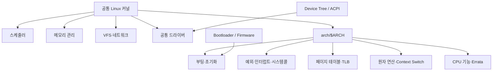
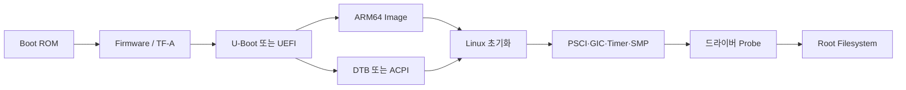
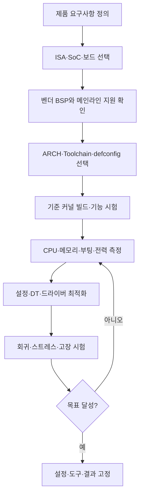

# 리눅스 커널과 CPU 아키텍처

## 1. 수행 개요

| 항목 | 내용 |
|---|---|
| 수행 목표 | Linux가 지원하는 주요 CPU 아키텍처의 특성과 커널 최적화 방법 이해 |
| 중점 아키텍처 | ARM32, ARM64, x86, MIPS |
| 추가 비교 | RISC-V, PowerPC |
| 실습 대상 | Raspberry Pi 4(ARM64), x86-64 Linux PC |
| 주요 도구 | Kconfig, kbuild, 크로스 컴파일러, Device Tree, `perf`, ftrace |
| 결과물 | 아키텍처 비교, 설정·빌드 절차, 산업·차량용 적용 분석 |

이 문서의 목표는 단순히 “ARM은 저전력, x86은 고성능”이라고 암기하는 것이 아니다. 명령어 집합 구조(ISA), 실제 CPU 구현, SoC 주변장치, 펌웨어, Linux 지원 상태와 제품 요구사항을 함께 비교하여 올바른 아키텍처와 커널 설정을 선택하는 데 있다.

---

## 2. Linux 커널과 아키텍처의 관계

Linux 커널은 프로세스, 파일시스템, 네트워크와 공통 드라이버 같은 대부분의 코드를 아키텍처와 무관하게 공유한다. CPU마다 달라지는 부분은 `arch/` 아래에 분리한다.



아키텍처별 디렉터리에는 보통 다음 요소가 있다.

```text
arch/<architecture>/
├─ Kconfig          아키텍처별 설정 항목
├─ configs/         defconfig 기준 설정
├─ kernel/          부팅, 예외, 시스템콜, SMP 등
├─ mm/              페이지 테이블, TLB, 캐시 관련 코드
├─ include/         아키텍처 전용 헤더
└─ boot/            커널 Image와 부팅 관련 산출물
```

최신 Linux 문서에는 ARM, ARM64, x86, MIPS, RISC-V, PowerPC 외에도 ARC, LoongArch, m68k, Nios II, OpenRISC, PA-RISC, s390, SuperH, SPARC, Xtensa 등의 아키텍처 문서가 존재한다. 실제 `arch/` 목록과 지원 수준은 사용하는 커널 릴리스에서 직접 확인해야 한다.

```bash
ls arch
find arch -maxdepth 2 -type d -name configs
```

### 2.1 아키텍처는 어떻게 선택하는가

CPU 아키텍처는 보통 `menuconfig` 화면에서 다른 ISA로 바꾸는 방식이 아니라, 빌드 명령의 `ARCH` 변수로 먼저 선택한다. 그러면 kbuild가 `arch/$ARCH/Kconfig`를 읽는다.

```text
ARCH 선택
→ arch/$ARCH/Kconfig 로드
→ defconfig 적용
→ menuconfig로 기능 조정
→ .config 생성
→ 해당 아키텍처용 Image·모듈·DTB 빌드
```

`CROSS_COMPILE`은 실행 파일 이름 앞의 접두사이며 `gcc` 자체를 포함하지 않는다.

```bash
make ARCH=arm64 CROSS_COMPILE=aarch64-linux-gnu- defconfig
make ARCH=arm64 CROSS_COMPILE=aarch64-linux-gnu- menuconfig
make ARCH=arm64 CROSS_COMPILE=aarch64-linux-gnu- Image modules dtbs -j$(nproc)
```

---

## 3. 주요 아키텍처 비교

| 구분 | x86-64 | ARM64 | MIPS | RISC-V | PowerPC |
|---|---|---|---|---|---|
| ISA 성격 | 복잡한 가변 길이 명령과 강한 하위 호환성 | AArch64 고정 길이 중심 RISC | 전통적 RISC, 32/64비트와 endian 변형 | 개방형 모듈식 RISC ISA | RISC, 32/64비트와 다양한 서버·임베디드 계열 |
| Linux 디렉터리 | `arch/x86` | `arch/arm64` | `arch/mips` | `arch/riscv` | `arch/powerpc` |
| 대표 장점 | 높은 단일·멀티코어 성능, 성숙한 PC/서버 생태계 | 성능 대비 전력과 SoC 통합, 폭넓은 모바일·임베디드 생태계 | 단순한 코어와 기존 네트워크·가전 SoC 자산 | ISA 개방성, 확장 가능성, 공급자 선택 | 산업·통신·자동차의 기존 자산, 일부 고신뢰 플랫폼 |
| 대표 한계 | 플랫폼 복잡성, 고성능 제품의 전력·냉각 부담 | SoC별 BSP·펌웨어 편차, 장치 통합 복잡성 | 신규 고성능 생태계와 도구·제품 선택 폭 감소 | 플랫폼·드라이버·펌웨어 성숙도 차이 | 신규 범용 생태계 축소와 제품별 endian·플랫폼 차이 |
| 하드웨어 기술 정보 | ACPI, UEFI, PCI 열거가 일반적 | 임베디드는 Device Tree, 서버는 ACPI도 사용 | Device Tree와 보드별 펌웨어 | Device Tree 중심, ACPI 지원도 발전 | Device Tree/펌웨어 플랫폼별 상이 |
| 대표 분야 | PC, 서버, 산업용 PC, 중앙 컴퓨팅 | 모바일, SBC, 차량 인포테인먼트·ADAS, 엣지 | 기존 공유기·셋톱박스·네트워크 장비 | 교육, MCU부터 Linux SoC, 가속기·엣지 | 기존 통신, 산업, 자동차·서버 시스템 |

> 주의: ISA만으로 소비전력과 성능이 결정되지 않는다. 같은 ARM64라도 작은 저전력 코어와 고성능 서버 코어의 특성은 크게 다르며, 저전력 x86과 고전력 ARM 서버도 존재한다. 공정, 캐시, 코어 수, 주파수, 메모리와 가속기가 실제 결과에 큰 영향을 준다.

---

## 4. x86 아키텍처

### 4.1 특징

x86은 오랜 하위 호환성, 강력한 단일 코어 성능과 성숙한 PC·서버 소프트웨어 생태계가 장점이다. 현대 x86 CPU 내부는 복잡한 명령을 내부 동작으로 변환해 실행하며, SIMD, 가상화, 보안과 성능 감시 기능이 풍부하다.

Linux는 x86에서 다음 플랫폼 요소를 폭넓게 지원한다.

- UEFI/ACPI 부팅과 하드웨어 기술
- PCI/PCIe 장치 열거
- SMT, 멀티소켓과 NUMA
- 대용량 메모리와 4/5단계 페이지 테이블
- KVM 가상화와 IOMMU
- 성숙한 `perf`, 전원 관리와 오류 보고 기능

### 4.2 장점과 단점

장점:

- 고성능 CPU·GPU·가속기와 대용량 메모리 선택 폭
- 데스크톱·서버용 개발 도구와 바이너리 생태계
- 산업용 PC와 중앙 연산 장치에서 높은 호환성
- 가상화와 컨테이너 운용에 유리

단점:

- PC 호환성과 펌웨어 계층으로 플랫폼이 복잡할 수 있음
- 고성능 제품은 냉각, 전원과 보드 비용이 커질 수 있음
- 작은 배터리 임베디드 장치에는 과도한 자원일 수 있음

### 4.3 x86 커널 최적화

| 요구사항 | 최적화 방법 | 주의점 |
|---|---|---|
| 대용량 메모리 | NUMA 정책, HugeTLB/THP 검토 | 지연 변화와 메모리 낭비 측정 |
| 다중 코어 | IRQ affinity, RPS/XPS, CPU isolation | 코어 고립이 전체 처리량을 낮출 수 있음 |
| 낮은 지연 | PREEMPT_DYNAMIC/RT, timer·IRQ 분석 | 최악 지연과 드라이버 호환성 확인 |
| 전력 절감 | CPU idle, 주파수 정책, 불필요한 장치 정지 | 응답 지연과 처리량의 절충 |
| 작은 전용 이미지 | 미사용 ACPI/PCI·파일시스템·드라이버 정리 | 부팅·복구에 필요한 기능 유지 |
| 보안 | IOMMU, lockdown, 서명 모듈, 완화책 유지 | 보안 완화 옵션을 성능만 보고 끄지 않음 |

배포판용 범용 x86 커널은 다양한 하드웨어를 지원하므로 크다. 고정된 산업용 PC에서는 실제 장치 목록을 기준으로 드라이버를 줄일 수 있지만, CPU 취약점 완화나 복구 장치를 무작정 제거해서는 안 된다.

빌드 예:

```bash
make ARCH=x86 x86_64_defconfig
make ARCH=x86 menuconfig
make ARCH=x86 bzImage modules -j$(nproc)
```

---

## 5. ARM 아키텍처 집중 분석

### 5.1 ARM32와 ARM64

Linux 소스에서 32비트 ARM과 64비트 ARM은 별도 아키텍처이다.

| 구분 | ARM32 | ARM64/AArch64 |
|---|---|---|
| 커널 디렉터리 | `arch/arm` | `arch/arm64` |
| 빌드 변수 | `ARCH=arm` | `ARCH=arm64` |
| 일반 도구 체인 | `arm-linux-gnueabihf-` | `aarch64-linux-gnu-` |
| 일반 용도 | 기존 32비트 SoC와 저용량 장치 | 최신 모바일·SBC·차량·서버 SoC |
| 주소 공간 | 32비트 제약 | 큰 가상·물리 주소 공간 지원 |

ARM Cortex-M/R 계열은 마이크로컨트롤러·실시간 제어에 사용되지만, 일반적인 MMU 기반 Linux는 주로 Cortex-A 등 Application profile CPU에서 실행한다. 차량의 안전 MCU와 Linux 애플리케이션 프로세서를 같은 것으로 혼동하면 안 된다.

### 5.2 ARM이 임베디드에 적합한 이유

- SoC에 CPU, GPU/NPU, ISP, 비디오 코덱, CAN/Ethernet, 보안 기능을 통합 가능
- 배터리·열 예산에 맞춘 다양한 코어와 동작점 선택
- 32비트부터 서버급 64비트까지 폭넓은 구현
- Device Tree 기반으로 보드별 장치·주소·IRQ 기술
- PSCI를 이용한 CPU 전원 상태와 SMP 기동
- big.LITTLE 같은 이기종 CPU 구성과 Energy Aware Scheduling 활용 가능

이 장점은 ARM 명령어 자체만의 결과가 아니라 SoC 통합 생태계와 다양한 CPU 구현 방식에서 나온다.

### 5.3 ARM64 부팅과 하드웨어 기술

일반적인 ARM64 임베디드 부팅 흐름은 다음과 같다.



Linux ARM64 부팅 문서는 RAM 초기화, 커널 이미지 배치와 CPU 진입 상태, Device Tree, PSCI, 캐시·MMU·타이머 조건을 정의한다. 임베디드 장치는 일반적으로 DT를 사용하고 ARM 서버급 시스템은 UEFI/ACPI도 사용할 수 있다.

### 5.4 ARM 커널 최적화 핵심

#### CPU와 스케줄링

- `CONFIG_SMP`: 멀티코어가 필요할 때 사용
- CPU topology와 capacity가 정확히 기술되어야 이기종 코어 배치가 정상 동작
- Energy Model과 EAS로 big.LITTLE 계열의 에너지 효율적 태스크 배치 검토
- 실시간 제어는 CPU affinity, IRQ affinity와 PREEMPT_RT를 측정 기반으로 적용

EAS는 모든 ARM 시스템에 자동으로 이득을 주는 기능이 아니다. 공식 문서상 이기종 CPU topology와 Energy Model 등 필요한 조건이 충족되어야 한다.

#### 전력과 열

- CPUFreq/CPUIdle과 올바른 Operating Performance Points 설정
- Clock, regulator와 power domain 드라이버 활성화
- Thermal zone, cooling device와 throttling 정책 검증
- 사용하지 않는 장치의 runtime PM 적용
- 처리량뿐 아니라 Joule/task와 지속 부하 시 온도를 측정

#### 메모리와 DMA

- 4K/16K/64K 페이지 크기는 메모리 사용, TLB 효율과 사용자 공간 호환성을 비교해 선택
- 카메라·GPU·NPU·VPU용 CMA 크기를 실제 최대 버퍼로 산정
- IOMMU/SMMU로 DMA 격리와 주소 변환 검토
- 불필요하게 큰 reserved-memory와 DMA pool 제거
- 32비트 주변장치의 DMA 주소 한계 확인

#### 장치와 커널 크기

- Device Tree에서 실제 보드의 장치, clock, interrupt, DMA와 reserved memory를 정확히 기술
- 미사용 SoC·보드·드라이버를 제거하거나 모듈화
- 부팅에 필요한 storage, regulator, pinctrl, clock 드라이버는 built-in 고려
- 개발 중 debug·tracing을 유지하고 제품 성능 측정 후 필요한 항목만 정리

#### 명령어 확장과 보안

- NEON/SVE 같은 벡터 기능은 사용자 알고리즘과 라이브러리에서 활용
- 커널 안의 SIMD 사용은 컨텍스트 보존 규칙과 전용 API를 따라야 함
- Pointer Authentication, MTE, BTI 등은 SoC·도구 체인·사용자 공간 지원과 함께 검토
- CPU errata workaround는 성능만 보고 제거하지 않음

### 5.5 `arch/arm64/configs` 확인과 빌드

```bash
ls arch/arm64/configs
make ARCH=arm64 defconfig
make ARCH=arm64 menuconfig
make ARCH=arm64 savedefconfig
cp defconfig arch/arm64/configs/myboard_defconfig
```

메인라인 ARM64는 여러 SoC를 포함하는 공통 `defconfig`를 중심으로 사용할 수 있다. Raspberry Pi 벤더 커널처럼 별도 트리에서는 `bcm2711_defconfig` 같은 보드·SoC 기준 설정이 제공될 수 있으므로 **사용 중인 커널 트리에서 실제 파일을 확인**한다.

Raspberry Pi 4 ARM64 크로스 빌드 예:

```bash
export ARCH=arm64
export CROSS_COMPILE=aarch64-linux-gnu-

make bcm2711_defconfig       # Raspberry Pi 벤더 커널 예시
make menuconfig
make -j$(nproc) Image modules dtbs
```

설정 보관:

```bash
cp .config configs/rpi4_arm64_measured.config
scripts/diffconfig configs/baseline.config .config
```

---

## 6. MIPS 아키텍처

### 6.1 특징

MIPS는 비교적 단순한 RISC 구조로 과거 공유기, 셋톱박스, 프린터와 네트워크 장비에 널리 사용되었다. Linux는 32/64비트, 여러 CPU 계열과 big/little-endian 플랫폼을 지원해 왔다.

장점:

- 기존 네트워크·가전 SoC와 보드 자산
- 작은 시스템에 맞춘 단순한 구현 가능
- 오래된 제품의 유지보수와 특정 SoC에서 검증된 BSP

한계:

- CPU 세대, endian, ABI와 SoC별 차이가 큼
- 신규 범용 제품·도구·장기 생태계 선택 폭이 ARM64나 RISC-V보다 좁을 수 있음
- 오래된 벤더 커널은 보안 패치와 최신 커널 이식 비용이 큼

“네트워크 장비는 MIPS”는 역사적 경향이지 현재의 고정 규칙은 아니다. 최신 네트워크 제품에는 ARM64, x86-64와 다른 아키텍처도 널리 사용된다.

### 6.2 MIPS 커널 최적화

- 정확한 `CONFIG_CPU_*`, 32/64비트와 endian 선택
- SoC용 timer, interrupt controller, cache와 DMA 동작 확인
- 작은 RAM 장치에서는 미사용 프로토콜·파일시스템·드라이버 제거
- 플래시 erase block에 맞는 MTD, UBI/UBIFS 설정
- 네트워크 장비는 NAPI, IRQ affinity, packet steering과 DMA 경로 측정
- 하드웨어 offload 사용 시 드라이버·펌웨어의 보안과 fallback 확인
- 오래된 out-of-tree BSP를 유지할지 메인라인으로 이전할지 수명주기 비용 평가

빌드 형식:

```bash
make ARCH=mips CROSS_COMPILE=mips-linux-gnu- <board>_defconfig
make ARCH=mips CROSS_COMPILE=mips-linux-gnu- menuconfig
make ARCH=mips CROSS_COMPILE=mips-linux-gnu- -j$(nproc)
```

보드에 따라 도구 체인의 endian 접두사와 커널 산출물 형식이 달라진다.

---

## 7. RISC-V와 PowerPC

### 7.1 RISC-V

RISC-V는 개방형이며 확장을 조합할 수 있는 ISA이다. 특정 공급자에 종속되지 않고 맞춤형 SoC와 가속기를 설계할 수 있다는 장점이 있다.

최적화·선정 시 확인할 내용:

- 실제 CPU가 제공하는 ISA extension과 사용자 ABI
- MMU mode, interrupt controller, timer와 SBI 펌웨어
- 벡터 확장 사용 여부와 컴파일러·사용자 공간 지원
- 메인라인 드라이버, 부트로더와 디버그 도구 성숙도
- 제품 수명 동안의 BSP와 보안 업데이트 계획

RISC-V는 성장 가능성이 크지만 “개방형 ISA”만으로 드라이버와 제품 지원이 자동 확보되는 것은 아니다.

### 7.2 PowerPC

PowerPC는 서버, 통신, 산업과 자동차 분야에 기존 설치 기반이 있다. 32/64비트와 endian, CPU family 및 플랫폼 차이를 확인해야 한다.

기존 장비에서는 검증 자산과 장기 공급이 장점이지만, 신규 설계에서는 도구 체인, 새 SoC 선택, 메인라인 지원과 인력 확보 비용을 ARM64·x86-64·RISC-V와 비교해야 한다.

---

## 8. 아키텍처 공통 커널 최적화 절차



### 8.1 요구사항을 수치화한다

| 영역 | 예시 요구사항 |
|---|---|
| 성능 | 처리량, 추론 시간, packet/s |
| 실시간 | 최대 지연, Jitter, Deadline Miss |
| 메모리 | 커널·부팅 후 RAM, CMA, 최대 사용량 |
| 부팅 | 전원 인가부터 서비스 준비까지 시간 |
| 전력·열 | 평균/최대 전력, 정상 온도, throttling |
| 저장장치 | Image·모듈 크기, 쓰기 수명 |
| 안전·보안 | Secure Boot, IOMMU, watchdog, rollback |
| 유지보수 | LTS 기간, CVE 패치, BSP 공급 기간 |

### 8.2 기준 설정에서 한 번에 하나씩 변경한다

공통 검토 항목:

- `CONFIG_PREEMPT_*`, `CONFIG_HZ`, NO_HZ 정책
- SMP, CPU hotplug, CPUFreq와 CPUIdle
- 필요한 파일시스템·네트워크 프로토콜·드라이버
- built-in과 module의 경계
- debug, tracing, sanitizer의 개발/제품 설정 분리
- DMA, CMA, IOMMU와 reserved memory
- 압축 알고리즘과 initramfs/rootfs 구성
- 보안 기능과 모듈 서명

최적화는 기능 삭제가 아니라 요구사항에 맞는 자원 배분이다. 예를 들어 부팅 장치 드라이버를 모듈로 바꾸면 커널 이미지는 작아져도 root filesystem을 열지 못할 수 있다.

### 8.3 측정 도구

```bash
# CPU와 hotspot
perf stat <workload>
perf record -g <workload>

# 커널 지연과 이벤트
trace-cmd record -e sched -e irq <workload>
cyclictest --mlockall --priority=80 --interval=1000

# 메모리와 부팅
cat /proc/meminfo
size vmlinux
systemd-analyze

# 전력·온도·주파수
cat /sys/class/thermal/thermal_zone*/temp
cat /sys/devices/system/cpu/cpu*/cpufreq/scaling_cur_freq
```

x86에서는 `powertop` 같은 도구를 추가로 활용할 수 있고, ARM SoC는 보드 전력 측정기와 vendor PMU 도구가 필요할 수 있다. 서로 다른 아키텍처 비교는 같은 workload, compiler 조건, 냉각 조건과 성능 목표에서 수행한다.

---

## 9. 임베디드 시스템에서 아키텍처 선택의 중요성

### 9.1 선택 기준

| 기준 | 질문 |
|---|---|
| 연산 | CPU, SIMD, GPU/NPU 처리량이 충분한가? |
| 실시간 | 최악 지연과 인터럽트 응답을 충족하는가? |
| 전력·열 | 배터리와 냉각 한도 안에서 지속 성능을 내는가? |
| 메모리·I/O | RAM 용량, ECC, PCIe, CAN, Ethernet이 적합한가? |
| 소프트웨어 | 메인라인 커널, 드라이버와 배포판 지원이 있는가? |
| 안전·보안 | Secure Boot, IOMMU, RAS, watchdog을 지원하는가? |
| 공급망 | 가격, 장기 공급, 대체품과 벤더 지원은 어떤가? |
| 개발비 | 도구, BSP 유지, 인증과 개발 인력 비용은 얼마인가? |

저렴한 칩을 선택해도 오래된 BSP와 부족한 드라이버 때문에 전체 개발비가 더 커질 수 있다. 반대로 성능이 높은 칩은 전력·열 설계와 냉각 비용을 증가시킬 수 있다.

### 9.2 최적화가 시스템에 미치는 영향

- 미사용 드라이버 제거: Image와 RAM 감소, 공격 표면 축소
- 적절한 CPUFreq/EAS: 에너지 효율과 열 안정성 개선
- DMA/CMA 조정: 카메라·가속기 버퍼 실패 방지
- PREEMPT_RT와 IRQ 배치: 최악 응답 지연 감소 가능
- SoC 전용 가속기 사용: CPU 부하 감소, 전력 효율 개선
- 잘못된 최적화: 부팅 실패, 장치 미동작, 성능 저하와 데이터 손상 가능

---

## 10. 산업·차량용 적용 사례

### 10.1 산업용 게이트웨이

- x86-64: 다수 컨테이너, 강한 연산, PCIe 확장과 기존 산업 소프트웨어에 유리
- ARM64: 팬리스, 작은 전력 예산과 통합형 I/O 장치에 유리
- 선택 기준: 프로토콜 수, AI 추론량, 온도 범위와 장기 공급

### 10.2 네트워크 장비

- MIPS는 기존 공유기·네트워크 제품에서 중요한 설치 기반을 가짐
- 최신 장비는 ARM64, x86-64와 전용 network accelerator도 사용
- NAPI, DMA, interrupt 분산, zero-copy와 하드웨어 offload가 중요

### 10.3 스마트폰·SBC

- ARM64 SoC는 CPU와 GPU, ISP, codec, 보안·전원 관리 통합에 유리
- Raspberry Pi 4는 Cortex-A72 기반 ARM64 학습 플랫폼
- 카메라·영상 처리에서는 CPU만이 아니라 CMA, ISP/GPU 드라이버와 thermal 설정이 중요

### 10.4 차량용 시스템

차량 한 대에는 서로 다른 요구의 프로세서가 함께 사용된다.

```text
인포테인먼트·ADAS 중앙 컴퓨터
├─ ARM64 또는 x86-64 Linux 애플리케이션 프로세서
├─ GPU/NPU/ISP 가속기
└─ Hypervisor·IOMMU·고속 Ethernet

안전·실시간 제어 ECU
├─ Safety MCU 또는 전용 실시간 CPU
├─ RTOS / Bare-metal
└─ Watchdog·Lockstep·안전 통신
```

ARM 계열이 스마트폰과 차량에서 널리 쓰이지만 모든 차량 프로세서가 Linux용 ARM인 것은 아니다. 안전 제어는 Cortex-R/M, RH850, TriCore 등 Linux가 아닌 실시간 플랫폼을 사용할 수 있으며, 중앙 컴퓨팅에는 ARM64와 x86-64가 모두 사용될 수 있다.

차량용 선택 기준:

- 장기 공급과 자동차 등급 온도
- GPU/NPU, 카메라 ISP와 CAN/Ethernet 통합
- ISO 26262 대응 자료와 고장 격리
- ECC, watchdog, RAS, IOMMU와 Secure Boot
- Hypervisor와 혼합 중요도 워크로드 지원
- OTA 업데이트, rollback과 장기 보안 패치
- 지속 부하에서의 전력·열 성능

---

## 11. Raspberry Pi 4 실습 절차

### 11.1 대상 확인

```bash
uname -m
lscpu
cat /proc/cpuinfo
```

64비트 Raspberry Pi OS에서는 일반적으로 `aarch64`가 표시된다.

### 11.2 커널 설정 비교

```bash
cd linux
export ARCH=arm64
export CROSS_COMPILE=aarch64-linux-gnu-

make bcm2711_defconfig
cp .config config.baseline
make menuconfig
cp .config config.optimized
scripts/diffconfig config.baseline config.optimized
```

`bcm2711_defconfig`은 Raspberry Pi 커널 트리를 전제로 한 예시이다. 파일이 없다면 현재 소스의 `arch/arm64/configs/`를 확인하고 해당 트리가 제공하는 defconfig를 선택한다.

### 11.3 빌드와 비교

```bash
make -j$(nproc) Image modules dtbs
du -h arch/arm64/boot/Image
find . -name '*.ko' -printf '%s\n' | awk '{sum += $1} END {print sum}'
```

보드에서 비교할 항목:

- 부팅 성공과 모든 필수 장치 동작
- Image·모듈 크기와 부팅 후 가용 메모리
- 부팅 시간
- CPU 처리량과 최대 지연
- 유휴·부하 전력과 최고 온도
- 카메라, 네트워크, 저장장치 스트레스 안정성

한 번에 여러 설정을 바꾸지 말고 변경 이유, 기대 효과와 측정 결과를 표로 기록한다.

---

## 12. 아키텍처별 최적화 요약

| 아키텍처 | 우선 확인할 최적화 |
|---|---|
| x86-64 | NUMA·SMT·IRQ 배치, Huge Page, 전원 상태, 가상화·IOMMU, 보안 완화 유지 |
| ARM64 | Device Tree, CPU capacity/EAS, CPUFreq·Idle, thermal, DMA/CMA·SMMU, SoC 가속기 |
| MIPS | CPU family·endian·ABI, cache/DMA, MTD/UBI, 작은 메모리, 네트워크 data path |
| RISC-V | ISA extension·ABI, SBI/firmware, MMU, interrupt, toolchain과 드라이버 성숙도 |
| PowerPC | CPU family·endian, Device Tree, 플랫폼 I/O, 실시간·기존 BSP 유지 전략 |

아키텍처 전용 설정만으로 최적화가 끝나지 않는다. 공통 커널 설정, Device Tree/ACPI, 펌웨어, 드라이버, 사용자 공간과 실제 workload가 함께 맞아야 한다.

---

## 13. 제약사항과 주의사항

- 인터넷 예제의 defconfig 이름을 현재 커널에 있다고 가정하지 않는다.
- SoC 벤더 커널과 메인라인 커널의 설정·드라이버 차이를 기록한다.
- `ARCH`, toolchain ABI와 root filesystem 아키텍처를 일치시킨다.
- CPU endian과 장치 DMA endian을 확인한다.
- 보안 완화, IOMMU와 CPU errata workaround를 성능 때문에 임의로 끄지 않는다.
- 개발용 debug 기능 제거 전 장애 분석과 회귀 시험을 완료한다.
- 평균 성능뿐 아니라 최대 지연, 지속 온도와 throttling을 측정한다.
- 변경 전 커널, DTB, 모듈과 부팅 파티션을 백업한다.
- 부팅 실패에 대비해 시리얼 콘솔과 이전 커널 선택 방법을 준비한다.

---

## 14. 수행 결과 확인

- [x] Linux 공통 코드와 `arch/$ARCH` 전용 코드의 관계 설명
- [x] ARM, x86, MIPS의 장단점과 적용 분야 비교
- [x] RISC-V와 PowerPC의 선택 요소 보완
- [x] x86과 ARM의 성능·전력 특성 비교
- [x] ARM32와 ARM64, Device Tree와 PSCI 설명
- [x] `ARCH`, `CROSS_COMPILE`, defconfig와 `menuconfig` 절차 설명
- [x] `arch/arm64/configs` 확인 방법 설명
- [x] 아키텍처별 커널 최적화 전략 정리
- [x] 임베디드 시스템의 비용·전력·발열·성능 영향 분석
- [x] 네트워크, 스마트폰, 산업·차량용 사례 정리
- [x] Raspberry Pi 4 실습과 측정 항목 제시

---

## 15. 결론

Linux는 공통 커널 위에 `arch/` 디렉터리의 부팅, 메모리, 인터럽트, 시스템콜과 CPU 기능 코드를 결합하여 여러 ISA를 지원한다. 빌드할 아키텍처는 `ARCH`로 선택하며 `arch/$ARCH/configs`의 defconfig를 기준으로 보드 요구사항에 맞게 `.config`를 만든다.

x86-64는 높은 성능, 대용량 메모리, 가상화와 성숙한 PC·서버 생태계가 강점이다. ARM64는 전력 예산에 맞춘 다양한 CPU와 SoC 주변장치 통합 덕분에 모바일·임베디드·차량 시스템에 유리하다. MIPS는 기존 네트워크·가전 제품의 자산이 중요하지만 신규 설계에서는 생태계와 장기 유지비를 평가해야 한다. RISC-V는 개방성과 확장성이 장점이며 플랫폼 지원 성숙도를 확인해야 한다.

좋은 아키텍처 선택은 벤치마크 수치 하나가 아니라 연산량, 실시간성, 전력·열, 장치 지원, 안전·보안, 공급망과 유지보수 비용의 균형이다. 커널 최적화 역시 기능을 많이 제거하는 작업이 아니라 측정 결과를 바탕으로 CPU, 메모리, I/O와 전력 자원을 제품 요구에 맞게 배치하는 과정이다.

---

## 16. 참고 자료

- [Linux Kernel Documentation: CPU Architectures](https://docs.kernel.org/arch/index.html)
- [Linux Kernel Documentation: ARM64 Architecture](https://docs.kernel.org/arch/arm64/index.html)
- [Linux Kernel Documentation: Booting AArch64 Linux](https://docs.kernel.org/arch/arm64/booting.html)
- [Linux Kernel Documentation: x86 Architecture](https://docs.kernel.org/arch/x86/index.html)
- [Linux Kernel Documentation: x86-64 Support](https://docs.kernel.org/arch/x86/x86_64/index.html)
- [Linux Kernel Documentation: MIPS](https://docs.kernel.org/arch/mips/index.html)
- [Linux Kernel Documentation: RISC-V](https://docs.kernel.org/arch/riscv/index.html)
- [Linux Kernel Documentation: Energy Aware Scheduling](https://docs.kernel.org/scheduler/sched-energy.html)
- [Linux Kernel Documentation: SoC Subsystem](https://docs.kernel.org/process/maintainer-soc.html)
- [Linux Kernel Build README](https://kernel.org/doc/html/latest/admin-guide/README.html)
