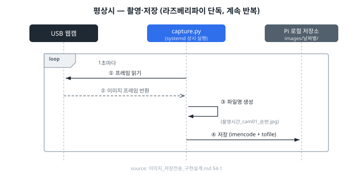
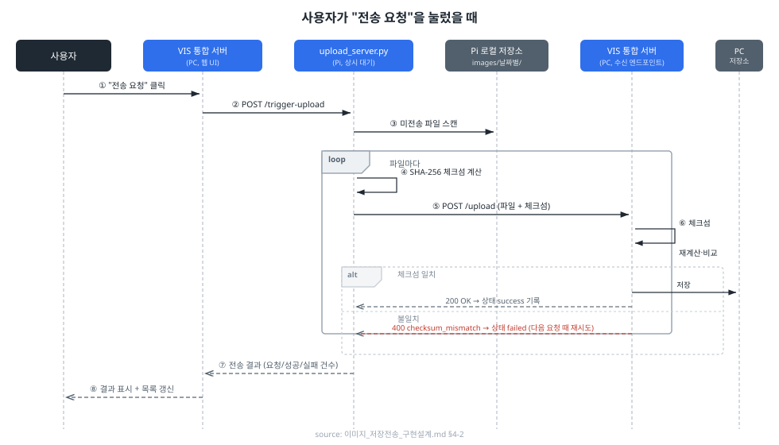
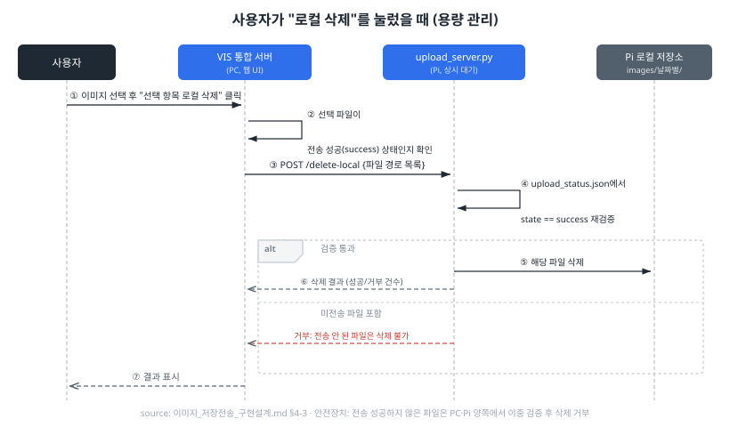
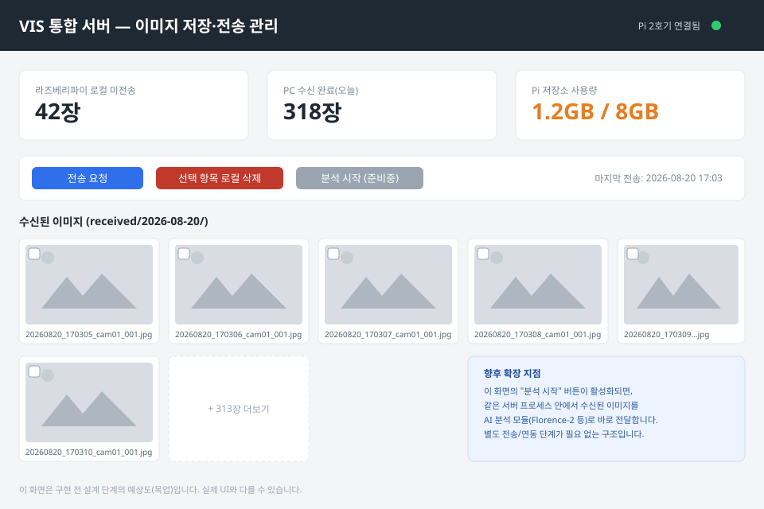

# VIS 기능 1 — 이미지 저장·전송 시스템 구현 설계

> 작성일: 2026-08-20
> 대상 기능: 비전 인식(VIS) 8단계 계획 중 "이미지 획득·저장·전송" 파트
> 위치: `features/image_transfer/design/`
> 참고: 이 문서에 적힌 흐름·로직은 이미 `vision/webcam_test/`에서 프로토타입으로 검증됐고, `vision/라즈베리파이_전환_구현계획.md`에서 라즈베리파이 전환 방침까지 정해진 상태입니다. 이 문서는 그 내용을 `features/image_transfer/`에 실제로 구현하기 위해 한 번 더 구조화한 설계 문서입니다.

---

## 1. 전체 그림

```
[라즈베리파이 2호기]                              [PC]
 USB 웹캠
   │ 1초 간격 촬영
   ▼
capture.py (상시 실행, systemd)
   │ 저장
   ▼
로컬 저장소 (images/날짜별/*.jpg)
   ▲
   │ 스캔·전송
upload_server.py (상시 대기, systemd)  ◄──POST /trigger-upload──  VIS 통합 서버 (FastAPI)
   │ POST /upload (파일+체크섬)                                        │
   └─────────────────────────────────────────────────────────────────▶│
                                                                        ▼
                                                              received/날짜별/*.jpg
                                                                        │
                                                                        ▼
                                                              (향후) AI 분석 모듈
                                                                        │
                                                                        ▼
                                                                  웹 UI (사용자)
```

핵심 원칙은 세 가지이며, 전부 기존 계획 문서에서 이미 확정된 내용을 그대로 따릅니다.

1. **촬영·저장은 라즈베리파이가 상시 자동으로** — 사람이 개입하지 않음
2. **전송은 요청 기반(request-triggered)** — 라즈베리파이가 먼저 보내는 게 아니라, PC 쪽 서버가 요청할 때만 전송
3. **로컬 삭제는 전송 성공 확인 후, 사용자가 명시적으로 요청할 때만** — 자동 삭제가 아님 (요구사항에 명시된 순서: "사용자가 요청 시 로컬저장소 데이터 삭제")

---

## 2. 요구사항 1 — 이미지 전송 목적지 결정

### 결론: **PC 위에서 실행되는 FastAPI 기반 "VIS 통합 서버" 하나**

별도의 외부 웹 서버, 클라우드 스토리지, DB 서버 등을 새로 두지 않고, `vision/webcam_test/server.py`를 확장한 **단일 서버 프로세스**가 아래 역할을 전부 겸합니다.

| 역할 | 설명 |
|---|---|
| 이미지 수신 서버 | 라즈베리파이가 보내는 `POST /upload` 요청을 받아 저장 |
| 전송 트리거 클라이언트 | 사용자가 웹 UI에서 "전송 요청"을 누르면, 이 서버가 라즈베리파이의 `POST /trigger-upload`를 대신 호출 |
| 삭제 요청 클라이언트 | 사용자가 "라즈베리파이 로컬 저장소 전체 삭제"를 누르면, 라즈베리파이에 삭제 요청을 전달 (PC 자체 보관소 삭제는 Pi를 거치지 않고 이 서버가 직접 처리) |
| 웹 UI 제공 | 이미지 목록·상태를 보여주는 대시보드 페이지 |
| (향후) AI 분석 실행 | 수신된 이미지를 분석 모듈에 전달하고 결과를 표시 |

**왜 별도 서버로 분리하지 않았는가**

- `라즈베리파이_전환_구현계획.md`에서 이미 "요청 주체(웹/외부 환경)는 PC 위의 통합 웹 환경 하나"로 확정됨 — 담당자 본인이 이미지 전송과 AI 분석을 모두 맡기 때문
- **가장 큰 이유는 요구사항 1번(향후 이미지 분석 기능 추가)** 입니다. 수신 서버와 분석 서버가 분리돼 있으면 "이미지 도착 → 다른 서버로 재전송 → 분석"이라는 불필요한 중계 단계가 생깁니다. 하나의 프로세스 안에 있으면 수신된 이미지 파일 경로를 분석 함수에 그냥 넘기기만 하면 됩니다.
- 인증·네트워크 구성도 단순해집니다 (Pi ↔ PC 양방향만 고려하면 됨, 외부 클라우드·공인 IP 불필요 — 기존 계획과 동일)

### 아직 안 정한 것 (이 문서 범위 밖)
- 웹 UI를 FastAPI의 서버사이드 템플릿(Jinja2)으로 할지, 별도 프론트엔드(React 등)로 뗄지는 미정입니다. 지금 단계(요청 촉박, 1인 개발)에서는 **Jinja2 템플릿 + 약간의 JS**로 시작하는 걸 권장하지만, 이건 실제 구현 착수 시점에 다시 확인이 필요합니다.

---

## 3. 폴더 구조 (`features/image_transfer/` 하위)

```
features/image_transfer/
├── design/                        ← 설계 문서 (이 폴더)
│   ├── README.md                  ← 이 문서
│   ├── ui_mockup.svg               요구사항 3: UI 예상도
│   ├── seq_capture.svg             시퀀스: 촬영·저장
│   ├── seq_transfer.svg            시퀀스: 전송 요청
│   └── seq_delete.svg              시퀀스: 로컬 삭제
├── pi_agent/                      ← 라즈베리파이 2호기에서 실행
│   ├── capture.py                 (webcam_test/capture.py 그대로 재사용 — 수정 없음)
│   ├── config.py                  (경로·IP만 라즈베리파이 환경에 맞게 조정)
│   ├── upload_batch.py            (webcam_test에서 그대로 재사용 — 스캔/체크섬/전송 로직)
│   └── upload_server.py           (webcam_test에서 그대로 재사용 + /delete-local, /delete-all-local 엔드포인트 추가)
└── pc_server/                     ← PC에서 실행 (VIS 통합 서버)
    ├── main.py                    (FastAPI 앱 진입점, GET /images, POST /images/delete 포함)
    ├── routes_upload.py           (라즈베리파이 → PC 이미지 수신: webcam_test/server.py 확장)
    ├── routes_control.py          (웹 UI → 전송 요청 / 라즈베리파이 삭제 요청 라우팅)
    ├── templates/
    │   └── dashboard.html         (ui_mockup.svg를 실제 HTML로 구현한 것)
    └── config.py
```

`pi_agent/`와 `pc_server/`로 나눈 이유는 실제로 두 대의 서로 다른 기기에서 실행되는 코드이기 때문입니다 — 실수로 라즈베리파이 코드를 PC에서 돌리거나 반대의 혼동을 줄이기 위함입니다.

---

## 4. 시퀀스 다이어그램 (요구사항 2)

### 4-1. 평상시 — 촬영·저장 (라즈베리파이 단독, 계속 반복)



### 4-2. 사용자가 "전송 요청"을 눌렀을 때



### 4-3. 사용자가 "라즈베리파이 로컬 저장소 전체 삭제"를 눌렀을 때 (용량 관리)



> **안전장치**: "전송 성공하지 않은 파일은 삭제할 수 없음"을 PC 쪽과 Pi 쪽 양쪽에서 이중으로 확인합니다. 사용자가 실수로 아직 안 보낸 사진을 지우는 사고를 막기 위함입니다.
>
> **구현 중 변경된 부분 (2026-08-20, 실사용 피드백 반영)**: 다이어그램은 "선택한 파일 목록"을 지정해서 지우는 형태로 그려져 있지만, 실제 사용해보니 라즈베리파이 로컬 삭제는 파일 단위로 고를 일이 거의 없고("용량 관리"가 목적이라 어차피 전송 완료된 건 다 지워도 됨), 오히려 "선택 삭제"라는 이름 때문에 PC 화면에 보이는 이미지가 지워지는 것으로 오해하기 쉬웠습니다. 그래서 최종적으로는 아래처럼 **두 가지 삭제를 명확히 분리**했습니다.
>
> | 기능 | 대상 | 선택 방식 |
> |---|---|---|
> | **선택 항목 삭제 (PC)** | PC `received/` 보관소 | 체크박스로 고른 것만 (＋"전체 선택" 토글 지원) |
> | **라즈베리파이 로컬 저장소 전체 삭제** | Pi 로컬 저장소 | 선택 없이 일괄 — 전송 성공(success) 확인된 파일 전부 |
>
> 파일 단위로 지정하는 `POST /delete-local`(Pi) API 자체는 남겨뒀지만(§5), 지금 대시보드 UI는 전체 삭제(`/delete-all-local`)만 사용합니다.

---

## 5. API 명세 (초안)

### 라즈베리파이 쪽 (`pi_agent/upload_server.py`, 포트 8001)

| 메서드/경로 | 설명 | 요청 주체 |
|---|---|---|
| `POST /trigger-upload` | 미전송 이미지를 PC로 전송 시작. 완료까지 동기 대기 후 결과 응답 (기존 계획 그대로) | PC(VIS 통합 서버)만 허용 (IP 제한) |
| `POST /delete-local` | 지정한 파일 목록 중 전송 성공 확인된 것만 로컬에서 삭제 (파일 단위 — 현재 대시보드 UI는 미사용, API로는 유지) | PC(VIS 통합 서버)만 허용 |
| `POST /delete-all-local` | 전송 성공(success) 확인된 파일 **전부**를 로컬에서 일괄 삭제 (신규 — "로컬 저장소 전체 삭제" 버튼이 호출) | PC(VIS 통합 서버)만 허용 |

### PC 쪽 (`pc_server/`, 포트 8000)

| 메서드/경로 | 설명 | 요청 주체 |
|---|---|---|
| `POST /upload` | 라즈베리파이가 보내는 이미지 수신, 체크섬 검증 후 저장 (기존 `server.py` 로직 재사용) | 라즈베리파이 |
| `GET /images` | 수신된 이미지 목록 조회 (웹 UI 렌더링용) | 웹 UI(브라우저) |
| `POST /images/delete` | (신규) 선택한 이미지를 **PC `received/` 보관소에서** 직접 삭제. 라즈베리파이와 무관, Pi를 거치지 않고 PC가 자체 처리 | 웹 UI(브라우저) |
| `POST /control/request-transfer` | 사용자가 "전송 요청" 클릭 시 호출 → 내부적으로 Pi의 `/trigger-upload` 호출 | 웹 UI(브라우저) |
| `POST /control/delete-local` | Pi의 `/delete-local`(파일 단위) 프록시 — 현재 대시보드 UI는 미사용 | 웹 UI(브라우저) |
| `POST /control/delete-all-local` | (신규) 사용자가 "라즈베리파이 로컬 저장소 전체 삭제" 클릭 시 호출 → 내부적으로 Pi의 `/delete-all-local` 호출 | 웹 UI(브라우저) |
| `GET /` | 대시보드 페이지 (아래 6번 목업 참고) | 웹 UI(브라우저) |

---

## 6. UI 예상도 (요구사항 3)



*(`ui_mockup.svg` — 이 폴더에 함께 저장된 파일입니다. 이미지 뷰어나 브라우저로 열어서 확인하세요.)*

구성 요소 (이미지는 초기 목업이며, 실제 구현은 아래처럼 버튼이 4개로 조정됐습니다 — §4-3의 "구현 중 변경된 부분" 참고):
- **상단 상태 요약**: Pi 로컬 미전송 장수 / PC 수신 완료 장수 / Pi 저장소 사용량 — 한눈에 "지금 전송해도 되는지, 삭제가 필요한지" 판단할 수 있게 함
- **액션 버튼 4개** (실제 구현 기준):
  - `전송 요청`(파랑) — Pi → PC 전송
  - `선택 항목 삭제 (PC)`(빨강) — 체크박스로 고른 이미지만 PC 보관소에서 삭제
  - `라즈베리파이 로컬 저장소 전체 삭제`(빨강) — Pi 쪽 전송 완료 파일 일괄 삭제
  - `분석 시작`(회색, 비활성) — 향후 AI 분석 기능이 붙을 자리를 미리 잡아둠
- **전체 선택 체크박스**: 그리드 위쪽에서 모든 이미지 체크박스를 한 번에 토글 (선택 삭제와 함께 씀)
- **이미지 그리드**: 수신된 이미지 썸네일 + 파일명(촬영시간 포함) + 선택 체크박스. PC 쪽 삭제 성공 시 새로고침 없이 해당 썸네일이 즉시 사라짐
- **향후 확장 안내 카드**: "분석 시작" 버튼이 나중에 어떻게 동작할지 미리 명시 (같은 서버 프로세스 안에서 바로 분석 모듈 호출)

---

## 7. 기존 코드 재사용 매핑

| 필요 기능 | 재사용할 기존 코드 | 수정 여부 |
|---|---|---|
| 웹캠 촬영·저장 | `webcam_test/capture.py` | 수정 없음 (2-2단계에서 라즈베리파이 실행까지 이미 검증 완료) |
| 파일명/폴더 규칙 | `webcam_test/config.py`의 `make_filename`, `get_day_dir` | 수정 없음 |
| 체크섬 기반 전송 | `webcam_test/upload_batch.py` | 수정 없음 |
| 전송 트리거 API | `webcam_test/upload_server.py` | `/delete-local`, `/delete-all-local` 엔드포인트 추가 |
| 이미지 수신·검증 | `webcam_test/server.py` | 웹 UI용 라우트(`/images`, `/images/delete`, `/`) 추가하며 확장 |

즉 이번 구현은 "새로 만드는 것"보다 **"이미 검증된 두 프로세스(촬영/전송)를 하나의 정식 폴더 구조로 옮기고, 그 위에 웹 UI와 삭제 기능을 얹는 것"**에 가깝습니다.

---

## 8. 결정 사항 (2026-08-20 확정)

| 항목 | 결정 |
|---|---|
| 웹 UI 구현 방식 | **FastAPI + Jinja2 템플릿**. 별도 프론트엔드(React 등) 분리는 하지 않음 — 서버사이드 렌더링으로 개발/빌드 파이프라인을 하나로 유지, 촉박한 일정과 1인 개발에 맞춤 |
| `/delete-local` 삭제 대상 지정 방식 | **파일 경로 목록**으로 지정. 웹 UI에서 체크박스로 고른 이미지들만 정확히 삭제 요청 (§4-3 시퀀스와 일치) |
| PC 고정 IP | **지금은 미정으로 진행**. 개발/테스트 단계에서는 `config.py`의 `SERVER_HOST`를 그때그때 확인해서 씀. 실제 시연 환경이 확정되는 시점에 `라즈베리파이_전환_구현계획.md` 2-3단계(공유기 DHCP 예약)에서 고정 |
| 이미지 그리드 대량 처리(페이지네이션 등) | **보류**. 지금은 수십 장 수준이라 무시 가능 — `/images`는 전체 목록을 한 번에 반환하는 단순한 형태로 구현. 수백~수천 장으로 늘어나면 그때 페이지네이션/무한스크롤 재검토 |

### 남은 확인 필요 사항 (구현 중 자연스럽게 정해질 것들)
- [ ] `TRIGGER_ALLOWED_HOST`(Pi 쪽 IP 제한)를 PC 고정 IP 확정 전까지 `None`으로 둘지, 개발 중 PC의 현재 IP로 임시 지정할지
