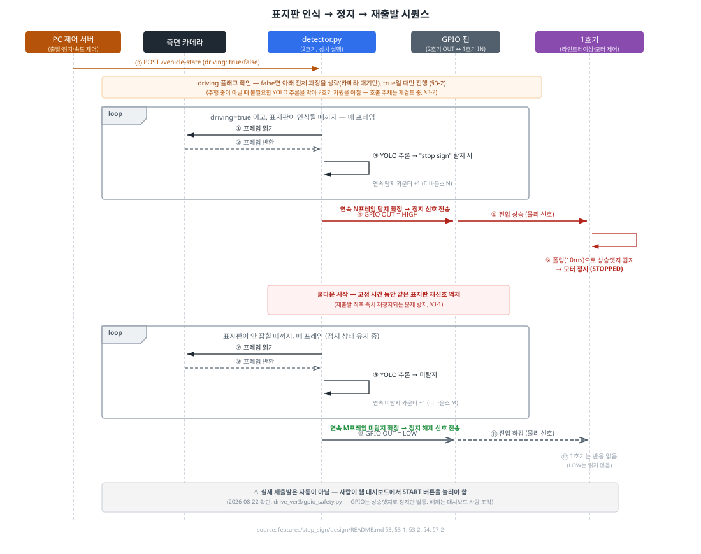

# VIS 기능 2 — 정지 표지판 인식 시스템 구현 설계

> 작성일: 2026-08-22
> 대상 기능: 비전 인식(VIS) 파트 중 "주행 중 정지 표지판 인식 → 로봇 정지" 기능
> 위치: `features/stop_sign/design/`
> 참고: 두 기능(①이미지 저장·전송, ②정지 표지판 인식)의 관계와 초기 검토 내용은
> [`vision/PPT_참고자료_이미지저장전송_정지표지판인식.md`](../../../vision/PPT_참고자료_이미지저장전송_정지표지판인식.md) §2,
> 하드웨어 분리 결정 배경은 [`비전인식_진행상황.md`](../../../비전인식_진행상황.md) §4 참고.
> 이 문서는 그 내용을 `features/stop_sign/`에 실제로 구현하기 위해 구조화한 설계 문서입니다.

---

## 1. 이 기능이 하는 일 (한 줄 요약)

로봇이 주행 중 **정지 표지판을 카메라로 인식하면 즉시 멈추고, 표지판을 지나가면 다시 움직이는** 기능입니다.

이미지 저장·전송 기능(①)과 달리, 이 기능은 **"5분 안에 리포트"가 아니라 실시간 제어**에 들어갑니다. 인식이 늦으면 표지판을 지나쳐버리고, 오탐(false positive)이 있으면 아무 이유 없이 멈춰버리기 때문에 정확도·반응속도 둘 다 중요합니다.

---

## 2. 왜 라즈베리파이 두 대가 필요한가 (하드웨어 역할 분리)

이 로봇에는 라즈베리파이가 2대 있고, 각각 역할이 다릅니다.

| | 라즈베리파이 **2호기** (이 기능 담당) | 라즈베리파이 **1호기** (팀원 담당) |
|---|---|---|
| 원래 역할 | 작물 카메라로 사진 저장·전송(①) | 라인트레이싱 + 모터 제어 |
| 이 기능에서 역할 | **측면 카메라로 정지 표지판 인식** | **인식 결과를 받아 실제로 정지/재출발** |
| 왜 이 보드인가 | 카메라·연산 담당 보드라 표지판 인식을 여기 추가하는 게 자연스러움 | 모터를 직접 제어하는 보드는 1호기뿐 |

**왜 한 보드에 다 몰아넣지 않았는가?**
- 표지판 인식(YOLO 추론)은 CPU 부담이 커서, 라인트레이싱처럼 지연에 민감한 실시간 루프와 한 보드에서 같이 돌리면 정지 타이밍이 늦어질 위험이 있습니다. 로봇이 표지판을 지나친 뒤에 멈추면 의미가 없으므로, 안전 요구사항과 정면으로 부딪힙니다.
- 1호기는 이미 32비트 OS로 라인트레이싱이 구현돼 있는데, YOLO 계열 라이브러리는 32비트 ARM을 사실상 지원하지 않습니다. 억지로 얹으려면 잘 돌아가는 1호기 환경을 통째로 새로 세팅해야 하는 위험이 있습니다.

그래서 **"인식은 2호기, 정지 실행은 1호기"** 로 역할을 나누고, 그 사이를 아래 3번처럼 아주 단순한 신호선 하나로만 연결합니다.

---

## 3. 두 보드는 어떻게 대화하는가 — GPIO 신호 하나로 연결

두 보드 사이에는 네트워크(와이파이)나 복잡한 통신 프로토콜을 쓰지 않고, **GPIO 핀을 물리적으로 전선 하나로 직결**합니다.

```
[2호기] GPIO OUT 핀  ──────전선 직결──────  GPIO IN 핀 [1호기]
```

| 신호 | 의미 | 1호기가 할 일 |
|---|---|---|
| **HIGH** (핀 전압 켜짐) | 2호기가 표지판을 인식 중 | 모터 정지 (STOPPED 상태로 전환) |
| **LOW** (핀 전압 꺼짐) | 표지판이 시야에서 사라짐 (지나감) | **아무 것도 안 함** — 실제 1호기 코드는 LOW를 읽지 않음 (아래 §3-2 참고) |

> ⚠️ **2026-08-22 확인: 자동 재출발은 없습니다.** `DIP_mobility_project/drive/drive_ver3`의 실제 1호기 코드(`gpio_safety.py`의 `VisionGpioStopPart`)를 확인해보니, GPIO 핀의 **상승 엣지(LOW→HIGH)만 감지해서 정지 명령을 한 번 발동**시키고, 그 뒤 핀이 다시 LOW로 내려가는 건 전혀 신경쓰지 않습니다. 표지판을 지나가서 우리 쪽이 LOW를 보내도 1호기는 반응하지 않고, **실제 재출발은 사람이 웹 대시보드의 START 버튼을 눌러야만 일어납니다** (`drive_ver3/README.md`: "Resume: Press web START again."). 이전 버전 이 문서에 적혀 있던 "LOW → 모터 재개"는 잘못된 가정이었습니다.
>
> 우리 쪽 코드(`detector.py`)는 이 사실을 몰라도 **정지 신호 자체는 정상 동작**합니다 — LOW→HIGH 전환이 일어나는 순간은 동일하게 발생하기 때문입니다. 다만 M프레임 디바운스로 LOW를 보내는 로직 자체는 1호기 입장에서는 아무 효과가 없는 "무의미한 신호"라는 걸 알아두어야 합니다 (그래도 우리 쪽 상태 초기화용으로는 여전히 필요하므로 코드는 그대로 둡니다).

> **핀 번호는 2호기·1호기가 같을 필요가 없습니다.** GPIO 핀 번호는 보드마다 독립적이라, 2호기의 GPIO17과 1호기의 GPIO17은 서로 다른 물리 핀입니다. 실제로 맞아야 하는 건 "전선이 어느 핀에서 나와서 어느 핀에 꽂혔는지"와 "1호기 코드가 그 꽂힌 핀 번호를 읽도록 설정돼 있는지"뿐입니다. **확인 결과 다행히 우연히 일치합니다** — 우리 `config.py`의 `GPIO_OUT_PIN = 17`과 `drive_ver3/config.py`의 `VISION_GPIO_STOP_PIN = 17`이 이미 같은 번호입니다.

**왜 이렇게 단순하게 했는가?**
- 와이파이나 시리얼 통신보다 지연이 훨씬 적고, 배선도 간단합니다.
- 대신 켜짐/꺼짐 신호 하나뿐이라 "왜 멈췄는지" 같은 부가 정보는 전달할 수 없습니다. 지금 요구사항(정지 표지판 하나만 인식)에는 충분하지만, 나중에 다른 표지판 종류를 구분해야 하면 별도 통신 방식을 추가로 검토해야 합니다.

**신호가 프레임 노이즈로 깜빡이지 않게 — 디바운스**

카메라가 한 프레임만 잘못 인식(또는 놓침)해도 핀이 깜빡이면 로봇이 덜컹거리게 됩니다. 이를 막기 위해 2호기 쪽에서 다음 규칙을 적용합니다.

- **연속 N프레임** 동안 계속 탐지돼야 비로소 HIGH로 올림 (한 프레임의 오탐으로 갑자기 멈추지 않게)
- **연속 M프레임** 동안 계속 안 잡혀야 비로소 LOW로 내림 (표지판이 진짜로 지나갔다고 확신할 때만 재출발)
- N, M 값은 아직 정해지지 않았고, 실제 카메라·모델로 측정해서 튜닝해야 합니다 (§8 미정 항목 참고).

**1호기 쪽 감지 방식**: ~~폴링(반복 확인)이 아니라 인터럽트~~ → **2026-08-22 정정**: 실제 코드(`gpio_safety.py`의 `VisionGpioStopPart.update()`)는 10ms 간격 **폴링**으로 구현돼 있었습니다 (인터럽트 콜백 아님). 다만 10ms면 충분히 빨라서 실시간성에 큰 영향은 없을 걸로 보이고, 라인트레이싱 메인 루프와도 별도 스레드(`threaded=True`)로 분리돼 있어 서로 안 막습니다.

> 이 기능은 **핀 번호·신호 규약만 여기서 정의**하고, 1호기 쪽 실제 코드는 라인트레이싱을 담당하는 팀원의 프로젝트(`DIP_mobility_project/drive/drive_ver3/`)에 구현되어 있습니다. 이 리포지토리에는 2호기 쪽 코드만 들어갑니다. 실제 코드 위치: `gpio_safety.py`(`VisionGpioStopPart`, `DriveStatusGpioPart`), `dashboard_control.py`(웹 제어 API), `manage.py`(DonkeyCar 파츠 연결), `config.py`(`VISION_GPIO_STOP_PIN`, `VISION_GPIO_STATUS_PIN` 등).
>
> ⚠️ **주의**: `drive_ver3/config.py`를 보면 `DASHBOARD_CONTROL_ENABLED`, `VISION_GPIO_STOP_ENABLED`, `VISION_GPIO_STATUS_ENABLED`가 전부 **기본값 `False`**입니다 — 즉 1호기 쪽에서 이 기능들이 아직 실제로 켜져 있지 않을 수 있습니다. 실기 연동 테스트 전에 1호기 담당 팀원에게 이 설정들이 켜져 있는지 반드시 확인해야 합니다.
>
> ℹ️ `drive_ver3`에는 우리 것과 별개로 자체 "Vision Pi" 스크립트(`vision_stop_detector.py`, `vision_gpio.py`, `vision_stop_client.py`)도 있지만, **2호기에는 이 리포지토리의 `pi2_detector`를 사용하기로 결정**했습니다 (`vision_stop_detector.py`는 참고하지 않음). 다만 GPIO 신호를 받는 쪽(1호기, `gpio_safety.py`)은 그대로 유지되므로, 위 프로토콜(엣지 트리거·수동 재출발)에는 우리 쪽이 맞춰야 합니다.

### 3-1. 재정지 방지 — 재출발 직후 쿨다운(lockout)

**문제 상황**: 로봇이 정지해 있는 동안은 표지판이 카메라 시야에서 사라지지 않으므로, 신호는 계속 HIGH로 유지됩니다. 이 상태에서 (타이머 등) 외부 요인으로 1호기가 재출발하더라도, 막 움직이기 시작한 시점에는 여전히 표지판이 화면에 보이기 때문에 2호기는 계속 HIGH를 보내고 있는 상태입니다. 즉 재출발하자마자 즉시 다시 멈추는 문제가 생길 수 있습니다.

통신이 **2호기 → 1호기 단방향**이라, 2호기는 "1호기가 언제 재출발했는지"를 알 방법이 없습니다. 따라서 이 문제는 1호기가 아니라 **2호기(detector.py) 쪽에서 해결**합니다.

**해결책: 고정 시간 쿨다운**
- 표지판을 새로 인식해 HIGH를 한 번 보내고 나면, 그 뒤 **고정된 쿨다운 시간** 동안은 같은 표지판이 계속 잡혀도 신호를 다시 보내지 않습니다 (이미 처리한 표지판으로 취급).
- 쿨다운 시간은 "정지 → 재출발 → 로봇이 표지판을 실제로 완전히 지나쳐서 화면에서 벗어나는 데 걸리는 시간"보다 넉넉하게 잡아야 하며, 값은 실측으로 정합니다 (§8 미정 항목).
- 위치·바운딩박스 기반으로 "같은 표지판인지" 판단하는 방식(시간이 아니라 표지판이 실제로 화면을 벗어났는지 확인)도 검토했으나, 구현이 더 복잡해 **1차는 고정 시간 쿨다운으로 진행**하기로 결정했습니다.

### 3-2. 자원 절약 — 정차 중에는 추론을 멈춘다

**문제 상황**: 차체 제어(출발·정지·속도 조절)는 팀원이 구현한 **PC 위의 제어 서버**가 담당합니다. 그런데 지금까지의 설계는 "차체가 지금 달리는 중인지"를 2호기가 전혀 모르는 채로, 목적지 도착·충전·수동 정지 등 **표지판과 무관한 이유로 정차 중일 때도 YOLO 추론을 계속 돌립니다.** 표지판 인식은 작물 촬영(①)과 2호기 자원을 나눠 써야 하므로, 안 달리는 동안의 추론은 그대로 낭비입니다.

**해결책: PC 제어 서버가 상태 변화를 2호기에 푸시**
- 이미지 전송 기능(①)에서 이미 "PC가 요청하면 Pi가 응답"하는 패턴(`upload_server.py`의 `/trigger-upload`)을 쓰고 있으므로, 같은 패턴을 재사용합니다.
- `pi2_detector`에 새 엔드포인트(예: `POST /vehicle-state`, body `{"driving": true|false}`)를 추가하고, **PC 제어 서버가 차체를 출발/정지시킬 때마다 이 엔드포인트를 호출**해 상태를 알려줍니다.
- `detector.py`는 이 상태를 메모리 플래그로 들고 있다가, **`driving=false`인 동안은 YOLO 추론을 건너뜁니다** (카메라 자체는 열어두거나 짧게 쉬어도 되지만, 무거운 추론 연산만 생략).
- 폴링(2호기가 PC에 주기적으로 물어보는 방식) 대신 푸시를 선택한 이유는, 정차 중에도 계속 PC에 요청을 보내는 낭비가 없고, 기존 "요청 기반(request-triggered)" 설계 원칙과도 일관되기 때문입니다.

> ⚠️ 이 엔드포인트를 추가하려면 `pi2_detector`가 GPIO 출력뿐 아니라 **간단한 HTTP 서버(FastAPI 등)도 함께 떠 있어야** 합니다 — 아래 §5 폴더 구조에 반영했습니다.

> ⚠️ **2026-08-22 확인: "PC 제어 서버" 가정이 실제와 다릅니다.** `drive_ver3`를 보니 차체 제어 API(`/api/control`, 토큰 인증)는 **PC가 아니라 1호기 자체에서 실행**되는 웹 서버(`dashboard_control.py`)였습니다. PC는 그 API에 접속하는 브라우저 클라이언트일 뿐입니다. 그리고 **아무 코드도 우리 쪽 `POST /vehicle-state`를 호출해주지 않습니다** — 지금 이대로면 2호기는 영원히 `driving=false`로 대기만 하게 됩니다.
>
> 다행히 1호기에는 이미 **자기 실제 주행 상태를 GPIO로 내보내는 기능**(`gpio_safety.py`의 `DriveStatusGpioPart`, 기본 **GPIO27**, `0=이동중 / 1=정지중`)이 구현돼 있습니다. `POST /vehicle-state`를 계속 쓸지, 아니면 **2호기가 GPIO27을 직접 읽는 방식으로 바꿀지**는 재검토가 필요합니다 — 후자가 1호기의 실제 배선 구조와 더 맞아떨어지고 새로운 HTTP 호출 코드를 남한테 부탁할 필요도 없어집니다. 단, `VISION_GPIO_STATUS_ENABLED`가 기본 `False`라 1호기 쪽에서 켜야 하고, 2호기 쪽 GPIO 입력 배선·읽기 코드도 새로 만들어야 합니다 (§8 미정 항목 참고).

---

## 4. 전체 그림

```
                    [PC]                          [라즈베리파이 2호기]                              [라즈베리파이 1호기]
        제어 서버 (출발·정지·속도)                    측면 카메라 (USB 웹캠)
              │                                        │ 실시간 프레임
              │ POST /vehicle-state                    ▼
              │ {"driving": true|false}         detector.py (상시 실행, capture.py와 별도 프로세스)
              └───────────────────────────────▶   │ driving=false면 추론 건너뜀 (§3-2)
                                                    │ driving=true면: YOLO 추론 → "stop sign" 확인
                                                    │ 디바운스 (연속 N/M 프레임) + 쿨다운 (§3-1)
                                                    ▼
                                              GPIO OUT 핀 ───────전선 직결───────▶ GPIO IN 핀 (인터럽트)
                                                                                        │
                                                                                        ▼
                                                                                   모터 정지 / 재개
```

**왜 `capture.py`(작물 사진 촬영)와 별도 프로세스로 분리했는가?**
- 2호기는 이미 ①(작물 사진 촬영·전송) 기능을 위해 `capture.py`, `upload_server.py`가 상시 실행 중입니다.
- 표지판 인식을 같은 프로세스 안에 넣으면, 한쪽에서 예외가 나면 다른 쪽까지 같이 죽는 위험이 있습니다. 카메라 장치도 서로 다르므로(작물용 카메라 vs 측면 카메라), 독립 프로세스로 두는 게 안전합니다.
- 자원(CPU)이 부족해지면 `nice` 등으로 우선순위만 조정하면 되고, 두 기능을 억지로 한 코드에 얽을 필요가 없습니다.

---

## 5. 폴더 구조 (`features/stop_sign/` 하위)

```
features/stop_sign/
├── design/                    ← 설계 문서 (이 폴더)
│   ├── README.md               ← 이 문서
│   └── seq_detect_stop.svg     ← 시퀀스: 표지판 인식 → 정지 → 재출발
└── system/
    └── pi2_detector/           ← 라즈베리파이 2호기에서 실행 (표지판 인식 전용 프로세스)
        ├── detector.py         (메인 루프: 카메라 → YOLO 추론 → 디바운스 → GPIO 출력, driving 플래그 체크)
        ├── state_api.py        (PC 제어 서버가 호출하는 `POST /vehicle-state` — driving 플래그 갱신, §3-2)
        ├── config.py           (카메라 인덱스, GPIO 핀 번호, confidence 임계값, N/M 값, 쿨다운 시간, 모델 경로)
        └── requirements.txt    (ultralytics, opencv-python, gpiozero, fastapi, uvicorn)
```

`pi_agent/`(①, 작물 사진)와 별도로 `pi2_detector/`를 둔 이유는 위 4번에서 설명한 대로, 같은 보드에서 실행되더라도 서로 다른 카메라·서로 다른 프로세스이기 때문입니다.

---

## 6. 시퀀스 다이어그램



---

## 7. 0단계 검증 결과 (2026-08-22)

랩탑 화면에 표지판 이미지를 띄운 뒤 폰 카메라로 거리·각도를 달리해 촬영한 사진 5장을, 파인튜닝 없이 `yolov8n.pt`(COCO 사전학습)로 추론한 결과입니다.

| 조건 | 탐지 여부 | confidence |
|---|---|---|
| 근접 촬영 2장 | ✅ | 0.96 / 0.89 |
| 중간 거리+기울임 1장 | ✅ (낮음) | 0.54 |
| 원거리(표지판이 프레임에서 작게) 2장 | ❌ | 0.00 |

**결론**
- 파인튜닝 없이도 **가까운 거리에서는 확실하게 인식됨** — §8 "인식 모델 1차 후보" 가설이 맞았음을 1차 확인
- confidence를 좌우하는 핵심 변수는 **거리(프레임에서 표지판이 차지하는 크기)** — 멀어질수록 급격히 떨어지거나 놓침
- 오탐(표지판이 아닌 걸 `stop sign`으로 잘못 인식)은 5장 모두에서 0건

**한계 (2호기 온보드 재검증 시 확인 필요)**
- 테스트는 랩탑 화면 + 폰 카메라 조합으로, **실제 측면 카메라(USB 웹캠)의 화각·초점 특성과는 다를 수 있음**
- 실주행 거리(20cm 이내)는 웹캠 최소 초점 거리, 화각에 표지판 전체가 들어오는지(팔각형 윤곽이 잘리면 인식률 저하 가능), 주행 중 흔들림(motion blur) 등 근접 촬영 특유의 리스크가 있음 — 웹캠 미확보 상태라 지금은 1차 결과로 진행하고, **웹캠 확보 시 20cm 거리 재검증 필요** (§8 미정 항목에 반영)

### 7-1. 실제 2호기 하드웨어 통합 검증 (2026-08-22)

측면 카메라는 아직 배선 전이라, **2호기에 이미 연결돼 있던 작물 카메라(index 0)를 임시로 빌려** `pi2_detector` 코드 전체(카메라 → YOLO 추론 → 디바운스 → GPIO 출력, `POST /vehicle-state` 연동)를 실제 라즈베리파이에서 end-to-end로 검증했습니다.

**검증된 것**
- `POST /vehicle-state`로 `driving=true` 푸시 → 그 이후에만 추론 시작 (§3-2 정상 동작)
- 실카메라 프레임으로 표지판을 실시간 인식 → 디바운스 통과 → **GPIO17 핀이 실제로 LOW→HIGH 전환** (`pinctrl get 17`로 실측 확인)
- 표지판 치움 → 디바운스 통과 → **GPIO17이 HIGH→LOW 복귀** 실측 확인
- 크래시 없이 반복 사이클 안정 동작

**설치 중 발견한 이슈 (다음 배포 시 참고)**
- Pi(aarch64)에서 `pip install ultralytics`를 바로 실행하면 torch가 불필요한 NVIDIA CUDA 패키지(GB 단위)까지 의존성으로 받으려다 네트워크 타임아웃 발생 → **Pi가 실제로 재부팅되는 사고 발생** (정확한 원인은 미확정이나 시점상 연관 추정)
- 해결: `torch`, `torchvision`을 **PyTorch 공식 CPU 인덱스**(`download.pytorch.org/whl/cpu`)에서 먼저 설치한 뒤 `ultralytics` 설치 — 상세 절차는 `system/pi2_detector/requirements.txt` 상단 주석 참고
- 순서를 안 지키면 torch/torchvision 버전 불일치로 `RuntimeError: operator torchvision::nms does not exist` 크래시 발생 가능

**아직 남은 것**: 표지판 인식 자체는 검증됐지만, 이건 작물 카메라를 빌린 결과입니다 — **실제 측면 카메라 배선 후 같은 방식으로 재검증 필요** (§8에 반영).

### 7-2. 1호기 실제 코드(`drive_ver3`)와의 호환성 점검 (2026-08-22)

`DIP_mobility_project/drive/drive_ver3/`에 1호기(드라이브 Pi) 쪽 코드가 이미 상당 부분 구현돼 있어 대조해봤습니다. 결과는 §3, §3-2에 반영했고, 여기 요약만 정리합니다.

| 항목 | 우리 가정 | 실제 확인된 사실 |
|---|---|---|
| GPIO 신호 해석 | LOW = 재출발 신호 | **1호기는 LOW를 아예 안 봄.** 상승 엣지만 감지해 정지 1회 발동. 재출발은 **사람이 웹 대시보드 START 버튼**을 눌러야만 (`gpio_safety.py`) |
| 1호기 감지 방식 | 인터럽트 | 실제로는 **10ms 폴링** |
| 주행 상태를 누가 2호기에 알려주는지 | PC의 별도 제어 서버가 push | **1호기 자체가 제어 API를 호스팅**(`dashboard_control.py`, 포트 9200). 우리 `/vehicle-state`를 호출해주는 코드는 없음(§3-2) |
| 피드백 채널 | 없음(단방향만 가능하다고 가정) | **이미 있음** — 1호기가 GPIO27로 실제 이동/정지 상태를 내보내는 `DriveStatusGpioPart` 구현돼 있음 (기본 비활성) |
| GPIO 핀 번호 | 협의 필요 | **우연히 일치** — 양쪽 다 17번 |
| 2호기 담당 스크립트 | 우리 `pi2_detector` | `drive_ver3`에도 자체 버전(`vision_stop_detector.py`) 있었지만 **사용 안 하기로 결정** — `pi2_detector` 유지 |

**결정 사항**: 2호기에는 이 리포지토리의 `pi2_detector`를 계속 사용. 단, 1호기의 실제 프로토콜(엣지 트리거, 수동 재출발)에 맞춰 README §3의 신호 해석을 정정함.

---

## 8. 지금까지 확정한 것 / 아직 안 정한 것

### 확정
| 항목 | 결정 | 근거 |
|---|---|---|
| 인식 모델 1차 후보 | **사전학습 YOLO(YOLOv8n/YOLO11n)의 COCO `stop sign` 클래스**를 파인튜닝 없이 사용 | §7 검증 결과, 근접 촬영에서 0.86~0.96 confidence로 확인 — 데이터셋 확보·파인튜닝 과정 생략 가능 |
| 2호기 프로세스 구조 | 작물 촬영(`capture.py`)과 **별도 프로세스**로 분리 | §4 참고 — 서로 다른 카메라, 장애 격리 |
| 1호기 감지 방식 | ~~인터럽트~~ → **실제로는 폴링(10ms)** | §3 참고 — 2026-08-22 실제 코드 확인 결과 정정. 속도상 문제는 없어 보임 |
| 통신 방식 | **GPIO 핀 직결**, HIGH=정지진입 | §3 참고 — 지연 최소, 배선 단순. LOW는 1호기가 안 읽음(§3 정정 내용 참고) |
| 재정지 방지 | **2호기 detector.py에 고정 시간 쿨다운(lockout)** — HIGH 전송 후 일정 시간 동안 재신호 억제 | §3-1 참고 — 표지판이 계속 보이는 동안 반복적으로 정지 신호를 재전송하지 않기 위함(실제 재출발이 사람 손으로 이뤄지므로, 애초에 우려했던 "자동재출발 직후 재정지"는 아니지만 신호 남발 방지 차원에서 유지) |
| 정차 중 자원 절약 | `POST /vehicle-state`로 주행 상태를 2호기에 푸시, `driving=false`면 YOLO 추론 생략 | §3-2 참고 — **호출 주체 미확정** (아래 미정 항목). 1호기의 GPIO27 상태 출력으로 대체할지 재검토 필요 |
| 2호기 담당 코드 | 이 리포지토리의 `pi2_detector` 사용, `drive_ver3`의 `vision_stop_detector.py`는 미사용 | §7-2 참고 — 중복 구현 확인 후 결정 |

### 아직 안 정한 것
- [ ] **`POST /vehicle-state`를 실제로 호출해줄 주체가 없음** — "PC 제어 서버"는 실재하지 않고 제어 API는 1호기 자체에 있음이 확인됨(§3-2). 이대로면 2호기가 영원히 대기 상태. **1호기의 GPIO27 상태 출력(`DriveStatusGpioPart`, 0=이동/1=정지)을 2호기가 직접 읽는 방식으로 전환할지 결정 필요** — 결정되면 `pi2_detector`에 GPIO 입력 읽기 코드 추가해야 함
- [ ] 1호기 쪽 `DASHBOARD_CONTROL_ENABLED`, `VISION_GPIO_STOP_ENABLED`, `VISION_GPIO_STATUS_ENABLED`가 실제로 켜져 있는지 라인트레이싱 담당 팀원에게 확인 (기본값은 전부 `False`)
- [ ] 디바운스 값 N, M (연속 프레임 수) — 실제 카메라·모델로 측정 후 튜닝
- [ ] 쿨다운 시간 값 — "정지→재출발→표지판을 완전히 벗어남"까지 걸리는 실측 시간보다 넉넉하게 설정 필요
- [ ] confidence 임계값 — 위와 동일하게 실측 필요
- [ ] `POST /vehicle-state` 인증/허용 IP — ①의 `/trigger-upload`와 동일하게 PC 고정 IP 확정 전까지는 임시로 열어둘지 결정 필요
- [ ] PC 제어 서버가 이 엔드포인트를 실제로 호출하도록 팀원 쪽 코드에 연동 필요 (이 리포지토리 범위 밖 — 인터페이스만 정의)
- [ ] 사전학습 모델 검증 결과가 기준(정확도/오탐률)에 못 미칠 경우, 공개 교통표지판 데이터셋(AI Hub 등)으로 파인튜닝 전환 여부
- [ ] 2호기가 작물 촬영(①)과 표지판 인식(②)을 동시에 수행할 때 CPU 자원이 충분한지 (프로세스 우선순위 조정으로 해결 가능한지, 아니면 카메라 해상도/추론 주기를 낮춰야 하는지)
- [ ] **실제 측면 카메라(USB 웹캠) 확보 후 20cm 거리 재검증** — §7 한계에서 언급한 화각·초점 거리 문제 확인 (지금은 웹캠 미확보라 폰 카메라 결과로 잠정 진행 중)

---

## 9. 관련 문서

| 문서 | 내용 |
|---|---|
| [../../../vision/PPT_참고자료_이미지저장전송_정지표지판인식.md](../../../vision/PPT_참고자료_이미지저장전송_정지표지판인식.md) | ①·② 두 시스템 비교, 초기 구상 |
| [../../../비전인식_진행상황.md](../../../비전인식_진행상황.md) | 하드웨어 분리 결정 배경 (§4) |
| [../../image_transfer/design/README.md](../../image_transfer/design/README.md) | ① 이미지 저장·전송 설계 (같은 2호기에서 실행되는 다른 프로세스) |
